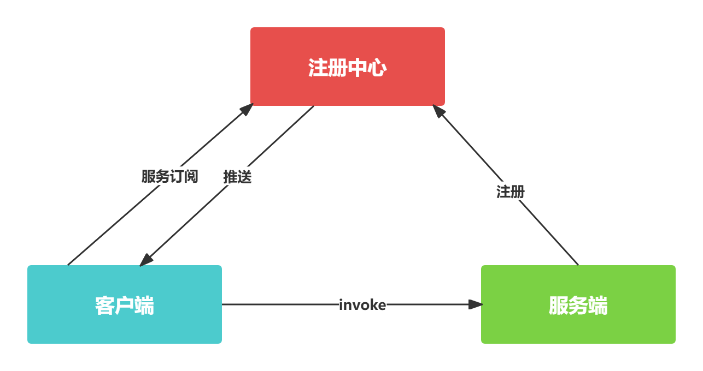
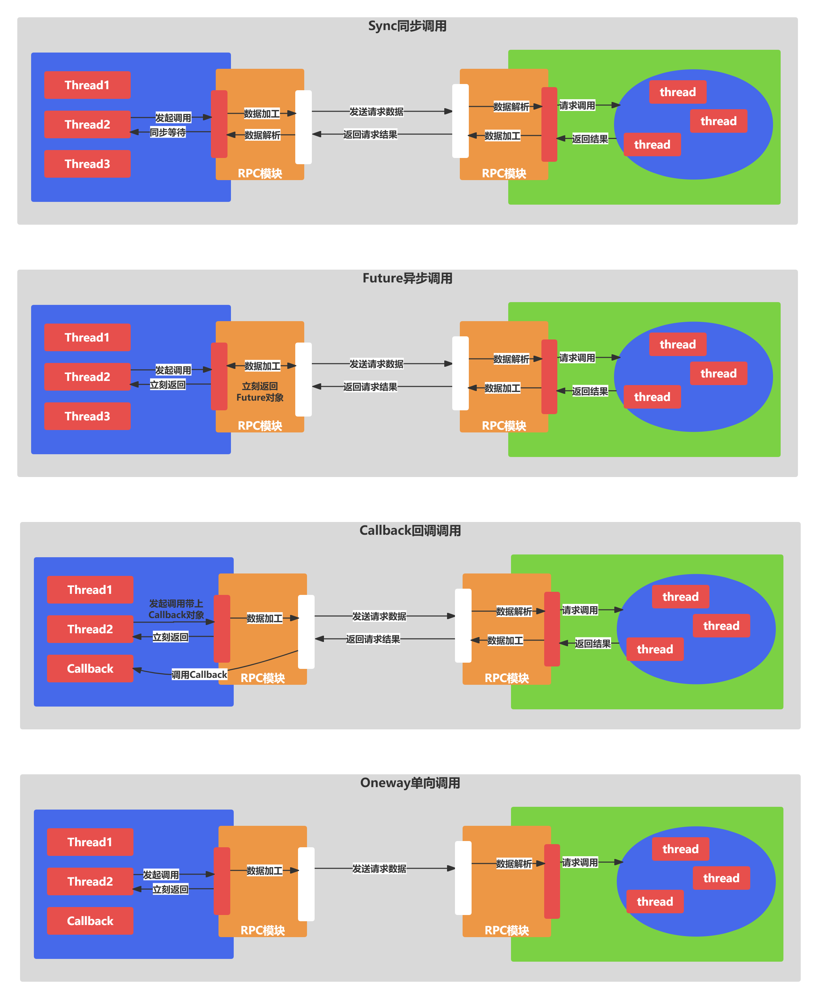
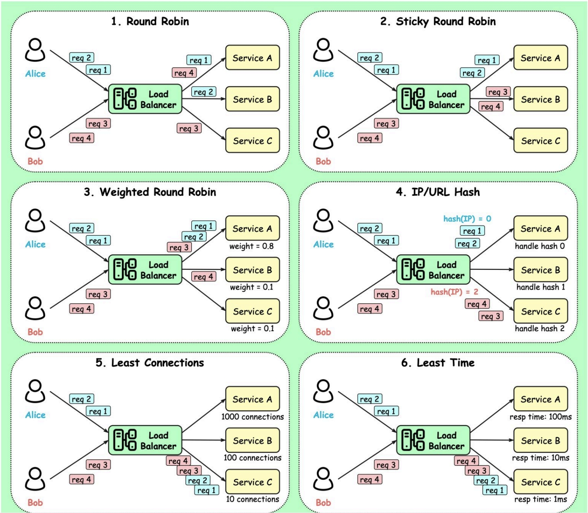
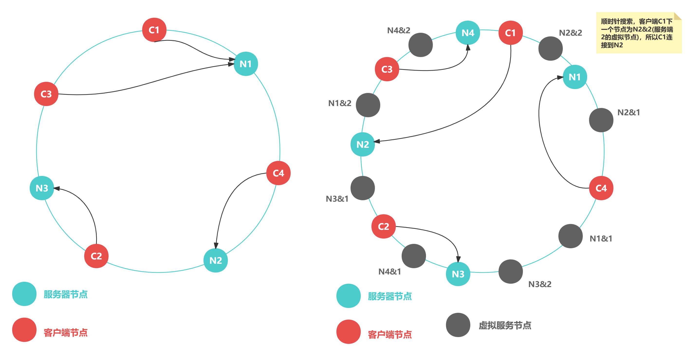

# 前言

- rpc是大型企业高频使用的一种中间件框架
- 用于解决分布式系统中服务之间的调用问题
- 线程模型、通信协议设计、同步/异步调用、负载均衡等
- RPC框架的核心流程以及必备的组件

# RPC框架架构设计

- RPC又称远程过程调用(Remote Procedure Call)
- 就是开发者能够像调用本地方法一样调用远程的服务

- 服务端在启动后，会将它提供的服务列表发布到注册中心，客户端向注册中心订阅服务地址
- 客户端会通过本地代理模块Proxy调用服务端，Proxy模块收到负责将方法，参数等数据转化成网络字节流
- 服务端接收到数据后进行解码，得到请求信息
- 服务端根据解码后的请求信息调用对应的服务，然后将调用结果返回给客户端

# 服务注册与发现

- 在分布式系统中，不同服务之间应该如何通信呢？
- 传统的方式可以通过HTTP请求调用，保存服务端的服务列表等
- 这样做需要开发者主动感知到服务端暴露的信息，系统之间耦合严重

- 注册中心：服务端节点上线后自行向注册中心注册服务列表，节点下线时需要从注册中心将节点元数据信息移除
- 服务在下线时需要从注册中心移除元数据，那么注册中心怎么才能感知到服务下线呢？
  - 节点主动通知的实现方式，当节点需要下线时，向注册中心发送下线请求，让注册中心移除自己的元数据信息
- 主动通知+心跳检测
  - 除了主动通知注册中心下线外，还需要增加节点与注册中心的心跳检测功能，这个过程也叫探活心跳检测可以由节点或者注册中心负责
  - 好处是可以解决客户端和服务端之间错综复杂的关系，并且能够实现对服务的动态管理

# 通信协议与序列化

- 既然RPC是远程调用，必然离不开网络通信协议
- 客户端在向服务端发起调用之前，需要考虑采用何种方式将调用信息进行编码，并传输到服务端
- RPC框架可以基于不同的协议实现
  - 大部分主流RPC框架会选择TCP, HTTP协议
  - 出名的gRPC框架使用的则是HTTP2
- 客户端和服务端在通信过程中需要传输哪些数据呢？这些数据又该如何编解码呢？
  - 如果采用TCP协议，需要将调用的接口，方法，请求参数，调用属性等信息序列化成二进制字节流传递给服务提供方，服务端接收到数据后，再把二进制字节流反序列化得到调用信息，然后利用反射的原理调用对应方法，最后将返回结果，返回码，异常信息等返回给客户端
  - 比较常用的序列化算法有FastJson, Kryo, Hessian, Protobuf等

# RPC调用方式

# 线程模型

## I/O线程

- 主要负责处理网络数据
- 例如事件轮询，编解码，数据传输等
- 如果业务逻辑耗时较多
- 那么I/O必须将这些请求分发到业务线程池中进行处理

## 业务线程

- Dubbo使用Netty作为底层的网络通信框架
- 采用了主从Reactor线程模型
- 其中Boss和Worker线程池就可以看作IO线程

| 策略类型   | 策略说明                                                     |
| ---------- | ------------------------------------------------------------ |
| all        | 所有请求，事件，心跳等都会分发到业务线程池，即Worker线程接收到事件后，会将事件提交到业务线程池中 |
| connection | 连接建立，断开事件放入队列排队执行，其他所有消息都分发到业务线程池执行 |
| direct     | 所有事件都在I/O线程中执行                                    |
| execution  | 只有请求类的消息分发到业务线程池执行，响应以及其他事件消息直接在I/O线程中执行 |
| message    | 只有请求响应消息被分发到业务线程池执行，其他事件消息都在IO线程中执行 |

# 负载均衡

- 如何保证服务提供者所有节点的负责均衡呢？
- 客户端在发起调用之前，需要感知有多少服务端节点可用，然后从中选取一个进行调用
- 客户端需要拿到服务端节点的状态信息，并根据不同的策略实现负载均衡算法

- Round-Robin轮询：最简单有效的负责均衡策略，并没有考虑服务端节点的实际负载水平，而是依次轮询服务端节点
- Weighted Round-Robin权重轮询：对不同负载水平的服务端节点增加权重系数，这样恶意通过权重系数降低性能较差或者配置较低的节点流量，权重系数可以根据服务端负载水平实时进行调整，使集群达到相对均衡的状态
- Least Connections最小连接数：客户端根据服务端节点当前的连接数进行负载均衡，客户端会选择连接数最少的一台服务器进行调用，演化出最少请求数，CPU利用率最低等其他维度的负载均衡方案
- Consistent Hash一致性Hash:是一种特殊的Hash算法，在服务端节点扩容或者下线时，尽可能保证客户端请求还是固定分配到同一台服务器节点，采用哈希环来实现的，通过Hash函数将对象和服务器节点放置在哈希环上

# 动态代理

- RPC框架怎么做到像调用本地接口一样调用远程服务端呢？
- 必须依赖动态代理来实现
- 需要创建一个代理对象，在代理对象中完成数据报文编码，然后发起调用发送数据给服务提供方，以此屏蔽RPC框架的调用细节
- 代理类的生成速度，生成的字节码大小
- JDK动态代理、Cglib、Javassist、ASM、Byte Buddy

## JDK动态代理

- 在运行时可以动态创建代理类
- 但是JDK动态代理的功能比较局限，代理对象必须实现一个接口，否则抛出异常
- JDK动态代理所生成的代理类时接口的实现类，不能代理接口中不存在的方法
- JDK动态代理是通过反射调用的形式代理类中的方法

## Cglib动态代理

- 是基于ASM字节码生成框架实现的
- 通过字节码技术生成的代理类，所以代理类的类型是不受限制的
- 采用了FastClass机制，为代理类和被代理类各自创建一个Class
- 这个Class会为代理类和被代理类的方法分配index索引
- FastClass就可以通过index直接定位要调用的方法，并直接调用

## Javassist和ASM

- 二者都是Java字节码操作框架，使用起来难度较大
- Byte Buddy也是一个字节码生成和操作的类库，提供了更加便捷的API
- 用于创建和修改Java类，无须理解字节码的格式

# 服务提供者发布服务

- 服务提供者启动服务，并暴露端口
- 启动时扫描需要对外发布的服务，并将服务元数据信息发布到注册中心
- 接收RPC请求，解码后得到请求信息
- 提交请求至自定义线程池进行处理，并将处理结果写回客户端

# 请求处理与响应

- 采用Netty提供的Promise工具来实现RPC请求的同步等待
- Promise基于JDK的Future扩展了更多新特性
- Promise模式本质是一种异步编程模型
- 可以先拿到一个查看任务执行结果的凭证，不必等待任务执行完毕
- 当我们需要获取任务执行结果时，再使用凭证提供的相关接口进行获取

# 注册中心

- 一致性Consistency, 可用性Availability, 分区容错性 Partition tolerance
- Zookeeper: CP类型注册中心，保证了所有节点的强一致性，但是在Leader选举的过程中是无法对外提供服务的，牺牲了部分可用性
- Eureka: AP类型注册中心，通过牺牲强一致性来保证高可用性

# 线程池隔离

- 以Dubbo框架为例，提供了6种内置的集群容错措施
- Failover,失效转移策略
  - 是Dubbo默认的集群容错措施
  - 当出现调用失败时，会重新尝试调用其他服务节点
- Failback,失效自动恢复策略
  - Failback策略适用于实时性不高的场景，如消息推送
- Failfast,快速失败策略
  - 适合非幂等性操作
  - 缺点就是需要服务消费者自己控制重试逻辑
- Forking, 并行措施
  - 通常用于实时性要求较高的操作
- Failsafe, 失效安全策略
  - Failsafe策略在出现异常时，直接忽略
  - 适合执行非核心的操作
- Broadcast, 广播措施
  - 通常用于更新服务提供方的本地资源状态