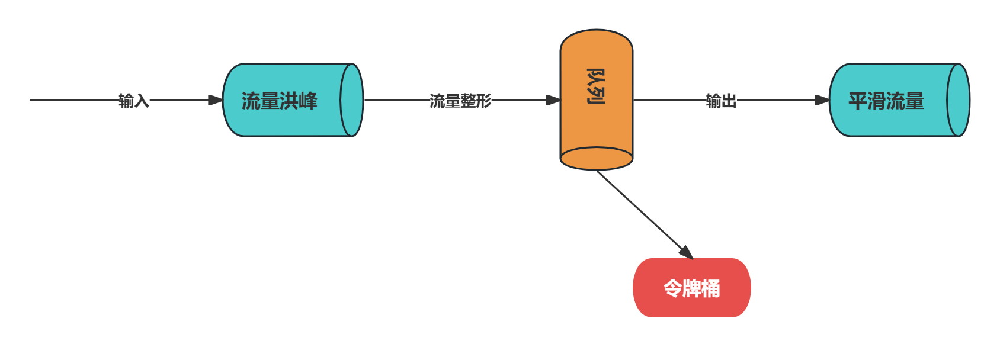

# 性能篇

## TCP参数

### SO_SNDBUF/SO_RCVBUF

- TCP发送缓冲区和接收缓冲区的大小
- 为例能够达到最大网络吞吐量，SO_SNDBUF不应当小于带宽和时延的乘积
- SO_RCVBUF会一直保存数据到应用进程读取为止
- SO_SNDBUF/SO_RCVBUF大小的设置建议参考消息的平均大小
- 更灵活的方式是可以动态调整缓冲区的大小

### TCP_NODELAY

- 是否开启Nagle算法
- Nagle算法通过缓存的方式将网络数据包累计到一定量才会发送、从而避免频繁发送小的数据包

### SO_BACKLOG

- 已完成三次握手的请求队列最大长度
- 同一时刻服务端可能会处理多个连接
- 在高并发海量连接的场景下，该参数应适当调大

### SO_KEEPALIVE

- 连接保活
- 启用了TCP SO_KEEPALIVE属性，TCP会主动探测连接状态
- Linux默认设置了2小时的心跳频率
- TCP KEEPALIVE机制主要用于回收死亡时间较长的连接，不适合实时性高的场景

### Linux文件最大连接数

- 可以通过 vim /etc/security/limits.conf,添加如下配置

```
* soft nofile 1000000
* hard nofile 1000000
```

## 业务线程池的必要性

- ChannelPipeline负责所有事件的传播
- 如果其中任何一个ChannelHandler处理器需要执行耗时的操作，那么IO线程就会出现阻塞，甚至整个系统都会被拖垮
- 在ChannelHandler处理器种自定义新的业务线程池，将耗时的操作提交到业务线程池种执行

## 共享ChannelHandler

## 设置高低水位线

- 高低水位线WRITE_BUFFER_HIGH_WATER_MARK和WRITE_BUFFER_LOW_WATER_MARK是两个非常重要的流控参数
- Netty每次添加数据时都会累加数据的字节数，然后判断缓存大小是否超过所设置的高水位线
- 高低水位线的设置方式

```java
//Server
new ServerBootstrap().childOption(ChannelOption.WRITE_BUFFER_HIGH_WATER_MARK, 32 * 1024)
               .childOption(ChannelOption.WRITE_BUFFER_LOW_WATER_MARK, 8 * 1024);
//Client
new Bootstrap().option(ChannelOption.WRITE_BUFFER_HIGH_WATER_MARK, 32 * 1024)
               .option(ChannelOption.WRITE_BUFFER_LOW_WATER_MARK, 8 * 1024);

if(ctx.channel().isAlive() && ctx.channel().isWritable()) {
    ctx.writeAndFlush(message);
} else {
    
}
```

## GC参数优化

### 堆内存

- -Xms和-Xmx参数，-Xmx用于控制JVM Heap的最大值
- 必须设置其大小，合理调整-Xmx有助于降低GC开销，提升系统吞吐量
- -Xms表示JVM Heap的初始值
- 对于生产环境的服务端来说-Xms和-Xmx最好设置为相同值

### 堆外内存

- DirectByteBuffer最容易造成OOM的情况
- DirectByteBuffer对象的回收需要依赖Old GC或者Full GC才能触发清理
- 通过JVM参数 -XX:MaxDirectMemorySize指定堆外内存的上限大小

### 年轻代

- -Xmn调整新生代大小， -XX:SurvivorRatio设置SurvivorRatio和Eden区比例
- 我们经常遇到YGC频繁的情况，应该清楚程序种对象的基本分布情况
- 如果存在大量朝生夕灭的对象，应适当调大新生代；反之应适当调大老年代

## 内存池&对象池

- ByteBuf可以分为堆内存HeapByteBuf和堆外内存DirectByteBuf
- 为了减少堆外内存的频繁创建和销毁
- Netty提供了池化类型的PooledDirectByteBuf
- Netty中启用内存池可以在创建客户端或者服务端的时候指定

```java
bootstrap.option(ChannelOption.ALLOCATOR, PooledByteBufAllocator.DEFAULT);
bootstrap.childOption(ChannelOption.ALLOCATOR, PooledByteBufAllocator.DEFAULT);
```

- 对象池与内存池都是为了提高Netty的并发处理能力
- 通常在项目开发中我们会将一些通用的对象缓存起来，当需要该对象时，优先从对象池中获取对象实例

## Native支持

- Netty提供了C++编写JNI调用的Socket Transport

```xml
<dependency>
    <groupId>io.netty</groupId>
    <artifactId>netty-transport-native-epoll</artifactId>
</dependency>
```

| NIO                    | Epoll                    |
| ---------------------- | ------------------------ |
| NioEventLoopGroup      | EpollEventLoopGroup      |
| NioEventLoop           | EpollEventLoop           |
| NioServerSocketChannel | EpollServerSocketChannel |
| NioSocketChannel       | EpollSocketChannel       |

## 线程绑定

- Linux操作系统CPU亲和性
- CPU亲和性是指在多核CPU的机器上线程可以被强制运行在某个CPU上而不会调度到其他CPU，也被称为绑核
- OpenHFT/Java-Thread-Affinity

```xml
<dependency>
    <groupId>net.openhft</groupId>
    <artifactId>affinity</artifactId>
    <version>3.23.3</version>
</dependency>
```

```java
public static void main(String[] args) {
    EventLoopGroup boss = new NioEventLoopGroup(1);
    ThreadFactory threadFactory = new AffinityThreadFactory("worker", AffinityStrategies.DIFFERENT_CORE);
    EventLoopGroup worker = new NioEventLoopGroup(4, threadFactory);
    new ServerBootstrap().group(boss, worker)
        .channel(NioServerSocketChannel.class)
        .option(ChannelOption.SO_BACKLOG, 128)
        .childOption(ChannelOption.SO_KEEPALIVE, true)
        .childHandler(null)
        .bind(8080);
}
```

# 高可用性

## 连接空闲检测+心跳检测

- 连接空闲检测是指每隔一段时间检测连接是否有数据读写
- 服务端需要通过心跳检测的机制判断客户端是否存活
- 连接空闲检测和心跳检测是应对假死的一种有效手段
- 通常空闲检测时间间隔要大于2个周期的心跳检测时间间隔，主要是为了排除网络抖动造成的心跳包未能成功收到
- TCP中已经有SO_KEEPALIVE参数，为什么还要在应用层加入心跳机制？
  - 心跳机制不仅能说明应用程序是活跃状态
  - 更重要的是可以判断应用程序是否还在正常工作

## 解码器保护

- 在解码器中设置一个最大字节的阈值，结合Netty提供的TooLongFrameException异常通知和ChannelPipeline中其它ChannelHandler

```java
public class MyDecoder extends ByteToMessageDecoder {
    private static final int MAX_FRAME_LENGTH = 1024;
    @Override
    protected void decode(ChannelHandlerContext ctx, ByteBuf in, List<Object> out) throws Exception {
        int readable = in.readableBytes();
        if(readable > MAX_FRAME_LENGTH) {
            in.skipBytes(readable);
            throw new RuntimeException("message too long");
        }
        // 读取数据
    }
}
```

## 线程池隔离

- 如果有复杂且耗时的业务逻辑
- 推进的做法是在ChannelHandler处理器中自定义新的业务线程池
- 将耗时的操作提交到业务线程池中执行
- 建议根据业务逻辑的核心等级拆分出多个业务线程池

## 流量整形

- 流量整形(Traffic Shaping)是一种主动控制服务流量输出速率的措施，保证下游服务能够平稳处理
- 采用令牌桶算法控制流量以恒定的速率输出



- GlobalTrafficShapingHandler = ChannelTrafficShapingHandler + GlobalChannelTrafficShapingHandler
- 全局流量整形GlobalChannelTrafficShapingHandler
  - 作用范围是所有Channel
  - 用户可以设置全局报文的接收速率，发送速率，整形周期
- Channel级流量整形ChannelTrafficShapingHandler
  - 作用范围是单个Channel
  - 可以对不同的Channel设置流量整形策略

## 堆外内存泄漏排查思路

### 堆外内存回收

- jmap -histo:live pid 手动触发FullGC,观察堆外内存是否被回收
- 如果正常回收很可能是因为堆外设置太小，可以通过-XX:MaxDirectMemorySize调整

### 堆外内存代码监控

- JDK默认采用Cleaner回收释放DirectByteBuffer, Cleaner继承于PhantomReference
- 因为依赖GC进行处理，所以回收的时间是不可控的
- Java提供了一些了不同类型的MXBean用于获取JVM进程线程，内存等监控指标

```java
BufferPoolMXBean directBufferPoolMXBean = ManagementFactory.getPlatformMXBeans(BufferPoolMXBean.class).get(0);
log.info("direct buffer pool: {}", directBufferPoolMXBean.getCount());
log.info("memory used: {}", directBufferPoolMXBean.getMemoryUsed());
```

### Netty自带检测工具

- 通过下命令启用堆外内存泄漏检测工具

```shell
-Dio.netty.leakDetection.level=paranoid
```

- disabled: 关闭堆外内存泄漏检测
- simple: 以1%的采样率进行堆外内存泄漏检测，消耗资源较少，属于默认的检测级别
- advanced:以1%的采样率进行堆外内存泄漏检测，并提供详细的内存泄漏报告
- paranoid:追踪全部堆外内存的使用情况，并提供详细的内存泄漏报告，属于最高的检测级别，性能开销较大，常用于本地调试排查问题

### MemoryAnalyzer内存分析

- 通过传统Dump内存的方法排查堆外内存泄漏问题

```sh
jmap -dump:format=b,file=heap.dump pid
```

### Btrace神器

- 一款通过字节码检测Java程序的排障神器
- 它可以获取程序在运行过程中的一切信息

```java
@BTrace
public class TraceDirectAlloc {
    @OnMethod(clazz="java.nio.Bits", method="reserveMemory")
    public static voi printThreadStack() {
        jstack();
    }
}
```

### 二分排查法：笨方法解决大问题

- 为了提高排查的效率，最好能够在本地模拟复现堆外内存泄漏问题
- 可以根据近期代码变更的记录，通过二分法对代码进行回滚，然后再次尝试是否可以复现堆外内存泄漏问题，最终可以定位出有问题的代码commit