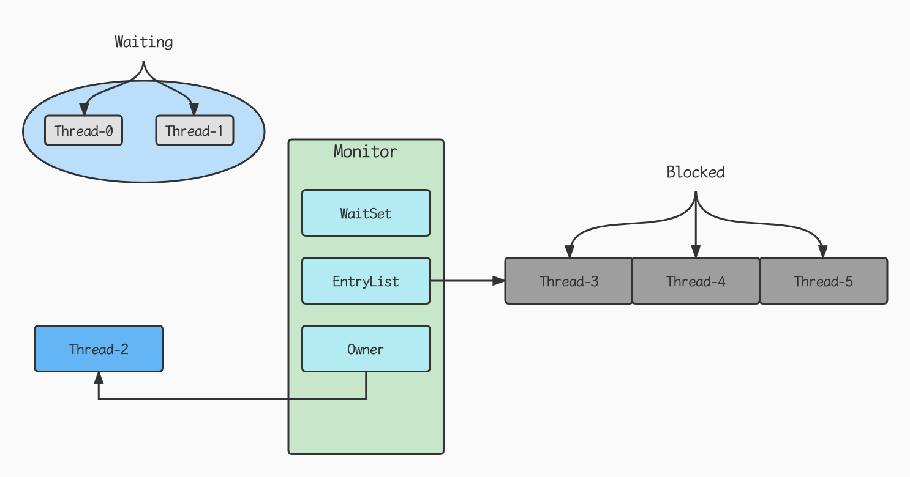
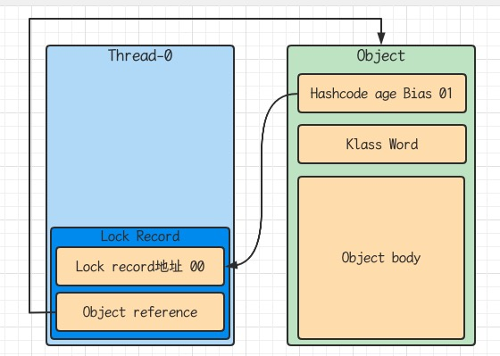
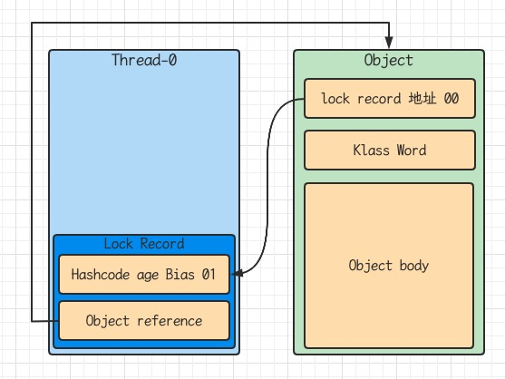
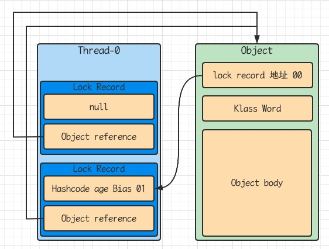
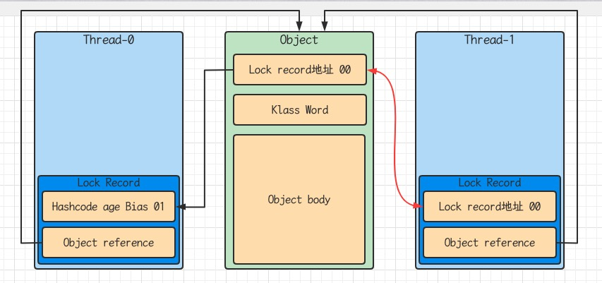
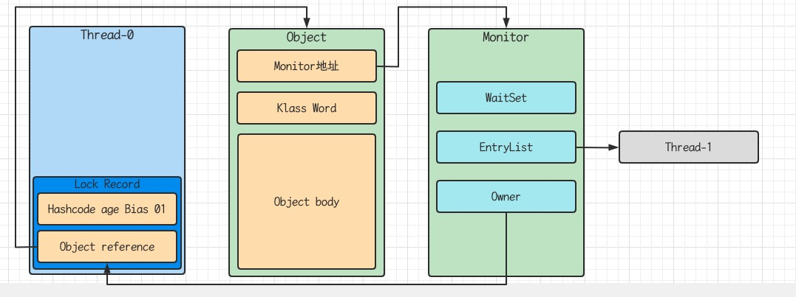

## Java对象头

以32位虚拟机为例

普通对象

<table style="text-align: center">
  <tr>
    <td colspan="2">Object Header(64 bits)</td>
  </tr>
  <tr>
    <td>Mark Word (32 bits)</td>
    <td>Klass Word (32 bits)</td>
  </tr>
</table>

数组对象

<table style="text-align: center">
  <tr>
    <td colspan="3">Object Header(96 bits)</td>
  </tr>
  <tr>
    <td>Mark Word (32 bits)</td>
    <td>Klass Word (32 bits)</td>
    <td>array length (32 bits)</td>
  </tr>
</table>

其中Mark Word结构为

<table style="text-align: center">
  <tr>
    <td colspan="5">Mark Word(32 bits)</td>
    <td>State</td>
  </tr>
  <tr>
    <td colspan="2">hascode:25</td>
    <td>age:4</td>
    <td>biased_lock:0</td>
    <td>01</td>
    <td>Normal</td>
  </tr>
  <tr>
    <td>thread:23</td>
    <td>epoch:2</td>
    <td>age:4</td>
    <td>biased_lock:1</td>
    <td>01</td>
    <td>Biased</td>
  </tr>
  <tr>
    <td colspan="4">ptr_to_lock_recrd:30</td>
    <td>00</td>
    <td>Lightweight Locked</td>
  </tr>
  <tr>
    <td colspan="4">ptr_to_heavyweight_monitor:30</td>
    <td>10</td>
    <td>Heavyweight Locked</td>
  </tr>
  <tr>
  	<td colspan="4"></td>
    <td>11</td>
    <td>Marked for GC</td>
  </tr>
</table>

## Monitor

Monitor被翻译为监视器或管程

每个Java对象都可以关联一个Monitor对象，如果使用synchronized给对象上锁（重量级）之后，该对象头的Mark Word中就被设置指向Monitor对象的指针

Monitor结构如下



- 刚开始Monitor中Owner为null
- 当Thread-2执行synchronized(obj)就会将Monitor的所有者置为Thread-2, Monitor中只能有一个Owner
- 在Thread-2上锁的过程中，如果Thread-3, Thread-4, Thread-5也来执行synchronized(obj)，就会进入EntryList Blocked

- Thread-2执行完同步代码块的内容，然后唤醒EntryList中等待的线程来竞争锁，竞争的时候是非公平的
- 图中WaitSet中的Thread-0, Thread-1是之前获得的锁，但条件不满足进入Waiting状态的现场，后面讲wait-notify时会分析

> synchronized必须是进入同一个对象的monitor才有上述的效果
>
> 不加synchronized的对象不会关联监视器，不遵从以上规则

## synchronized原理

```java
static final Object lock = new Object();
static int counter = 0;
public static void main(String[] args) {
  synchronized (lock) {
    counter++;
  }
}
```

对应的字节码

```java
  public static void main(java.lang.String[]);
    descriptor: ([Ljava/lang/String;)V
    flags: ACC_PUBLIC, ACC_STATIC
    Code:
      stack=2, locals=3, args_size=1
         0: getstatic     #2                  // Field lock:Ljava/lang/Object; lock引用（synchronized开始）
         3: dup
         4: astore_1                          // lock引用 -> slot 1
         5: monitorenter                      //将lock对象MarkWord置为Monitor指针
         6: getstatic     #3                  // Field counter:I i
         9: iconst_1                          //准备常数 1
        10: iadd                              // +1
        11: putstatic     #3                  // Field counter:I i
        14: aload_1                           // lock引用
        15: monitorexit                       // 将lock对象MarkWord重置，唤醒EntryList
        16: goto          24
        19: astore_2                          // e -> slot 2
        20: aload_1                           // lock 引用
        21: monitorexit                       // 将lock对象MarkWord重置，唤醒EntryList
        22: aload_2                           // slot 2
        23: athrow                            // throw e
        24: return
      Exception table:
         from    to  target type
             6    16    19   any
            19    22    19   any
      LineNumberTable:
        line 11: 0
        line 12: 6
        line 13: 14
        line 14: 24
      LocalVariableTable:
        Start  Length  Slot  Name   Signature
            0      25     0  args   [Ljava/lang/String;
      StackMapTable: number_of_entries = 2
        frame_type = 255 /* full_frame */
          offset_delta = 19
          locals = [ class "[Ljava/lang/String;", class java/lang/Object ]
          stack = [ class java/lang/Throwable ]
        frame_type = 250 /* chop */
          offset_delta = 4
    MethodParameters:
      Name                           Flags
      args

```

### 1.轻量级锁

轻量级锁的使用场景：如果一个对象虽然有多线程访问，但多线程访问的时间是错开的（也就是没有竞争），那么可以使用轻量级锁来优化

轻量级锁对使用者是透明的，即语法仍然是synchronized

假设有两个方法同步块，利用同一个对象加锁

```java
static final Object obj = new Object();
public static void method1() {
  synchronized(obj) {
    //同步块A
    method2();
  }
}
public static void method2() {
  synchronized(obj) {
    //同步块B
  }
}
```

- 创建锁记录（Lock Record）对象，每个线程的栈桢都会包含一个锁记录的结构，内部可以存储对象的Mark Work


- 让锁记录中Object reference指向锁对象，并尝试用cas替换Object的Mark Word, 将Mark Word的值存入锁记录



- 如果cas替换成功，对象头中存储了锁记录地址和状态00，表示由该线程给对象加锁，这时图示如下



- 如果cas失败，有两种情况
  - 如果是其它线程已经持有了该Object的轻量级锁，这时表明有竞争，进入锁膨胀过程
  - 如果是自己执行了synchronized锁重入，那么再加一条Lock Record作为重入的计数



- 当退出synchronized代码块（解锁）如果有取值为null的锁记录，表示有重入，这时重置锁记录，表示重入计数减一


- 当退出synchronized代码块（解锁）锁记录值不为null，这时使用cas将Mark Word的值恢复给对象头
  - 成功，则解锁成功
  - 失败，说明轻量级锁进行了锁膨胀或已经升级为重量级锁，进入重量级锁解锁过程

### 2.锁膨胀

如果在尝试加轻量级锁的过程中,CAS操作无法成功，这时一种情况就是有其他线程为此对象加上了轻量级锁（有竞争），这事需要进行锁膨胀，将轻量级锁变为重量级锁

```java
static Object obj = new Object();
public static void method1() {
  synchronized(obj) {
    //同步块
  }
}
```

- 当Thread-1进行轻量级加锁时，Thread-0已经对该对象加了轻量级锁



- 这时Thread-1加轻量级锁失败，进入锁膨胀过程
  - 即为Object对象申请Monitor锁，让Object指向重量级锁地址
  - 然后自己进入Monitor的EntryList BLOCKED



- 当Thread-0退出同步块解锁时，使用cas将Mark Word的值恢复给对象头。失败，这时会进入重量级锁流程，即按照Monitor地址找到Monitor对象，设置Owner为null, 唤醒EntryList中BLOCKED线程

### 3.自旋优化

