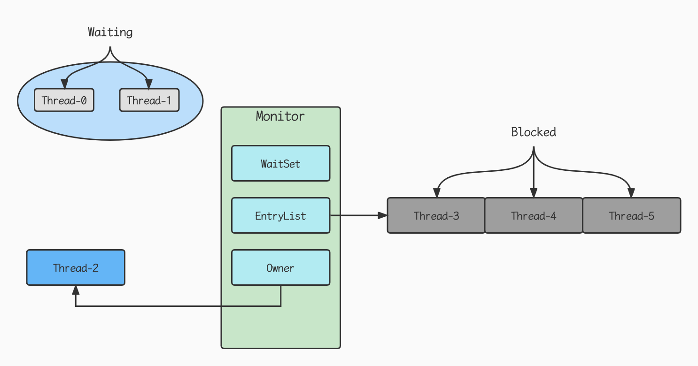
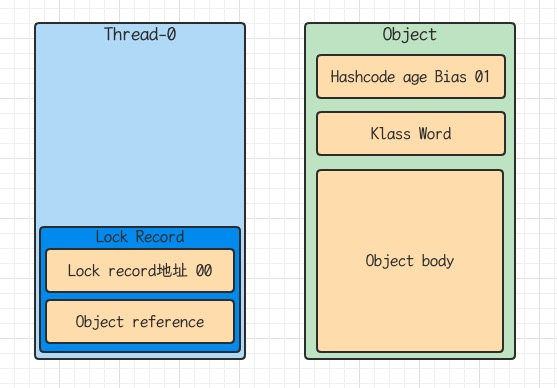
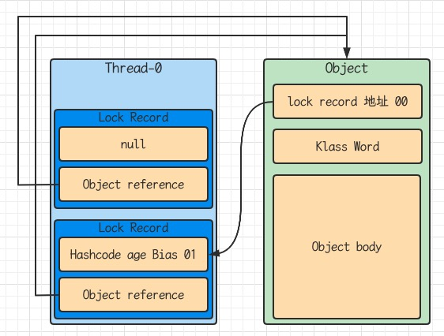

## Java对象头

以32位虚拟机为例

普通对象

<table style="text-align: center">
  <tr>
    <td colspan="2">Object Header(64 bits)</td>
  </tr>
  <tr>
    <td>Mark Word (32 bits)</td>
    <td>Klass Word (32 bits)</td>
  </tr>
</table>

数组对象

<table style="text-align: center">
  <tr>
    <td colspan="3">Object Header(96 bits)</td>
  </tr>
  <tr>
    <td>Mark Word (32 bits)</td>
    <td>Klass Word (32 bits)</td>
    <td>array length (32 bits)</td>
  </tr>
</table>

其中Mark Word结构为

<table style="text-align: center">
  <tr>
    <td colspan="5">Mark Word(32 bits)</td>
    <td>State</td>
  </tr>
  <tr>
    <td colspan="2">hascode:25</td>
    <td>age:4</td>
    <td>biased_lock:0</td>
    <td>01</td>
    <td>Normal</td>
  </tr>
  <tr>
    <td>thread:23</td>
    <td>epoch:2</td>
    <td>age:4</td>
    <td>biased_lock:1</td>
    <td>01</td>
    <td>Biased</td>
  </tr>
  <tr>
    <td colspan="4">ptr_to_lock_record:30</td>
    <td>00</td>
    <td>Lightweight Locked</td>
  </tr>
  <tr>
    <td colspan="4">ptr_to_heavyweight_monitor:30</td>
    <td>10</td>
    <td>Heavyweight Locked</td>
  </tr>
  <tr>
  	<td colspan="4"></td>
    <td>11</td>
    <td>Marked for GC</td>
  </tr>
</table>

## Monitor

Monitor被翻译为监视器或管程

每个Java对象都可以关联一个Monitor对象，如果使用synchronized给对象上锁（重量级）之后，该对象头的Mark Word中就被设置指向Monitor对象的指针

Monitor结构如下



- 刚开始Monitor中Owner为null
- 当Thread-2执行synchronized(obj)就会将Monitor的所有者置为Thread-2, Monitor中只能有一个Owner
- 在Thread-2上锁的过程中，如果Thread-3, Thread-4, Thread-5也来执行synchronized(obj)，就会进入EntryList Blocked

- Thread-2执行完同步代码块的内容，然后唤醒EntryList中等待的线程来竞争锁，竞争的时候是非公平的
- 图中WaitSet中的Thread-0, Thread-1是之前获得的锁，但条件不满足进入Waiting状态的现场，后面讲wait-notify时会分析

> synchronized必须是进入同一个对象的monitor才有上述的效果
>
> 不加synchronized的对象不会关联监视器，不遵从以上规则

## synchronized原理

```java
static final Object lock = new Object();
static int counter = 0;
public static void main(String[] args) {
  synchronized (lock) {
    counter++;
  }
}
```

对应的字节码

```java
  public static void main(java.lang.String[]);
    descriptor: ([Ljava/lang/String;)V
    flags: ACC_PUBLIC, ACC_STATIC
    Code:
      stack=2, locals=3, args_size=1
         0: getstatic     #2                  // Field lock:Ljava/lang/Object; lock引用（synchronized开始）
         3: dup
         4: astore_1                          // lock引用 -> slot 1
         5: monitorenter                      //将lock对象MarkWord置为Monitor指针
         6: getstatic     #3                  // Field counter:I i
         9: iconst_1                          //准备常数 1
        10: iadd                              // +1
        11: putstatic     #3                  // Field counter:I i
        14: aload_1                           // lock引用
        15: monitorexit                       // 将lock对象MarkWord重置，唤醒EntryList
        16: goto          24
        19: astore_2                          // e -> slot 2
        20: aload_1                           // lock 引用
        21: monitorexit                       // 将lock对象MarkWord重置，唤醒EntryList
        22: aload_2                           // slot 2
        23: athrow                            // throw e
        24: return
      Exception table:
         from    to  target type
             6    16    19   any
            19    22    19   any
      LineNumberTable:
        line 11: 0
        line 12: 6
        line 13: 14
        line 14: 24
      LocalVariableTable:
        Start  Length  Slot  Name   Signature
            0      25     0  args   [Ljava/lang/String;
      StackMapTable: number_of_entries = 2
        frame_type = 255 /* full_frame */
          offset_delta = 19
          locals = [ class "[Ljava/lang/String;", class java/lang/Object ]
          stack = [ class java/lang/Throwable ]
        frame_type = 250 /* chop */
          offset_delta = 4
    MethodParameters:
      Name                           Flags
      args

```

### 1.轻量级锁

轻量级锁的使用场景：如果一个对象虽然有多线程访问，但多线程访问的时间是错开的（也就是没有竞争），那么可以使用轻量级锁来优化

轻量级锁对使用者是透明的，即语法仍然是synchronized

假设有两个方法同步块，利用同一个对象加锁

```java
static final Object obj = new Object();
public static void method1() {
  synchronized(obj) {
    //同步块A
    method2();
  }
}
public static void method2() {
  synchronized(obj) {
    //同步块B
  }
}
```

- 创建锁记录（Lock Record）对象，每个线程的栈桢都会包含一个锁记录的结构，内部可以存储对象的Mark Work



- 让锁记录中Object reference指向锁对象，并尝试用cas替换Object的Mark Word, 将Mark Word的值存入锁记录


- 如果cas替换成功，对象头中存储了锁记录地址和状态00，表示由该线程给对象加锁，这时图示如下


- 如果cas失败，有两种情况
  - 如果是其它线程已经持有了该Object的轻量级锁，这时表明有竞争，进入锁膨胀过程
  - 如果是自己执行了synchronized锁重入，那么再加一条Lock Record作为重入的计数



- 当退出synchronized代码块（解锁）如果有取值为null的锁记录，表示有重入，这时重置锁记录，表示重入计数减一


- 当退出synchronized代码块（解锁）锁记录值不为null，这时使用cas将Mark Word的值恢复给对象头
  - 成功，则解锁成功
  - 失败，说明轻量级锁进行了锁膨胀或已经升级为重量级锁，进入重量级锁解锁过程

### 2.锁膨胀

如果在尝试加轻量级锁的过程中,CAS操作无法成功，这时一种情况就是有其他线程为此对象加上了轻量级锁（有竞争），这事需要进行锁膨胀，将轻量级锁变为重量级锁

```java
static Object obj = new Object();
public static void method1() {
  synchronized(obj) {
    //同步块
  }
}
```

- 当Thread-1进行轻量级加锁时，Thread-0已经对该对象加了轻量级锁


- 这时Thread-1加轻量级锁失败，进入锁膨胀过程
  - 即为Object对象申请Monitor锁，让Object指向重量级锁地址
  - 然后自己进入Monitor的EntryList BLOCKED


- 当Thread-0退出同步块解锁时，使用cas将Mark Word的值恢复给对象头。失败，这时会进入重量级锁流程，即按照Monitor地址找到Monitor对象，设置Owner为null, 唤醒EntryList中BLOCKED线程

### 3.自旋优化

重量级锁竞争的时候，还可以使用自旋来进行优化，如果当前线程自旋成功（即这时候持锁线程已经退出了同步块，释放了锁），这时当前线程就可以避免阻塞

自旋重试成功的情况

| 线程1（cpu1上）         | 对象Mark               | 线程2（cpu2上）         |
| ----------------------- | ---------------------- | ----------------------- |
| -                       | 10（重量锁）           | -                       |
| 访问同步块，获取monitor | 10（重量锁）重量锁指针 | -                       |
| 成功（加锁）            | 10（重量锁）重量锁指针 | -                       |
| 执行同步块              | 10（重量锁）重量锁指针 | -                       |
| 执行同步块              | 10（重量锁）重量锁指针 | 访问同步块，获取monitor |
| 执行同步块              | 10（重量锁）重量锁指针 | 自旋重试                |
| 执行完毕                | 10（重量锁）重量锁指针 | 自旋重试                |
| 成功（解锁）            | 01（无锁）             | 自旋重试                |
| -                       | 10（重量锁）重量锁指针 | 成功（加锁）            |
| -                       | 10（重量锁）重量锁指针 | 执行同步块              |

自旋失败的情况

| 线程1（cpu 1上）        | 对象Mark               | 线程2 （cpu 2上）       |
| ----------------------- | ---------------------- | ----------------------- |
| -                       | 10（重量锁）           | -                       |
| 访问同步块，获取monitor | 10（重量锁）重量锁指针 | -                       |
| 成功（加锁）            | 10（重量锁）重量锁指针 | -                       |
| 执行同步块              | 10（重量锁）重量锁指针 | -                       |
| 执行同步块              | 10（重量锁）重量锁指针 | 访问同步块，获取monitor |
| 执行同步块              | 10（重量锁）重量锁指针 | 自旋重试                |
| 执行同步块              | 10（重量锁）重量锁指针 | 自旋重试                |
| 执行同步块              | 10（重量锁）重量锁指针 | 自旋重试                |
| 执行同步块              | 10（重量锁）重量锁指针 | 阻塞                    |

- 在Java6之后自旋锁是自适应的，比如对象刚刚的一次自旋操作成功过，那么认为这次自旋成功的可能性会高，就多自旋几次；反之，就少自旋甚至不自旋，总之，比较智能
- 自旋会占用cpu时间，单核cpu自旋就是浪费，多核cpu自旋才能发挥优势
- Java7之后不能控制是否开启自旋功能

### 4.偏向锁

轻量级锁在没有竞争时（就自己这个线程），每次重入仍然需要执行cas操作

Java6中引入了偏向锁来做进一步优化；只有第一次使用cas将线程ID设置到对象的Mark Word头，之后发现这个线程Id是自己的就表示没有竞争，不用重新cas.以后只有不发生竞争，这个对象就归该线程所有

```java
static final Object obj = new Object();
public static void m1() {
  synchronized(obj) {
    //同步块A
    m2();
  }
}
public static void m2() {
  synchronized(obj) {
    //同步块B
    m3();
  }
}
public static void m3() {
  synchronized(obj) {
    //同步块C
  }
}
```


#### 偏向状态

一个对象创建时:

- 如果开启了偏向锁（默认开启），那么对象创建后，mark word值为0x05即最后3位为101,这时他的thread, epoch, age都为0
- 偏向锁默认是延迟的，不会在程序启动时立即生效，如果想避免延迟，可以加VM参数 -XX:BiasedLockingStartupDelay=0来禁用延迟
- 如果没有开启偏向锁，那么对象创建后，markword值为0x01就最后3位为001，这时他的hashcode, age都为0，第一次用到hashcode时才会赋值

查看对象头示例

引入依赖

```xml
<dependency>
  <groupId>org.openjdk.jol</groupId>
  <artifactId>jol-core</artifactId>
  <version>0.16</version>
</dependency>
```

```java
@Slf4j(topic = "c.TestBiased")
public class TestBiased {
    public static void main(String[] args) throws Exception {
        Dog d = new Dog();
        log.debug(ClassLayout.parseInstance(d).toPrintable());
        Thread.sleep(4000);
        log.debug(ClassLayout.parseInstance(new Dog()).toPrintable());
    }
}
class Dog {}
```

打印结果

```java
18:40:25.348 [main] DEBUG c.TestBiased - com.bytebuf.biased.Dog object internals:
OFF  SZ   TYPE DESCRIPTION               VALUE
  0   8        (object header: mark)     0x0000000000000001 (non-biasable; age: 0)
  8   4        (object header: class)    0xf800ef94
 12   4        (object alignment gap)    
Instance size: 16 bytes
Space losses: 0 bytes internal + 4 bytes external = 4 bytes total

18:40:29.357 [main] DEBUG c.TestBiased - com.bytebuf.biased.Dog object internals:
OFF  SZ   TYPE DESCRIPTION               VALUE
  0   8        (object header: mark)     0x0000000000000005 (biasable; age: 0)  //4秒后再次创建对象为偏向状态
  8   4        (object header: class)    0xf800ef94
 12   4        (object alignment gap)    
Instance size: 16 bytes
Space losses: 0 bytes internal + 4 bytes external = 4 bytes total
```

上面测试代码添加VM参数 -XX:-UseBiasedLocking禁用偏向锁，打印结果为

```java
18:44:22.873 [main] DEBUG c.TestBiased - com.bytebuf.biased.Dog object internals:
OFF  SZ   TYPE DESCRIPTION               VALUE
  0   8        (object header: mark)     0x0000000000000001 (non-biasable; age: 0)
  8   4        (object header: class)    0xf800ef94
 12   4        (object alignment gap)    
Instance size: 16 bytes
Space losses: 0 bytes internal + 4 bytes external = 4 bytes total

18:44:26.879 [main] DEBUG c.TestBiased - com.bytebuf.biased.Dog object internals:
OFF  SZ   TYPE DESCRIPTION               VALUE
  0   8        (object header: mark)     0x0000000000000001 (non-biasable; age: 0) //normal状态
  8   4        (object header: class)    0xf800ef94
 12   4        (object alignment gap)    
Instance size: 16 bytes
Space losses: 0 bytes internal + 4 bytes external = 4 bytes total
```

#### 撤销-调用对象hashCode

调用了对象的hashCode，但偏向锁的对象Mark Word中存储的是线程id，如果调用hashCode会导致偏向锁被撤销

- 轻量级锁会在锁记录中记录hashCode
- 重量级锁会在Monitor中记录hashCode

```java
public class TestBiased {
    public static void main(String[] args) throws Exception {
        Dog d = new Dog();
        log.debug(ClassLayout.parseInstance(d).toPrintable());
        Thread.sleep(4000);
        Dog d1 = new Dog();
        log.debug(ClassLayout.parseInstance(d1).toPrintable());
        d1.hashCode();
        log.debug(ClassLayout.parseInstance(d1).toPrintable());
    }
}
class Dog {}
```

```java
18:50:35.293 [main] DEBUG c.TestBiased - com.bytebuf.biased.Dog object internals:
OFF  SZ   TYPE DESCRIPTION               VALUE
  0   8        (object header: mark)     0x0000000000000001 (non-biasable; age: 0)
  8   4        (object header: class)    0xf800ef94
 12   4        (object alignment gap)    
Instance size: 16 bytes
Space losses: 0 bytes internal + 4 bytes external = 4 bytes total

18:50:39.300 [main] DEBUG c.TestBiased - com.bytebuf.biased.Dog object internals:
OFF  SZ   TYPE DESCRIPTION               VALUE
  0   8        (object header: mark)     0x0000000000000005 (biasable; age: 0)
  8   4        (object header: class)    0xf800ef94
 12   4        (object alignment gap)    
Instance size: 16 bytes
Space losses: 0 bytes internal + 4 bytes external = 4 bytes total

18:50:39.301 [main] DEBUG c.TestBiased - com.bytebuf.biased.Dog object internals:
OFF  SZ   TYPE DESCRIPTION               VALUE
  0   8        (object header: mark)     0x0000002752f6e201 (hash: 0x2752f6e2; age: 0) //调用hashCode方法后，偏向锁状态被撤销
  8   4        (object header: class)    0xf800ef94
 12   4        (object alignment gap)    
Instance size: 16 bytes
Space losses: 0 bytes internal + 4 bytes external = 4 bytes total
```

#### 撤销-其它线程使用对象

当其他线程使用偏向锁对象时，会将偏向锁升级为轻量级锁：添加VM启动参数禁用延迟偏向锁，对象创建的时候就是偏向锁标志：-XX:BiasedLockingStartupDelay=0

```java
@Slf4j
public class TestBiased {
    public static void main(String[] args) throws Exception {
        Dog d = new Dog();
        log.debug(ClassLayout.parseInstance(d).toPrintable());
        new Thread(() -> {
            synchronized (d) {
                log.debug(ClassLayout.parseInstance(d).toPrintable());
            }
            synchronized (TestBiased.class) {
                TestBiased.class.notify();
            }
        }, "t1").start();
        new Thread(() -> {
            synchronized (TestBiased.class) {
                try {
                    TestBiased.class.wait();
                } catch (InterruptedException e) {
                    e.printStackTrace();
                }
            }
            synchronized (d) {
                log.debug(ClassLayout.parseInstance(d).toPrintable()); //t1线程使用了偏向锁对象，此处打印的对象升级为了轻量级锁
            }
        }, "t2").start();
    }
}
class Dog {}
```

打印结果

```java
OFF  SZ   TYPE DESCRIPTION               VALUE
  0   8        (object header: mark)     0x0000000000000005 (biasable; age: 0)
  8   4        (object header: class)    0xf800ef95
 12   4        (object alignment gap)    
Instance size: 16 bytes
Space losses: 0 bytes internal + 4 bytes external = 4 bytes total

21:42:24.247 [t1] DEBUG com.bytebuf.concurrent.TestBiased - com.bytebuf.concurrent.Dog object internals:
OFF  SZ   TYPE DESCRIPTION               VALUE
  0   8        (object header: mark)     0x000001feefa52005 (biased: 0x000000007fbbe948; epoch: 0; age: 0)
  8   4        (object header: class)    0xf800ef95
 12   4        (object alignment gap)    
Instance size: 16 bytes
Space losses: 0 bytes internal + 4 bytes external = 4 bytes total

21:42:24.247 [t2] DEBUG com.bytebuf.concurrent.TestBiased - com.bytebuf.concurrent.Dog object internals:
OFF  SZ   TYPE DESCRIPTION               VALUE
  0   8        (object header: mark)     0x000000439b7ff180 (thin lock: 0x000000439b7ff180)
  8   4        (object header: class)    0xf800ef95
 12   4        (object alignment gap)    
Instance size: 16 bytes
Space losses: 0 bytes internal + 4 bytes external = 4 bytes total
```

#### 撤销-调用 wait/notify

示例与其他线程使用对象一样

#### 批量重偏向

如果对象被多个线程访问，但没有竞争，这时偏向了线程t1的对象仍有机会重新偏向t2,重偏向会重置对象的Thread ID

当撤销偏向锁阈值超过20次后，jvm会觉得，我是不是偏向错了，于是会在给这些对象加锁时重新偏向至加锁线程

```java
public class TestBiased {
    public static void main(String[] args) throws Exception {
        Vector<Dog> list = new Vector<>();
        new Thread(() -> {
            for (int i = 0; i < 30; i++) {
                Dog d = new Dog();
                list.add(d);
                synchronized (d) {
                    log.debug(i + "\t" +ClassLayout.parseInstance(d).toPrintable());
                }
            }
            synchronized (TestBiased.class) {
                TestBiased.class.notify();
            }
        }, "t1").start();
        new Thread(() -> {
            synchronized (TestBiased.class) {
                try {
                    TestBiased.class.wait();
                } catch (InterruptedException e) {
                    e.printStackTrace();
                }
            }
            log.debug("==============================");
            for (int i = 0; i < 30; i++) {
                Dog d = list.get(i);
                synchronized (d) {
                    log.debug(i + "\t" + ClassLayout.parseInstance(d).toPrintable()); 
                }
            }
        }, "t2").start();
    }
}
class Dog {}
```

```java
//t1线程30次打印的都是偏向锁，threadID指向t1
22:18:38.183 [t1] DEBUG com.bytebuf.concurrent.TestBiased - 0	com.bytebuf.concurrent.Dog object internals:
OFF  SZ   TYPE DESCRIPTION               VALUE
  0   8        (object header: mark)     0x0000020a8c588005 (biased: 0x0000000082a31620; epoch: 0; age: 0)
  8   4        (object header: class)    0xf800ef95
 12   4        (object alignment gap)    
Instance size: 16 bytes
Space losses: 0 bytes internal + 4 bytes external = 4 bytes total
......
22:18:38.193 [t1] DEBUG com.bytebuf.concurrent.TestBiased - 29	com.bytebuf.concurrent.Dog object internals:
OFF  SZ   TYPE DESCRIPTION               VALUE
  0   8        (object header: mark)     0x0000020a8c588005 (biased: 0x0000000082a31620; epoch: 0; age: 0)
  8   4        (object header: class)    0xf800ef95
 12   4        (object alignment gap)    
Instance size: 16 bytes
Space losses: 0 bytes internal + 4 bytes external = 4 bytes total

22:18:38.193 [t2] DEBUG com.bytebuf.concurrent.TestBiased - ==============================
//t1线程使用了偏向锁对象，t2线程此处打印的对象升级为了轻量级锁
22:18:38.193 [t2] DEBUG com.bytebuf.concurrent.TestBiased - 0	com.bytebuf.concurrent.Dog object internals:
OFF  SZ   TYPE DESCRIPTION               VALUE
  0   8        (object header: mark)     0x0000008e76dfef00 (thin lock: 0x0000008e76dfef00)
  8   4        (object header: class)    0xf800ef95
 12   4        (object alignment gap)    
Instance size: 16 bytes
Space losses: 0 bytes internal + 4 bytes external = 4 bytes total 
......

22:18:38.198 [t2] DEBUG com.bytebuf.concurrent.TestBiased - 18	com.bytebuf.concurrent.Dog object internals:
OFF  SZ   TYPE DESCRIPTION               VALUE
  0   8        (object header: mark)     0x0000008e76dfef00 (thin lock: 0x0000008e76dfef00)
  8   4        (object header: class)    0xf800ef95
 12   4        (object alignment gap)    
Instance size: 16 bytes
Space losses: 0 bytes internal + 4 bytes external = 4 bytes total
// 第20次打印，发现t1线程不跟t2线程竞争锁对象了，此时对象又变为了偏向锁，threadID指向t2
22:18:38.198 [t2] DEBUG com.bytebuf.concurrent.TestBiased - 19	com.bytebuf.concurrent.Dog object internals:
OFF  SZ   TYPE DESCRIPTION               VALUE
  0   8        (object header: mark)     0x0000020a8c588905 (biased: 0x0000000082a31622; epoch: 0; age: 0)
  8   4        (object header: class)    0xf800ef95
 12   4        (object alignment gap)    
Instance size: 16 bytes
Space losses: 0 bytes internal + 4 bytes external = 4 bytes total

```

