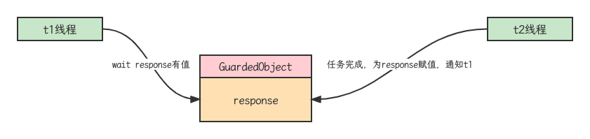
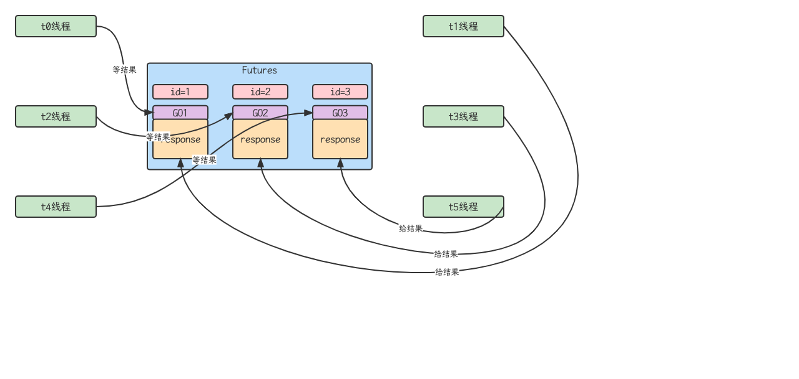
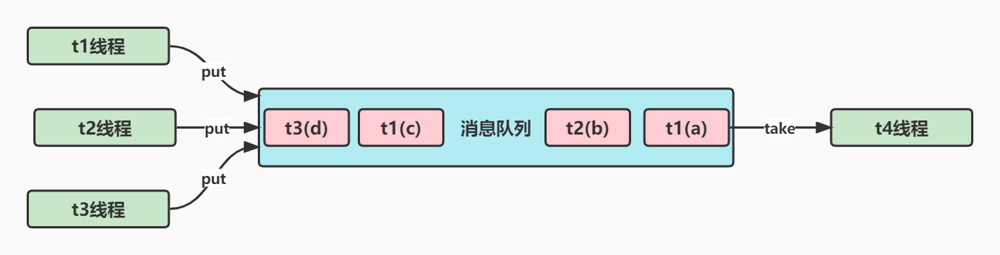

## wait-notify 原理


- Owner线程发现条件不满足，调用wait方法，即可进入WaitSet变为WAITING状态
- BLOCKED和WAITING的线程都处于阻塞状态，不占用CPU时间片
- BLOCKED线程会在Owner线程释放锁时唤醒
- WAITING线程会在Owner线程调用notify或notifyAll时唤醒，但唤醒后并不意味这立刻获得锁，扔需进入EntiryList重新竞争

## API介绍

- obj.wait()让进入object监视器的线程到waitSet等待
- obj.notify()让object上正在waitSet等待的线程中挑一个唤醒
- obj.notify()让object上正在waitSet等待的线程全部唤醒
- 他们都是线程之间进行协作的手段，都属于Object对象的方法。必须获得此对象的锁，才能调用这几个方法

## wait notify的使用方式

### sleep(long n)和wait(long n)的区别

- sleep是Thread方法，而wait是Object的方法
- sleep不需要强制和synchronized配合使用，但wait需要和synchronized一起用
- sleep在睡眠的同时，不会释放对象锁，但wait在等待的时候会释放对象锁

### 使用模板

```java
synchronized(lock) {
  while(条件不成立) {
    lock.wait();
  }
  // do work
}
//另一个线程
synchronized(lock) {
  lock.notifyAll();
}
```

## 同步模式之保护性暂停

### 定义

即Guarded Suspension, 用在一个线程等待另一个线程的执行结果

- 有一个结果需要从一个线程传递到另一个线程，让他们关联同一个GuardedObject
- 如果有结果不断从一个线程到另一个线程那么可以使用消息队列（生产者、消费者）
- JDK中，join的实现，Future的实现，采用的就是此模式
- 因为要等待另一方的结果，因此归类到同步模式



### 实现

```java
public class GuardedObject {
    private Object response;
    public Object get() {
        synchronized (this) {
            while (response == null) {
                try {
                    this.wait();
                } catch (InterruptedException e) {
                    e.printStackTrace();
                }
            }
            return response;
        }
    }
    public Object get(long timeout) {
        synchronized (this) {
            long begin = System.currentTimeMillis();
            //经历的时间
            long passedTime = 0;
            while (response == null) {
                // 经历的时间超过了最大等待时间，退出循环
                if (passedTime >= timeout) {
                    break;
                }
                try {
                    this.wait(timeout - passedTime);
                } catch (InterruptedException e) {
                    e.printStackTrace();
                }
                passedTime = System.currentTimeMillis() - begin;
            }
            return response;
        }
    }
    public void complete(Object response) {
        synchronized (this) {
            this.response = response;
            this.notifyAll();
        }
    }
}
public class Downloader {
    public static List<String> download() throws IOException {
        HttpURLConnection connection = (HttpURLConnection) new URL("https://www.baidu.com").openConnection();
        List<String> lines = new ArrayList<>();
        try(BufferedReader reader = new BufferedReader(new InputStreamReader(connection.getInputStream(), StandardCharsets.UTF_8))) {
            String line;
            while ((line = reader.readLine()) != null) {
                lines.add(line);
            }
        }
        return lines;
    }
}
@Slf4j
public class Test {
    public static void main(String[] args) {
        GuardedObject guardedObject = new GuardedObject();
        new Thread(() -> {
            log.debug("等待结果");
            Object result = guardedObject.get(1000);
            log.debug("结果: {}", result);
        }, "t1").start();
        new Thread(() -> {
            log.debug("执行下载");
            try {
                List<String> download = Downloader.download();
                guardedObject.complete(download);
            } catch (IOException e) {
                e.printStackTrace();
            }
        }, "t2").start();
    }
}
```

### join原理

是调用者轮询检查线程alive状态

`t.join()`

等价于下面的代码

```java
synchronized (t1) {
 // 调用者线程进入 t1 的 waitSet 等待, 直到 t1 运行结束
 while (t1.isAlive()) {
 	t1.wait(0);
 }
}
```

> join体现的是【保护性暂停】模式

### 扩展

图中Futures就好比居民楼一层的信箱（每个信箱有房间编号），左侧的t0, t2, t4就好比等待邮件的居民，右侧的t1, t3, t5就好比邮递员

如果需要再多个类之间使用GuardedObject对象，作为参数传递不是很方便，因此设计一个用来解耦的中间类，这样不仅能够解耦【结果等待者】和【结果生产者】，还能够同时支持多个任务的管理



```java
public class Mailboxes {
    private static Map<Integer, GuardedObject> boxes = new Hashtable<>();
    private static int id = 1;
    private static synchronized int generateId() {
        return id++;
    }
    public static GuardedObject createGuardedObject() {
        GuardedObject go = new GuardedObject(generateId());
        boxes.put(go.getId(), go);
        return go;
    }
    public static GuardedObject getGuardedObject(int id) {
        return boxes.get(id);
    }
    public static Set<Integer> getIds() {
        return boxes.keySet();
    }
}
@Slf4j
public class People extends Thread {
    @Override
    public void run() {
        //收信
        GuardedObject guardedObject = Mailboxes.createGuardedObject();
        log.debug("开始收信 id: {}", guardedObject.getId());
        Object mail = guardedObject.get();
        log.debug("收到信 id: {}, 内容: {}", guardedObject.getId(), mail);
    }
}
@Slf4j
public class Postman extends Thread {
    private int id;
    private String mail;
    public Postman(int id, String mail) {
        this.id = id;
        this.mail = mail;
    }
    @Override
    public void run() {
        //送信
        GuardedObject guardedObject = Mailboxes.getGuardedObject(id);
        log.debug("送信 id: {}, 内容: {}", id, mail);
        guardedObject.complete(mail);
    }
}
@Slf4j
public class Test {
    public static void main(String[] args) throws Exception {
        for (int i = 0; i < 3; i++) {
            new People().start();
        }
        Thread.sleep(1000);
        for (Integer id : Mailboxes.getIds()) {
            new Postman(id, "内容" + id).start();
        }
    }
}
```

## 异步模式之生产者/消费者

### 定义

- 与前面的保护性暂停中的GuardedObject不同，不需要产生和消费结果一样的线程一一对应
- 消费队列可以用来平衡生产和消费的线程资源
- 生产者仅负责产生结果数据，不关心数据该如何处理，而消费者专心处理结果数据
- 消息队列是有容量限制的，满时不会再加入数据，空时不会再消耗数据
- JDK中各种阻塞队列，采用的就是这种模式



### 实现

```java
@AllArgsConstructor
@ToString
public final class Message {
    @Getter
    private int id;
    @Getter
    private Object value;
}
@Slf4j
public class MessageQueue {
    private LinkedList<Message> list = new LinkedList<>();
    private int capacity;
    public MessageQueue(int capacity) {
        this.capacity = capacity;
    }
    public Message take() {
        synchronized (list) {
            //判断队列是否为空
            while (list.isEmpty()) {
                try {
                    log.debug("队列为空，消费者线程等待");
                    list.wait();
                } catch (InterruptedException e) {
                    e.printStackTrace();
                }
                //从队列头部获取消息并返回
                Message message = list.removeFirst();
                log.debug("已消费消息: {}", message);
                list.notifyAll();
                return message;
            }
        }
        return null;
    }
    public void put(Message message) {
        synchronized (list) {
            //检查队列是否已满
            while (list.size() == capacity) {
                try {
                    log.debug("队列已满，生产者线程等待");
                    list.wait();
                } catch (InterruptedException e) {
                    e.printStackTrace();
                }
            }
            //将消息加入队列尾部
            list.addLast(message);
            log.debug("已生产消息 {}", message);
            list.notifyAll();
        }
    }
}
public class TestMessage {
    public static void main(String[] args) {
        MessageQueue queue = new MessageQueue(2);
        for (int i = 0; i < 3; i++) {
            int id = i;
            new Thread(() -> {
                queue.put(new Message(id, "值" + id));
            }, "生产者" + i).start();
        }
        new Thread(() -> {
            Message message = queue.take();
        }, "消费者").start();
    }
}
```

