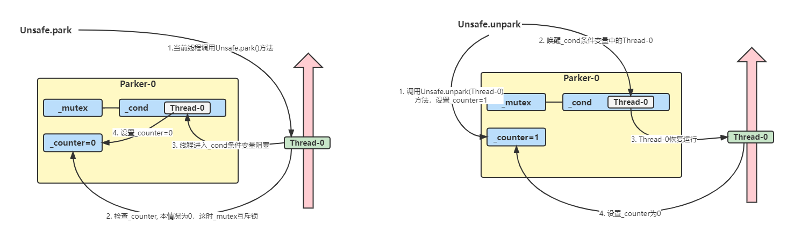

## 基本使用

他们是LockSupport类中的方法

```java
//暂停当前线程
LockSupport.park();

//恢复某个线程的运行
LockSupport.unpark(暂停线程对象);
```

先park再unpark

```java
@Slf4j
public class TestPark {
    public static void main(String[] args) {
        Thread t1 = new Thread(() -> {
            log.debug("start...");
            sleep(1000);
            log.debug("park...");
            LockSupport.park();
            log.debug("resume...");
        }, "t1");
        t1.start();
        sleep(2000);
        log.debug("unpark...");
        LockSupport.unpark(t1);
    }
    private static void sleep(long time) {
        try {
            Thread.sleep(time);
        } catch (InterruptedException e) {
            e.printStackTrace();
        }
    }
}
```

## 特点

与Object的wait & notify相比

- wait, notify和notifyAll必须配合Object Monitor一起使用，而park, unpark不必
- park & unpark 是以线程为单位来【阻塞】和【唤醒】线程，而notify只能随机唤醒一个等待线程
- park & unpark可以先unpark, 而wait & notify不能先notify

## 原理

每个线程都有自己的一个Parker对象，由三部分组成_counter, _cond, 和 _mutex

- 线程就像一个旅人，Parker就像他随身携带的背包，条件变量就好比背包中的帐篷。 _counter就好比背包中的备用干粮（0为耗尽，1为充足）
- 调用park就是要看需不需要停下来歇息
  - 如果备用干粮耗尽，那么钻进帐篷歇息
  - 如果备用干粮充足，那么不需要停留，继续前进
- 调用unpark,就好比令干粮充足
  - 如果这时线程还在帐篷，就唤醒让他继续前进
  - 如果这时线程还在运行，那么下次他调用park时，仅是耗掉备用干粮，不需要停留继续前进
  - 因为背包空间有限，多次调用unpark仅会补充一份备用干粮

