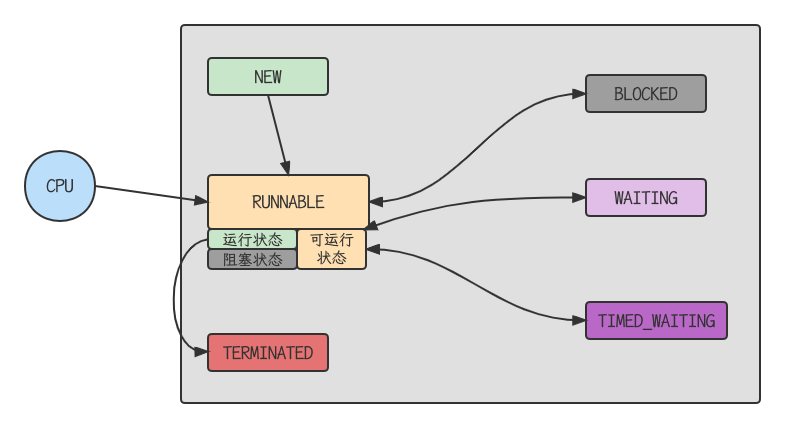

## NEW --> RUNNABLE

- 当调用t.start()方法时，由NEW --> RUNNABLE

## RUNNABLE <--> WAITING

### case1

t线程用synchronized(obj)获取了对象锁后

- 调用obj.wait()方法，t线程从RUNNABLE --> WAITING
- 调用obj.notify(), obj.notifyAll(), t.interrupt()时
  - 竞争锁成功，t线程从 WAITING  -->  RUNNABLE
  - 竞争锁失败，t线程从 WAITING --> BLOCKED

```java
@Slf4j
public class TestWaitNotify {
    final static Object obj = new Object();
    public static void main(String[] args) throws Exception {
        new Thread(() -> {
            synchronized (obj) {
                log.debug("执行...");
                try {
                    //让线程在obj上一直等待下去
                    obj.wait();
                } catch (InterruptedException e) {
                    throw new RuntimeException(e);
                }
                log.debug("其它代码");
            }
        }, "t1").start();
        new Thread(() -> {
            synchronized (obj) {
                log.debug("执行...");
                try {
                    obj.wait();
                } catch (InterruptedException e) {
                    throw new RuntimeException(e);
                }
                log.debug("其它代码");
            }
        }, "t2").start();
        Thread.sleep(10);
        log.debug("唤醒obj上其他线程");
        synchronized (obj) {
            obj.notifyAll();
        }
    }
}
```

### case2

- 当线程调用t.join()方法时，当前线程从RUNNABLE --> WAITING

> 注意是当前线程在t线程对象的监视器上等待

- t线程运行结束，或调用了当前线程的interrupt()时，当前线程从WAITING --> RUNNABLE

### case3

- 当前线程调用LockSupport.park()方法会让当前线程从RUNNABLE --> WAITING
- 调用LockSupport.unpark(目标线程)或调用了线程的interrupt(),会让目标线程从 WAITING --> RUNNABLE

## RUNNABLE <--> TIMED_WAITING

### case1

t线程用synchronized(obj)获取了对象锁后

- 调用obj.wait(long n)方法时，t线程从RUNNABLE --> TIMED_WAITING
- t线程等待时间超过了n毫秒，或调用obj.notify(), obj.notifyAll(), t.interrupt()时
  - 竞争锁成功，t线程从TIMED_WAITING --> RUNNABLE
  - 竞争锁失败，t线程从TIMED_WAITING --> BLOCKED

### case2

- 当前线程调用t.join(long n)方法时，当前线程从RUNNABLE --> TIMED_WAITING

> 注意是当前线程在t线程对象的监视器上等待

- 当前线程等待的时间超过了n毫秒，或t线程运行结束，或调用了当前线程的interrupt()时，当前线程从TIMED_WAITING --> RUNNABLE

### case3

- 当前线程调用Thread.sleep(long n),当前线程从RUNNABLE --> TIMED_WAITING
- 当前线程等待时间超过了n毫秒，当前线程从TIMED_WAITING --> RUNNABLE

### case4

- 当前线程调用LockSupport.parkNanos(long nanos)或LockSupport.parkUtil(long millis)时，当前线程从RUNNABLE --> TIMED_WAITING
- 调用LockSupport.unpark(目标线程)或调用了线程的interrupt()时，或是等待超时，会让目标线程从TIMED_WAITING --> RUNNABLE

## RUNNABLE <--> BLOCKED

- t线程用synchronized(obj)获取了对象锁时如果竞争失败，从RUNNABLE --> BLOCKED
- 持obj锁线程的同步代码块执行完毕，会唤醒该对象上所有BLOCKED的线程重新竞争，如果其中t线程竞争成功，从BLOCKED --> RUNNABLE，其他失败的线程仍然BLOCKED

## RUNNABLE --> TERMINATED

- 当前线程所有代码执行完毕，进入TERMINATED