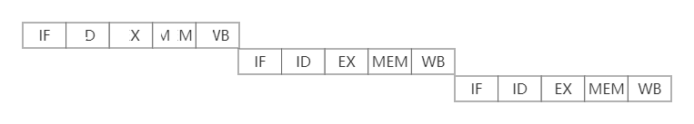
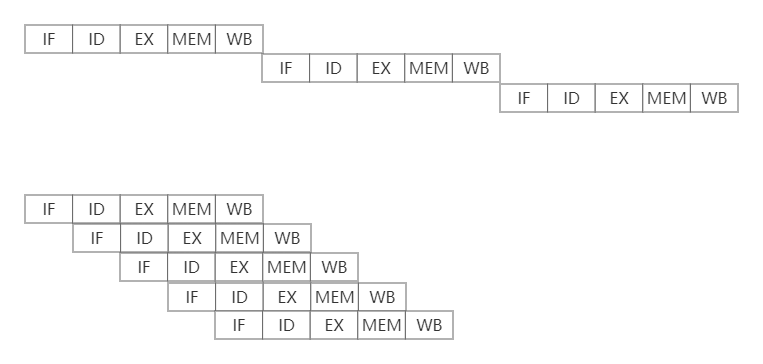
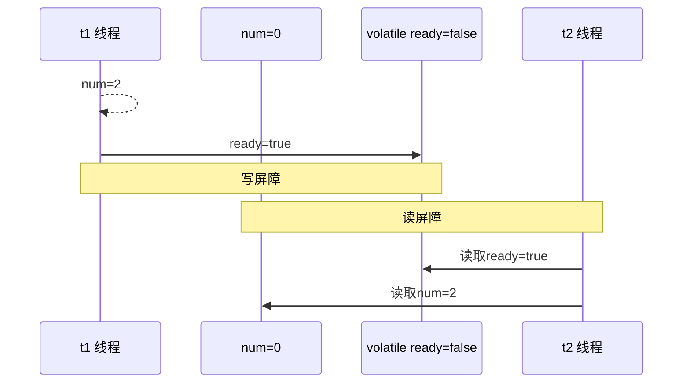
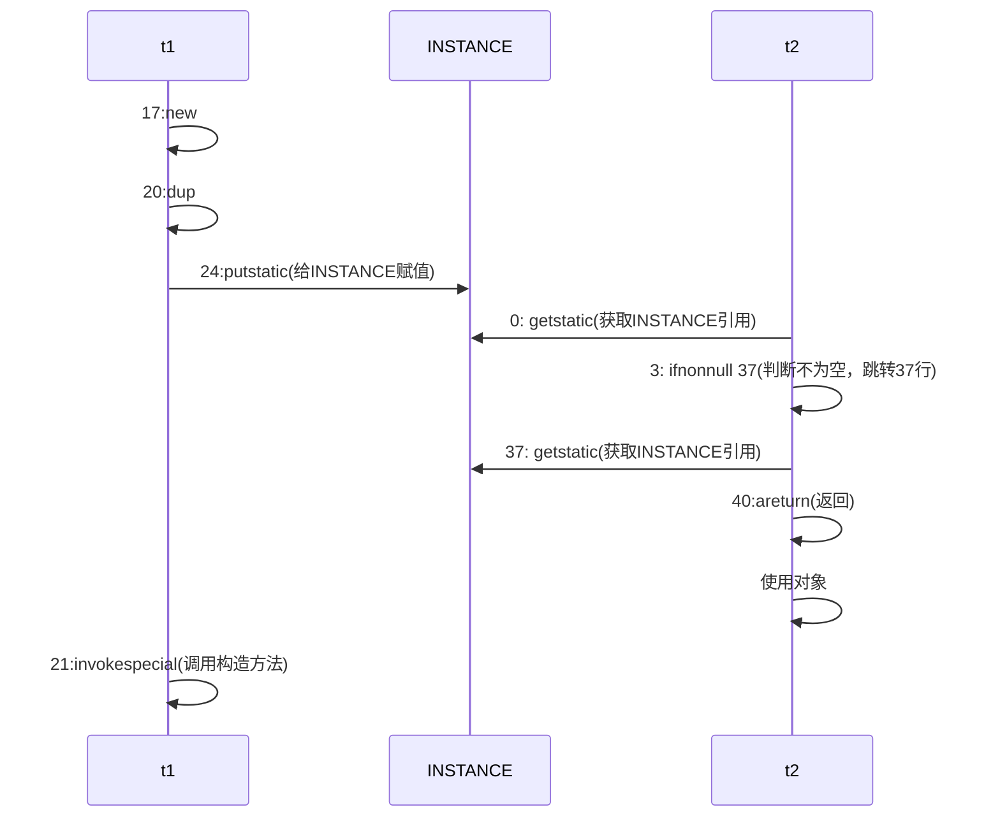

## Java内存模型

JMM即Java Memory Model, 它定义了主存、工作内存抽象概念，底层对应着CPU寄存器、缓冲、硬件内存、CPU指令优化等

JMM体现在以下几个方面

- 原子性-保证指令不会受到线程上下文切换的影响
- 可见性-保证指令不会受到CPU缓存的影响
- 有序性-保证指令不会受到CPU指令并行优化的影响

## 终止模式之两阶段终止

- 利用isInterrupted

```java
@Slf4j
public class TwoPhaseTermination {
    //监控线程
    private Thread monitorThread;
    //启动线程
    public void start() {
        monitorThread = new Thread(() -> {
            while (true) {
                Thread current = Thread.currentThread();
                //是否被打断
                if (current.isInterrupted()) {
                    log.debug("料理后事");
                    break;
                }
                try {
                    Thread.sleep(1000);
                } catch (InterruptedException e) {
                    //因为sleep出现异常后，会清除打断标记
                    //需要重置打断标记
                    current.interrupt();
                }
            }
        }, "monitor");
        monitorThread.start();
    }
    public void stop() {
        monitorThread.interrupt();
    }
    public static void main(String[] args) {
        TwoPhaseTermination twoPhaseTermination = new TwoPhaseTermination();
        twoPhaseTermination.start();
        twoPhaseTermination.stop();
    }
}
```

- 利用停止标记

```java
@Slf4j
public class TwoPhaseTermination {
    //监控线程
    private Thread monitorThread;
    // 判断是否执行过start方法
    private volatile boolean stop = false;
    //启动线程
    public void start() {
        monitorThread = new Thread(() -> {
            while (true) {
                Thread current = Thread.currentThread();
                if (stop) {
                    log.debug("料理后事");
                    break;
                }
                try {
                    Thread.sleep(1000);
                } catch (InterruptedException e) {
                    //因为sleep出现异常后，会清除打断标记
                    //需要重置打断标记
                    current.interrupt();
                }
            }
        }, "monitor");
        monitorThread.start();
    }
    public void stop() {
        stop = true;
        monitorThread.interrupt();
    }
    public static void main(String[] args) throws InterruptedException {
        TwoPhaseTermination twoPhaseTermination = new TwoPhaseTermination();
        twoPhaseTermination.start();
        twoPhaseTermination.start();
        Thread.sleep(3000);
        log.debug("停止监控");
        twoPhaseTermination.stop();
        twoPhaseTermination.stop();
    }
}
```

## 同步模式之Balking

Balking(犹豫)模式用在一个线程发现另一个线程或本线程已经做了某一件相同的事，那么本线程就无需要再做了，直接结束返回

```java
public class MonitorService {
    //用来表示是否已经有线程已经在执行启动了
    private volatile boolean starting;
    public void start() {
        log.info("尝试启动监控线程...");
        synchronized(this) {
            if(starting) {
                return;
            }
            starting = true;
        }
        //真正启动监控线程
    }
}
```

它还经常用来实现线程安全的单例

```java
public final class Singleton {
    private Singleton(){}
    private static Singleton INSTANCE = null;
    public static synchronized Singleton getInstance() {
        if (INSTANCE != null) {
            return INSTANCE;
        }
        INSTANCE = new Singleton();
        return INSTANCE;
    }
}
```

对比保护性暂停模式：保护性暂停模式用在一个线程等待另一个线程的执行结果，当条件不满足时线程等待

## 有序性

JVM会在不影响正确性的前提下，可以调整语句的执行顺序

```java
static int i;
static int j;
//在某个线程内执行如下赋值操作
i = ...;
j = ...;
```

可以看到，至于是先执行i, 还是先执行j, 对最终的结果不会产生影响。所以，上面代码真正执行是，既可以是

```java
i = ...;
j = ...;
```

也可以是

```java
j = ...;
i = ...;
```

这种特性称之为【指令重排】，多线程下【指令重排】会影响正确性。为什么要有指令重排这项优化呢？从CPU执行指令的原理来解释一下吧

### 指令重排序优化

事实上，现代处理器会设计为一个时钟周期完成一条执行时间最长的CPU指令，为什么这样做呢？可以想到指令还可以再划分成一个个更小的阶段，例如，每条指令都可以分为：取指令-指令译码-执行指令-内存访问-数据写回这5个阶段

- instruction fetch(IF)
- instruction decode(ID)
- execute(EX)
- memory access(MEM)
- register write back(WB)



在不改变程序结果的前提下，这些指令的各个阶段可以通过重排序来实现指令级并行，这一技术在80's中叶到90's中叶占据了计算机架构的重要地位

> 分阶段，分工是提升效率的关键

指令重排的前提是，重排指令不能影响结果，例如

```java
//可以重排的例子
int a = 10; //指令1
int b = 20; //指令2
System.out.println(a + b);
//不能重排的例子
int a = 10; //指令1
int b = a - 5; // 指令2
```

### 支持流水线的处理器

现代CPU支持多级指令流水线，例如支持同时执行取指令 - 指令译码 - 执行指令 - 内存访问 - 数据写回的处理器，就可以称之为五级指令流水线。这时CPU可以在一个时钟周期内，同时运行五条指令的不同阶段（相当于一条执行时间最长的复杂指令），IPC=1,本质上流水线技术并不能缩短单挑指令的执行时间，但它变相地提高了指令吞吐率

> 奔腾四(Pentium 4)支持高达35级流水线，但由于功耗太高被废弃



## volatile原理

volatile地底层实现原理是内存屏障，Memory Barrier(Memory Fence)

- 对volatile变量地写指令后会加入写屏障
- 对volatile变量地读指令前会加入读屏障

### 如何保证可见性

- 写屏障(sfence)保证在该屏障之前地，对变量地改动，都同步到主存中

```java
public void actor2(I_Result r) {
    num = 2;
    read = true; // ready是volatile赋值带写屏障
    // 写屏障
}
```

- 而读屏障(lfence)保证在该屏障之后，对共享变量地读取，加载的是主存中最新数据

```java
public void actor() {
    //读屏障
    // ready是volatile读取值带读屏障
    if (ready) {
       r.r1 = num + num; 
    } else {
       r.r1 = 1;
    }
}
```



volatile不能解决指令交错：

- 写屏障仅仅是保证之后的读取能够读到最新的结果，但不能保证读跑到它前面去
- 而有序性的保证也只是保证了本线程内相关代码不被重排序

### double-checked locking问题

以著名的double-checked locking单例模式为例

```java
public final class Singleton {
    private Singleton(){}
    private static Singleton INSTANCE = null;
    public static Singleton getInstance() {
        if (INSTANCE == null) {
            synchronized(Singleton.class) {
                if (INSTANCE == null) {
                    INSTANCE = new Singleton();
                }
            }
        }
        return INSTANCE;
    }
}
```

以上的实现特点是

- 懒惰实例化
- 首次使用getInstance()才使用synchronized加锁，后续使用时无需加锁
- 有隐含的，但很关键的一点：第一个if使用了INSTANCE变量，是在同步块之外

但在多线程环境下，上面的代码是有问题的，getInstance方法对应的字节码为：

```java
 0 getstatic #2 <com/bytebuf/concurrent/Singleton.INSTANCE : Lcom/bytebuf/concurrent/Singleton;>
 3 ifnonnull 37 (+34)
 6 ldc #3 <com/bytebuf/concurrent/Singleton>
 8 dup
 9 astore_0
10 monitorenter
11 getstatic #2 <com/bytebuf/concurrent/Singleton.INSTANCE : Lcom/bytebuf/concurrent/Singleton;>
14 ifnonnull 27 (+13)
17 new #3 <com/bytebuf/concurrent/Singleton>
20 dup
21 invokespecial #4 <com/bytebuf/concurrent/Singleton.<init> : ()V>
24 putstatic #2 <com/bytebuf/concurrent/Singleton.INSTANCE : Lcom/bytebuf/concurrent/Singleton;>
27 aload_0
28 monitorexit
29 goto 37 (+8)
32 astore_1
33 aload_0
34 monitorexit
35 aload_1
36 athrow
37 getstatic #2 <com/bytebuf/concurrent/Singleton.INSTANCE : Lcom/bytebuf/concurrent/Singleton;>
40 areturn
```



关键在于0:getstatic这行代码在monitor控制之外，它就像之前举例中不守规则的人，可以越过monitor读取INSTANCE变量的值

这时t1还未完全将构造方法执行完毕，如果在构造方法中要执行很多初始化操作，那么t2拿到的将是一个未初始化完毕的单例

对INSTANCE使用volatile修饰即可，可以禁用指令重排，但要注意在JDK5以上的版本volatile才会真正有效