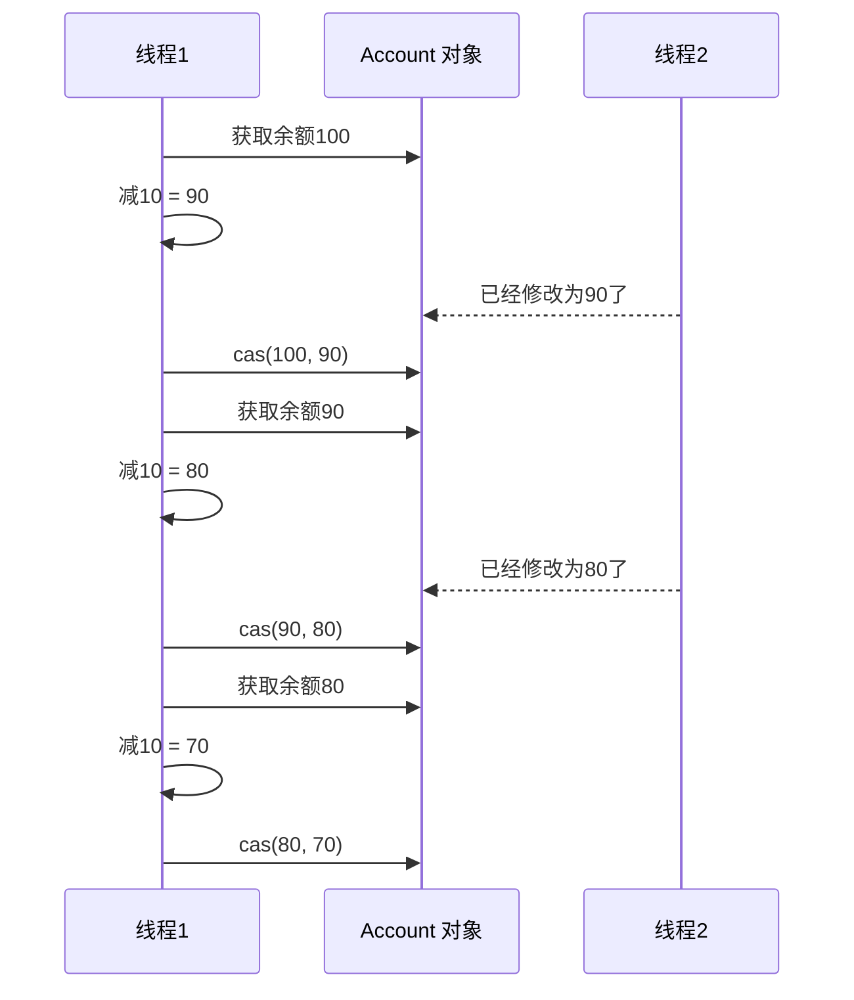
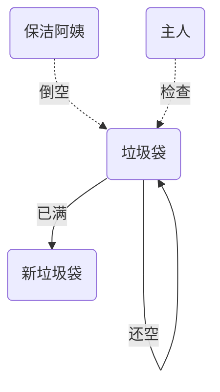
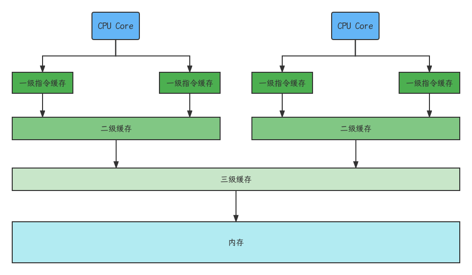
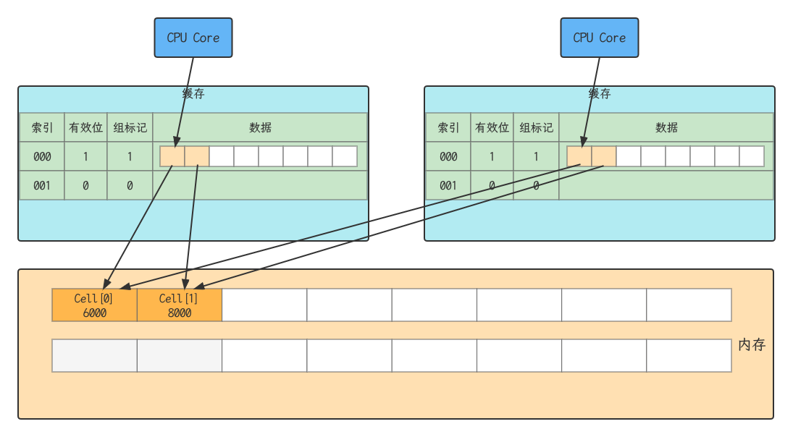
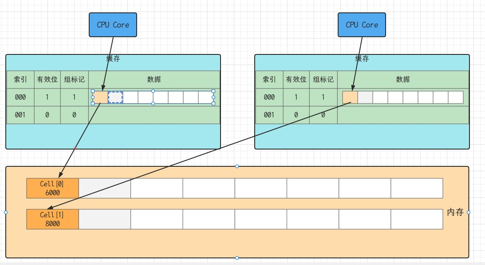
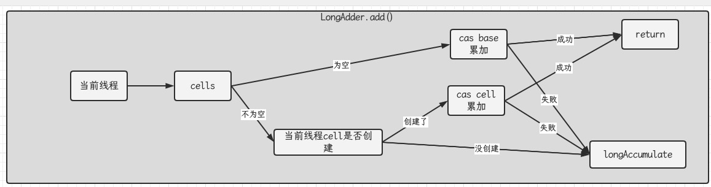
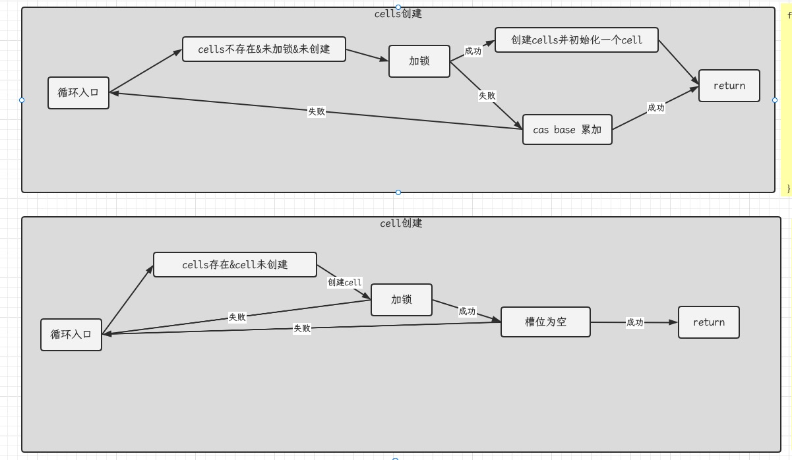
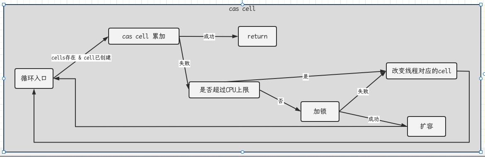

- CAS与volatile
- 原子整数
- 原子引用
- 原子累加器
- Unsafe

## 问题提出

有如下需求，保证account.withdraw()取款方法的线程安全

```java
public interface Account {
    //获取余额
    Integer getBalance();
    //取款
    void withdraw(Integer amount);
    /**
     * 方法内启动1000个线程，每个线程做-10元的操作
     * 如果初始月为10000，那么正确的结果应当是0
     */
    static void demo(Account account) {
        List<Thread> ts = new ArrayList<>();
        long start = System.nanoTime();
        for (int i = 0; i < 1000; i++) {
            ts.add(new Thread(() -> {
                account.withdraw(10);
            }));
        }
        ts.forEach(Thread::start);
        ts.forEach(t -> {
            try {
                t.join();
            } catch (InterruptedException e) {
                e.printStackTrace();
            }
        });
        System.out.println(account.getBalance() + " cost:" + (System.nanoTime() - start)/1000_000 + "ms");
    }
}
public class AccountUnsafe implements Account {
    private Integer balance;

    public AccountUnsafe(Integer balance) {
        this.balance = balance;
    }

    @Override
    public Integer getBalance() {
        return this.balance;
    }

    @Override
    public void withdraw(Integer amount) {
        this.balance -= amount;
    }
}
public class TestAccount {
    public static void main(String[] args) {
        Account account = new AccountUnsafe(10000);
        Account.demo(account);
    }
}
```

打印结果大于0

解决方案

```java
public class AccountCas implements Account {
    private AtomicInteger balance;

    public AccountCas(Integer balance) {
        this.balance = new AtomicInteger(balance);
    }

    @Override
    public Integer getBalance() {
        return this.balance.get();
    }

    @Override
    public void withdraw(Integer amount) {
        while (true) {
            // 获取余额的最新值
            int prev = balance.get();
            // 要修改的余额
            int next = prev - amount;
            // 真正修改
            if (balance.compareAndSet(prev, next)) {
                break;
            }
        }
    }
}
```

## CAS与volatile

前面看到的AtomicInteger的解决方法，内部并没有用锁来保护共享变量的线程安全，那么它是如何实现呢？

```java
    @Override
    public void withdraw(Integer amount) {
        while (true) {
            // 获取余额的最新值
            int prev = balance.get();
            // 要修改的余额
            int next = prev - amount;
            // 真正修改
            if (balance.compareAndSet(prev, next)) {
                break;
            }
        }
    }
```

其中关键的是compareAndSet,它的简称就是CAS(也有Compare And Swap的说法)，它必须是原子操作



>  注意
>
> 其实CAS的底层是lock cmpxchg指令（X86架构），在单核CPU和多核CPU下都能够保证【比较-交换】的原子性
>
> 在多核状态下，某个执行到带lock的指令时，CPU会让总线锁住，当这个核把此指令执行完毕，再开启总线。这个过程中不会被线程的调度机制所打断，保证了多个线程对内存操作的准确行，是原子的。

### volatile

获取共享变量时，为了保证该变量的可见性，需要使用volatile修饰

它可以用来修饰成员变量核静态成员变量，它可以避免线程从自己的工作缓存中查找变量的值，必须到主存中获取它的值，线程操作volatile变量都是直接操作主存。即一个线程对volatile变量的修改，对另一个线程可见

> 注意
>
> volatile仅仅保证了共享变量的可见性，让其他线程能够看到最新值，但不能解决指令交错问题（不能保证原子性）

CAS必须借助volatile才能读取到共享变量的最新值来实现【比较并交换】的效果

### 为什么无锁效率高

- 无锁情况下，即使重试失败，线程始终在高速运行，没有停歇，而synchronized会让线程在没有获得锁的时候，发生上下文切换，进入阻塞。
- 线程就好像高速跑道上的赛车，高速运行时，速度超快，一旦发生上下文切换，就好比赛车要减速，熄火，等被重新唤醒又得重新打火、启动、加速。。。恢复到高速运行，代价比较大
- 但无锁情况下，因为线程要保持运行，需要额外CPU的支持，CPU在这里就好比高速跑道，没有额外的跑道，线程想高速运行也无从谈起，虽然不会进入阻塞，但由于没有分到时间片，仍然会进入可运行状态，还是会导致上下文切换

### CAS的特点

结合CAS与volatile可以实现无锁并发，适用于线程数少、多核CPU的场景下

- CAS是基于乐观锁的思想：最乐观的估计，不怕别的线程来修改共享变量，就算修改了也没关系，我吃亏点再重试呗
- synchronized是基于悲观锁的思想：最悲观的估计，得防着其他线程来修改共享变量，我上了锁你们都别想改，我改完了解锁，你们才有机会
- CAS体现的是无锁并发，无阻塞并发
  - 因为没有使用synchronized所以线程不会陷入阻塞，这是效率提升的因素之一
  - 但如果竞争激烈，可以想到重试必然发生，反而效率会受影响

## 原子整数

JUC并发包提供了：AtomicBoolean, AtomicInteger, AtomicLong

```java
    @Override
    public void withdraw(Integer amount) {
        //while (true) {
            // 获取余额的最新值
            //int prev = balance.get();
            // 要修改的余额
            //int next = prev - amount;
            // 真正修改
            //if (balance.compareAndSet(prev, next)) {
                //break;
            //}
        //}
      balance.getAndAdd(-amount);
    }
```

```java
public class Test {
    public static void main(String[] args) {
        AtomicInteger i = new AtomicInteger(5);
        System.out.println(i.incrementAndGet()); // ++i;
        System.out.println(i.getAndIncrement()); // i++;
        System.out.println(i.getAndAdd(5));
        System.out.println(i.addAndGet(5));

        //i.getAndUpdate(p -> p * 2);
        //System.out.println(i);
        //System.out.println(i.updateAndGet(p -> p * 2));
        updateAndGet(i, p -> p * 2);
        System.out.println(i);

    }
    public static void updateAndGet(AtomicInteger i, IntUnaryOperator operator) {
        while (true) {
            int prev = i.get();
            int next = operator.applyAsInt(prev);
            if (i.compareAndSet(prev, next)) {
                break;
            }
        }
    }
}
```

## 原子引用

AtomicReference, AtomicMarkableReference, AtomicStampedReference

### AtomicReference

```java
public interface DecimalAccount {
    //获取余额
    BigDecimal getBalance();
    //取款
    void withdraw(BigDecimal amount);
    /**
     * 方法内会启动1000个线程，每个线程做-10元的操作
     * 如果出事余额为10000那么正确的结果应当是0
     */
    static void demo(DecimalAccount account) {
        List<Thread> ts = new ArrayList<>();
        for (int i = 0; i < 1000; i++) {
            ts.add(new Thread(() -> account.withdraw(BigDecimal.TEN)));
        }
        ts.forEach(Thread::start);
        ts.forEach(t -> {
            try {
                t.join();
            } catch (InterruptedException e) {
                throw new RuntimeException(e);
            }
        });
    }
}
public class DecimalAccountCas implements DecimalAccount {
    private AtomicReference<BigDecimal> balance;
    public DecimalAccountCas(BigDecimal balance) {
        this.balance = new AtomicReference<>(balance);
    }
    @Override
    public BigDecimal getBalance() {
        return balance.get();
    }
    @Override
    public void withdraw(BigDecimal amount) {
//        while (true) {
//            BigDecimal prev = balance.get();
//            BigDecimal next = prev.subtract(amount);
//            if (balance.compareAndSet(prev, next)) {
//                break;
//            }
//        }
        balance.updateAndGet(b -> b.subtract(amount));
    }
    public static void main(String[] args) {
        DecimalAccountCas accountCas = new DecimalAccountCas(new BigDecimal(10000));
        DecimalAccount.demo(accountCas);
        System.out.println(accountCas.getBalance());
    }
}
```

### ABA问题

```java
@Slf4j
public class Aba {
    static AtomicReference<String> ref = new AtomicReference<>("A");
    public static void main(String[] args) {
        log.debug("main start...");
        //获取值A, 这个工序变量被其他线程修改过？
        String prev = ref.get();
        other();
        try {
            Thread.sleep(1000);
        } catch (InterruptedException e) {
            throw new RuntimeException(e);
        }
        //尝试修改为C
        log.debug("change A -> C {}", ref.compareAndSet(prev, "C"));
    }
    private static void other() {
        new Thread(() -> log.debug("change A->B {}", ref.compareAndSet(ref.get(), "B"))).start();
        try {
            Thread.sleep(500);
        } catch (InterruptedException e) {
            throw new RuntimeException(e);
        }
        new Thread(() -> log.debug("change B->A {}", ref.compareAndSet(ref.get(), "A"))).start();
    }
}
```

输出

```
10:04:59.450 [main] DEBUG com.bytebuf.cas.Aba - main start...
10:04:59.498 [Thread-0] DEBUG com.bytebuf.cas.Aba - change A->B true
10:05:00.001 [Thread-1] DEBUG com.bytebuf.cas.Aba - change B->A true
10:05:01.004 [main] DEBUG com.bytebuf.cas.Aba - change A -> C true
```

主线程仅能判断出共享变量的值与最初值A是否相同，不能感知到这种从A到B又改回A的情况，如果主线程希望：

只要有其他线程【动过了】共享变量，那么自己的cas就算失败，这时，仅比较值是不够的，需要再加一个版本号

### AtomicStamedReference

```java
@Slf4j
public class AbaStamped {
    static AtomicStampedReference<String> ref = new AtomicStampedReference<>("A", 0);
    public static void main(String[] args) {
        log.debug("main start...");
        //获取值A, 这个工序变量被其他线程修改过？
        String prev = ref.getReference();
        int stamp = ref.getStamp();
        other();
        try {
            Thread.sleep(1000);
        } catch (InterruptedException e) {
            throw new RuntimeException(e);
        }
        //尝试修改为C
        log.debug("change A -> C {}", ref.compareAndSet(prev, "C", stamp, stamp + 1));
    }
    private static void other() {
        new Thread(() -> log.debug("change A->B {}", ref.compareAndSet(ref.getReference(), "B", ref.getStamp(), ref.getStamp() + 1))).start();
        try {
            Thread.sleep(500);
        } catch (InterruptedException e) {
            throw new RuntimeException(e);
        }
        new Thread(() -> log.debug("change B->A {}", ref.compareAndSet(ref.getReference(), "A", ref.getStamp(), ref.getStamp() + 1))).start();
    }
}
```

打印结果

```
10:14:18.714 [main] DEBUG com.bytebuf.cas.AbaStamped - main start...
10:14:18.774 [Thread-0] DEBUG com.bytebuf.cas.AbaStamped - change A->B true
10:14:19.278 [Thread-1] DEBUG com.bytebuf.cas.AbaStamped - change B->A true
10:14:20.278 [main] DEBUG com.bytebuf.cas.AbaStamped - change A -> C false
```

AtomicStampedReference可以个原子引用加上版本号，追踪原子引用整个的变化过程，如：A -> B -> A -> C,通过AtomicStampedReference,我们可以知道，引用变量中途被更改了几次。但有时候，并不关心引用变量更改了几次，只是单纯的关心是否更改过，所以就有了AtomicMarkableReference

### AtomicMarkableReference



```java
@Slf4j
public class TestAtomicMarkableReference {
    public static void main(String[] args) throws InterruptedException {
        GarbageBag bag = new GarbageBag("装满了垃圾");
        // 参数2mark可以看作一个标记，表示垃圾袋满了
        AtomicMarkableReference<GarbageBag> ref = new AtomicMarkableReference<>(bag, true);
        log.debug("start");
        GarbageBag prev = ref.getReference();
        log.debug(prev.toString());
        new Thread(() -> {
            log.debug("start");
            bag.setDesc("空垃圾袋");
            ref.compareAndSet(bag, bag, true, false);
            log.debug(bag.toString());
        }, "保洁阿姨").start();
        Thread.sleep(1000);
        log.debug("想换一只新垃圾袋？");
        boolean success = ref.compareAndSet(prev, new GarbageBag("空垃圾袋"), true, false);
        log.debug("换了吗？" + success);
        log.debug(ref.getReference().toString());
    }
}
@ToString
@AllArgsConstructor
class GarbageBag {
    @Setter
    String desc;
}
```

打印结果

```
12:33:10.649 [main] DEBUG com.bytebuf.cas.TestAtomicMarkableReference - start
12:33:10.654 [main] DEBUG com.bytebuf.cas.TestAtomicMarkableReference - GarbageBag(desc=装满了垃圾)
12:33:10.758 [保洁阿姨] DEBUG com.bytebuf.cas.TestAtomicMarkableReference - start
12:33:10.758 [保洁阿姨] DEBUG com.bytebuf.cas.TestAtomicMarkableReference - GarbageBag(desc=空垃圾袋)
12:33:11.753 [main] DEBUG com.bytebuf.cas.TestAtomicMarkableReference - 想换一只新垃圾袋？
12:33:11.753 [main] DEBUG com.bytebuf.cas.TestAtomicMarkableReference - 换了吗？false
12:33:11.754 [main] DEBUG com.bytebuf.cas.TestAtomicMarkableReference - GarbageBag(desc=空垃圾袋)
```

## 原子数组

AtomicIntegerArray, AtomicLongArray, AtomicReferenceArray

```java
public class TestAtomicArray {
    public static void main(String[] args) {
        demo(() -> new int[10], (array) -> array.length, (array, index) -> array[index]++, array -> System.out.println(Arrays.toString(array)));
        demo(() -> new AtomicIntegerArray(10), (array) -> array.length(), (array, index) -> array.getAndIncrement(index), array -> System.out.println(array));
    }
    /**
     * supplier 提供者 无中生有 () -> 结果
     * function 函数 一个参数一个结果 (参数) -> 结果， BiFunction (参数1, 参数2) -> 结果
     * consumer 消费者 一个参数没有结果 (参数) -> void, BiConsumer (参数1, 参数2) -> void
     * @param arraySupplier 提供数组，可以是线程不安全数组或线程安全数组
     * @param lengthFun 获取数组长度的方法
     * @param putConsumer 自增方法，回传array, index
     * @param printConsumer 打印数组的方法
     * @param <T>
     */
    private static <T> void demo(Supplier<T> arraySupplier, Function<T, Integer> lengthFun, BiConsumer<T, Integer> putConsumer, Consumer<T> printConsumer) {
        List<Thread> ts = new ArrayList<>();
        T array = arraySupplier.get();
        int length = lengthFun.apply(array);
        for (int i = 0; i < length; i++) {
            ts.add(new Thread(() -> {
                for (int j = 0; j < 10000; j++) {
                    putConsumer.accept(array, j % length);
                }
            }));
        }
        ts.forEach(Thread::start);
        ts.forEach(t -> {
            try {
                t.join();
            } catch (InterruptedException e) {
                throw new RuntimeException(e);
            }
        });
        printConsumer.accept(array);
    }
}
```

## 字段更新器

AtomicReferenceFieldUpdater, AtomicIntegerFieldUpdater, AtomicLongFieldUpdater

利用字段更新器，可以针对对象的某个域(Field)进行原子操作，只能配合volatile修饰的字段使用，否则会出现异常

```
Exception in thread "main" java.lang.IllegalArgumentException: Must be volatile type
```

```java
public class TestAtomicFieldUpdater {
    public static void main(String[] args) {
        Student student = new Student();
        AtomicReferenceFieldUpdater updater = AtomicReferenceFieldUpdater.newUpdater(Student.class, String.class, "name");
        System.out.println(updater.compareAndSet(student, null, "aaa"));
        System.out.println(student);
    }
}
@ToString
class Student {
    volatile String name;
}
```

打印结果

```
true
Student(name=aaa)
```

## 原子累加器

### 累加器性能比较

```java
public class TestLongAdder {
    public static void main(String[] args) {
        demo(() -> new AtomicLong(0), (adder) -> adder.getAndIncrement());
        demo(() -> new LongAdder(), (adder) -> adder.increment());
    }
    /**
     *
     * @param adderSupplier ()->结果 提供累加器对象
     * @param action (参数) -> 执行累加操作
     * @param <T>
     */
    private static <T> void demo(Supplier<T> adderSupplier, Consumer<T> action) {
        T adder = adderSupplier.get();
        List<Thread> ts = new ArrayList<>();
        for (int i = 0; i < 4; i++) {
            ts.add(new Thread(() -> {
                for (int j = 0; j < 500000; j++) {
                    action.accept(adder);
                }
            }));
        }
        long start = System.nanoTime();
        ts.forEach(Thread::start);
        ts.forEach(thread -> {
            try {
                thread.join();
            } catch (InterruptedException e) {
                throw new RuntimeException(e);
            }
        });
        System.out.println(adder + " cost:" + (System.nanoTime() - start)/1000_000 + " ms");
    }
}
```

打印结果

```
2000000 cost:49 ms
2000000 cost:15 ms
```

性能提升的原因很简单，就是在有竞争时，设置多个累加单元，Thread-0累加Cell[0]，而Thread-1累加Cell[1]...最后将结果汇总。这样它们在累加时操作的不同的Cell变量，因此减少了CAS重试失败，从而提高性能

### LongAdder源码

LongAdder是并发大师@author Doug Lea(大哥李)的作品，设计的非常精巧

LongAdder类有几个关键域

```java
//累加单元数组，懒惰初始化
transient volatile Cell[] cells;
//基础值，如果没有竞争，则用cas累加这个域
transient volatile long base;
//在cells创建或扩容时，设置为1，表示加锁
transient volatile int cellsBusy;
```

- 原理之伪共享

其中Cell即为累加单元

```java
//防止缓存行伪共享
@sun.misc.Contented
static final class Cell {
  volatile long value;
  Cell(long x) { value = x; }
  //最重要的方法，用cas方式进行累加，prev
  final boolean cas(long prev, long next) {
    return UNSAFE.compareAndSwapLong(this, valueOffset, prev, next);
  }
}
```

得从缓存说起，缓存与内存的速度比较



| 从CPU到 | 大约需要的时钟周期           |
| ------- | ---------------------------- |
| 寄存器  | 1 cycle(4GHz的CPU约为0.25ns) |
| L1      | 3-4 cycle                    |
| L2      | 10-20 cycle                  |
| L3      | 40-45 cycle                  |
| 内存    | 120-240 cycle                |

因为CPU与内存的速度差异很大，需要靠预读数据至缓存来提升效率。

而缓存以缓存行为单位，每个缓存行对应着一块内存，一般是64byte(8个long)

缓存的加入会造成数据副本的产生，即同一份数据会缓存在不同核心的缓存行中

CPU要保证数据的一致性，如果某个CPU核心更改了数据，其它CPU核心对应的整个缓存行必须失效



因为Cell是数组形式，在内存中是连续存储的，一个Cell为24字节（16字节对象头和8字节的value），因此缓存行下可以存储2个的Cell对象。这样问题就来了：

- Core-0 要修改Cell[0]
- Core-1要修改Cell[1]

无论谁修改成功，都会导致对方Core的缓存行失效，比如Core-0中Cell[0] = 6000, Cell[1] = 8000要累加Cell[0] = 6001, Cell[1] = 8001，这时会让Core-1的缓存行失效

@sun.misc.Contented用来解决这个问题，它的原理是在使用此注解的对象或字段前后各加128字节大小的padding, 从而让CPU将对象预读至缓存时占用不同的缓存行，这样，不会造成对方缓存行失效



累加主要调用到下面的方法

```java
public void add(long x) {
  //as 为累加单元数组，b为基础值, x为累加值
  Cell[] as; long b,v; int m; Cell a;
  // 进入if的两个条件
  // 1. as有值，表示已经发生过竞争，进入if
  // 2. cas给base累加时失败了，表示base发生了竞争，进入if
  if ((as = cells) != null || !caseBase(b = base, b + x)) {
    // uncontented表示cell没有竞争
    boolean uncontented = true;
    if (
      // as还没有创建
      as == null || (m = as.length - 1) < 0 ||
      // 当前线程对应的cell还没有
      (a = as[getProbe() & m]) == null ||
      // cas给当前线程的cell累加失败 uncontented = false (a为当前线程的cell)
      !(uncontented = a.cas(v = a.value, v + x))
    ) {
      //进入cell数组创建，cell创建的流程
      longAccumulate(x, null, uncontented);
    }
  }
}
```



```java
final void longAccumulate(long x, LongBinaryOperator fn, boolean wasUncontented) {
  int h;
  // 当前线程还没有对应的cell, 需要随机生成一个h值来将当前线程绑定到cell
  if ((h = getProbe()) == 0) {
    // 初始化probe
    ThreadLocalRandom.current();
    // h对应新的probe值，用来对应cell
    h = getProbe();
    wasUncontented = true;
  }
  // collide为true表示需要扩容
  boolean collide = false;
  for(;;) {
    Cell[] as, Cell a; int n; long v;
    // 已经有了cells
    if ((as = cells) != null && (n = as.length) > 0) {
      // 还没有cell
      if ((a = as[(n-1) & h]) == null) {
        // 为cellsBusy加锁，创建cell, cell的初始累加值为x
        // 成功则break, 否则继续continue循环
      }
      // 有竞争，改变线程对应的cell来重试cas
      else if (!wasUncontented) wasUncontented = true;
      // cas尝试累加， fn配合LongAccumulator不为null,配合LongAdder为null
      else if (a.cas(v = a.value, ((fn == null) ? v + x : fn.applyAsLong(v, x)))) break;
      // 如果cells长度已经超过了最大长度值，或者已经扩容，改变线程对应的cell来重试cas
      else if (n >= NCPU || cells != as) collide = false;
      // 确保collide为false进入此分支，就不会进入下面的else if进行扩容了
      else if (!collide) collide = true;
      // 加锁
      else if (cellsBusy == 0 && casCellsBusy()) continue; //加锁成功，扩容
      // 改变线程对应的cell
      h = advanceProbe(h);
    }
    // 还没有cells, 尝试给cellsBusy加锁
    else if (cellsBusy == 0 && cells == as && casCellsBusy()) {
      //加锁成功，初始化cells,最开始长度为2， 并填充一个cell
      // 成功则break;
    }
    // 以上两种情况是不，尝试给base累加
    else if (caseBase(v = base, ((fn == null) ? v + x : fn.applyAsLong(v, x)))) break;
  }
}
```



每个线程刚进入longAccumulate时，会尝试对应一个cell对象（找到一个坑位）



h获取最终结果通过sum方法

```java
public long sum() {
  Cell[] as = cells; Cell a;
  long sum = base;
  if (as != null) {
    for (int i = 0; i < as.length; ++i) {
      if ((a = as[i]) != null)
        sum += a.value;
    }
  }
  return sum;
}
```

## Unsafe

Unsafe对象提供了非常底层的操作内存、线程的方法，Unsafe对象不能直接调用，只能通过反射获得

```java
public class UnsafeAccessor {
    static Unsafe unsafe;
    static {
        try {
            Field theUnsafe = Unsafe.class.getDeclaredField("theUnsafe");
            theUnsafe.setAccessible(true);
            unsafe = (Unsafe) theUnsafe.get(null);
        } catch (Exception e) {
            throw new Error(e);
        }
    }
    public static Unsafe getUnsafe() {
        return unsafe;
    }
}
```

### Unsafe CAS操作

```java
public static void main(String[] args) throws Exception {
  Unsafe unsafe1 = UnsafeAccessor.getUnsafe();
  Field id = User.class.getDeclaredField("id");
  Field name = User.class.getDeclaredField("name");
  // 获得成员变量的偏移量
  long idOffset = unsafe1.objectFieldOffset(id);
  long nameOffset = unsafe1.objectFieldOffset(name);
  User user = new User();
  // 使用cas方法替换成员变量的值
  unsafe1.compareAndSwapInt(user, idOffset, 0 ,20);
  unsafe1.compareAndSwapObject(user, nameOffset, null ,"ddd");
  System.out.println(user);
}
```

```java
@Data
class User {
    volatile int id;
    volatile String name;
}
```
