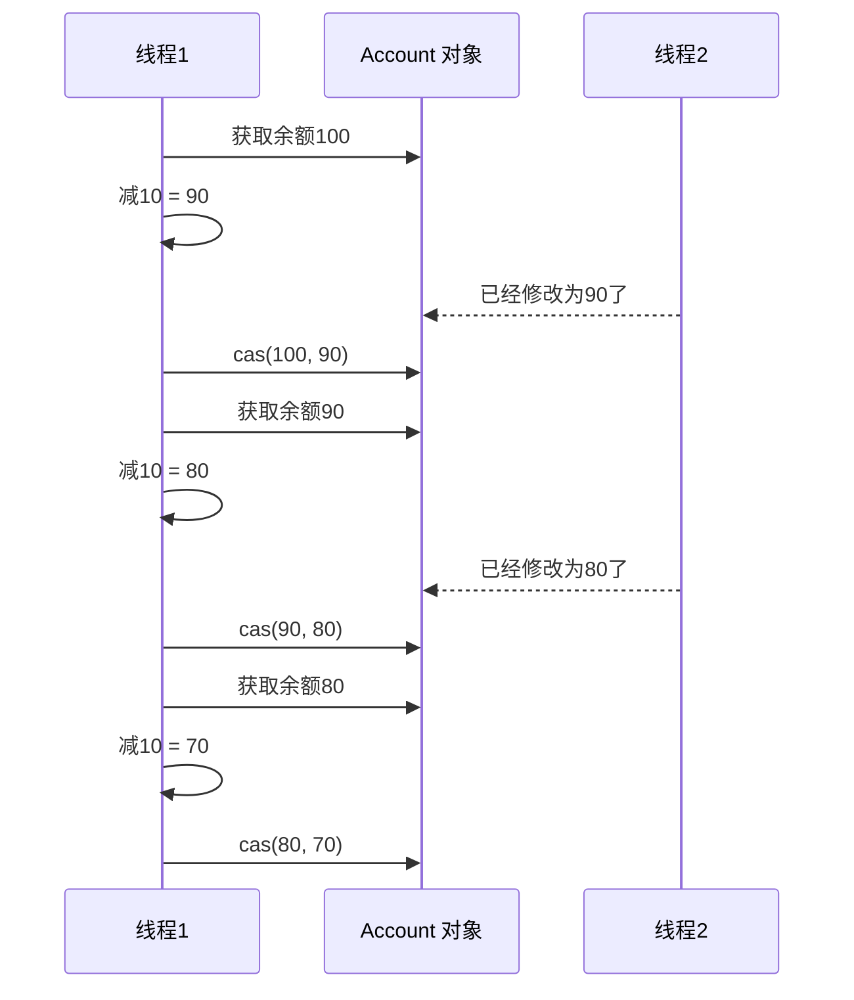
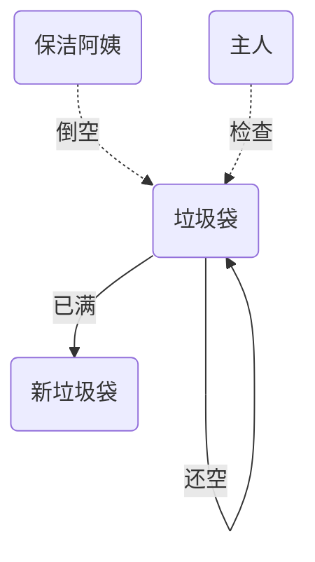

- CAS与volatile
- 原子整数
- 原子引用
- 原子累加器
- Unsafe

## 问题提出

有如下需求，保证account.withdraw()取款方法的线程安全

```java
public interface Account {
    //获取余额
    Integer getBalance();
    //取款
    void withdraw(Integer amount);
    /**
     * 方法内启动1000个线程，每个线程做-10元的操作
     * 如果初始月为10000，那么正确的结果应当是0
     */
    static void demo(Account account) {
        List<Thread> ts = new ArrayList<>();
        long start = System.nanoTime();
        for (int i = 0; i < 1000; i++) {
            ts.add(new Thread(() -> {
                account.withdraw(10);
            }));
        }
        ts.forEach(Thread::start);
        ts.forEach(t -> {
            try {
                t.join();
            } catch (InterruptedException e) {
                e.printStackTrace();
            }
        });
        System.out.println(account.getBalance() + " cost:" + (System.nanoTime() - start)/1000_000 + "ms");
    }
}
public class AccountUnsafe implements Account {
    private Integer balance;

    public AccountUnsafe(Integer balance) {
        this.balance = balance;
    }

    @Override
    public Integer getBalance() {
        return this.balance;
    }

    @Override
    public void withdraw(Integer amount) {
        this.balance -= amount;
    }
}
public class TestAccount {
    public static void main(String[] args) {
        Account account = new AccountUnsafe(10000);
        Account.demo(account);
    }
}
```

打印结果大于0

解决方案

```java
public class AccountCas implements Account {
    private AtomicInteger balance;

    public AccountCas(Integer balance) {
        this.balance = new AtomicInteger(balance);
    }

    @Override
    public Integer getBalance() {
        return this.balance.get();
    }

    @Override
    public void withdraw(Integer amount) {
        while (true) {
            // 获取余额的最新值
            int prev = balance.get();
            // 要修改的余额
            int next = prev - amount;
            // 真正修改
            if (balance.compareAndSet(prev, next)) {
                break;
            }
        }
    }
}
```

## CAS与volatile

前面看到的AtomicInteger的解决方法，内部并没有用锁来保护共享变量的线程安全，那么它是如何实现呢？

```java
    @Override
    public void withdraw(Integer amount) {
        while (true) {
            // 获取余额的最新值
            int prev = balance.get();
            // 要修改的余额
            int next = prev - amount;
            // 真正修改
            if (balance.compareAndSet(prev, next)) {
                break;
            }
        }
    }
```

其中关键的是compareAndSet,它的简称就是CAS(也有Compare And Swap的说法)，它必须是原子操作



>  注意
>
> 其实CAS的底层是lock cmpxchg指令（X86架构），在单核CPU和多核CPU下都能够保证【比较-交换】的原子性
>
> 在多核状态下，某个执行到带lock的指令时，CPU会让总线锁住，当这个核把此指令执行完毕，再开启总线。这个过程中不会被线程的调度机制所打断，保证了多个线程对内存操作的准确行，是原子的。

### volatile

获取共享变量时，为了保证该变量的可见性，需要使用volatile修饰

它可以用来修饰成员变量核静态成员变量，它可以避免线程从自己的工作缓存中查找变量的值，必须到主存中获取它的值，线程操作volatile变量都是直接操作主存。即一个线程对volatile变量的修改，对另一个线程可见

> 注意
>
> volatile仅仅保证了共享变量的可见性，让其他线程能够看到最新值，但不能解决指令交错问题（不能保证原子性）

CAS必须借助volatile才能读取到共享变量的最新值来实现【比较并交换】的效果

### 为什么无锁效率高

- 无锁情况下，即使重试失败，线程始终在高速运行，没有停歇，而synchronized会让线程在没有获得锁的时候，发生上下文切换，进入阻塞。
- 线程就好像高速跑道上的赛车，高速运行时，速度超快，一旦发生上下文切换，就好比赛车要减速，熄火，等被重新唤醒又得重新打火、启动、加速。。。恢复到高速运行，代价比较大
- 但无锁情况下，因为线程要保持运行，需要额外CPU的支持，CPU在这里就好比高速跑道，没有额外的跑道，线程想高速运行也无从谈起，虽然不会进入阻塞，但由于没有分到时间片，仍然会进入可运行状态，还是会导致上下文切换

### CAS的特点

结合CAS与volatile可以实现无锁并发，适用于线程数少、多核CPU的场景下

- CAS是基于乐观锁的思想：最乐观的估计，不怕别的线程来修改共享变量，就算修改了也没关系，我吃亏点再重试呗
- synchronized是基于悲观锁的思想：最悲观的估计，得防着其他线程来修改共享变量，我上了锁你们都别想改，我改完了解锁，你们才有机会
- CAS体现的是无锁并发，无阻塞并发
  - 因为没有使用synchronized所以线程不会陷入阻塞，这是效率提升的因素之一
  - 但如果竞争激烈，可以想到重试必然发生，反而效率会受影响

## 原子整数

JUC并发包提供了：AtomicBoolean, AtomicInteger, AtomicLong

```java
    @Override
    public void withdraw(Integer amount) {
        //while (true) {
            // 获取余额的最新值
            //int prev = balance.get();
            // 要修改的余额
            //int next = prev - amount;
            // 真正修改
            //if (balance.compareAndSet(prev, next)) {
                //break;
            //}
        //}
      balance.getAndAdd(-amount);
    }
```

```java
public class Test {
    public static void main(String[] args) {
        AtomicInteger i = new AtomicInteger(5);
        System.out.println(i.incrementAndGet()); // ++i;
        System.out.println(i.getAndIncrement()); // i++;
        System.out.println(i.getAndAdd(5));
        System.out.println(i.addAndGet(5));

        //i.getAndUpdate(p -> p * 2);
        //System.out.println(i);
        //System.out.println(i.updateAndGet(p -> p * 2));
        updateAndGet(i, p -> p * 2);
        System.out.println(i);

    }
    public static void updateAndGet(AtomicInteger i, IntUnaryOperator operator) {
        while (true) {
            int prev = i.get();
            int next = operator.applyAsInt(prev);
            if (i.compareAndSet(prev, next)) {
                break;
            }
        }
    }
}
```

## 原子引用

AtomicReference, AtomicMarkableReference, AtomicStampedReference

### AtomicReference

```java
public interface DecimalAccount {
    //获取余额
    BigDecimal getBalance();
    //取款
    void withdraw(BigDecimal amount);
    /**
     * 方法内会启动1000个线程，每个线程做-10元的操作
     * 如果出事余额为10000那么正确的结果应当是0
     */
    static void demo(DecimalAccount account) {
        List<Thread> ts = new ArrayList<>();
        for (int i = 0; i < 1000; i++) {
            ts.add(new Thread(() -> account.withdraw(BigDecimal.TEN)));
        }
        ts.forEach(Thread::start);
        ts.forEach(t -> {
            try {
                t.join();
            } catch (InterruptedException e) {
                throw new RuntimeException(e);
            }
        });
    }
}
public class DecimalAccountCas implements DecimalAccount {
    private AtomicReference<BigDecimal> balance;
    public DecimalAccountCas(BigDecimal balance) {
        this.balance = new AtomicReference<>(balance);
    }
    @Override
    public BigDecimal getBalance() {
        return balance.get();
    }
    @Override
    public void withdraw(BigDecimal amount) {
//        while (true) {
//            BigDecimal prev = balance.get();
//            BigDecimal next = prev.subtract(amount);
//            if (balance.compareAndSet(prev, next)) {
//                break;
//            }
//        }
        balance.updateAndGet(b -> b.subtract(amount));
    }
    public static void main(String[] args) {
        DecimalAccountCas accountCas = new DecimalAccountCas(new BigDecimal(10000));
        DecimalAccount.demo(accountCas);
        System.out.println(accountCas.getBalance());
    }
}
```

### ABA问题

```java
@Slf4j
public class Aba {
    static AtomicReference<String> ref = new AtomicReference<>("A");
    public static void main(String[] args) {
        log.debug("main start...");
        //获取值A, 这个工序变量被其他线程修改过？
        String prev = ref.get();
        other();
        try {
            Thread.sleep(1000);
        } catch (InterruptedException e) {
            throw new RuntimeException(e);
        }
        //尝试修改为C
        log.debug("change A -> C {}", ref.compareAndSet(prev, "C"));
    }
    private static void other() {
        new Thread(() -> log.debug("change A->B {}", ref.compareAndSet(ref.get(), "B"))).start();
        try {
            Thread.sleep(500);
        } catch (InterruptedException e) {
            throw new RuntimeException(e);
        }
        new Thread(() -> log.debug("change B->A {}", ref.compareAndSet(ref.get(), "A"))).start();
    }
}
```

输出

```
10:04:59.450 [main] DEBUG com.bytebuf.cas.Aba - main start...
10:04:59.498 [Thread-0] DEBUG com.bytebuf.cas.Aba - change A->B true
10:05:00.001 [Thread-1] DEBUG com.bytebuf.cas.Aba - change B->A true
10:05:01.004 [main] DEBUG com.bytebuf.cas.Aba - change A -> C true
```

主线程仅能判断出共享变量的值与最初值A是否相同，不能感知到这种从A到B又改回A的情况，如果主线程希望：

只要有其他线程【动过了】共享变量，那么自己的cas就算失败，这时，仅比较值是不够的，需要再加一个版本号

### AtomicStamedReference

```java
@Slf4j
public class AbaStamped {
    static AtomicStampedReference<String> ref = new AtomicStampedReference<>("A", 0);
    public static void main(String[] args) {
        log.debug("main start...");
        //获取值A, 这个工序变量被其他线程修改过？
        String prev = ref.getReference();
        int stamp = ref.getStamp();
        other();
        try {
            Thread.sleep(1000);
        } catch (InterruptedException e) {
            throw new RuntimeException(e);
        }
        //尝试修改为C
        log.debug("change A -> C {}", ref.compareAndSet(prev, "C", stamp, stamp + 1));
    }
    private static void other() {
        new Thread(() -> log.debug("change A->B {}", ref.compareAndSet(ref.getReference(), "B", ref.getStamp(), ref.getStamp() + 1))).start();
        try {
            Thread.sleep(500);
        } catch (InterruptedException e) {
            throw new RuntimeException(e);
        }
        new Thread(() -> log.debug("change B->A {}", ref.compareAndSet(ref.getReference(), "A", ref.getStamp(), ref.getStamp() + 1))).start();
    }
}
```

打印结果

```
10:14:18.714 [main] DEBUG com.bytebuf.cas.AbaStamped - main start...
10:14:18.774 [Thread-0] DEBUG com.bytebuf.cas.AbaStamped - change A->B true
10:14:19.278 [Thread-1] DEBUG com.bytebuf.cas.AbaStamped - change B->A true
10:14:20.278 [main] DEBUG com.bytebuf.cas.AbaStamped - change A -> C false
```

AtomicStampedReference可以个原子引用加上版本号，追踪原子引用整个的变化过程，如：A -> B -> A -> C,通过AtomicStampedReference,我们可以知道，引用变量中途被更改了几次。但有时候，并不关心引用变量更改了几次，只是单纯的关心是否更改过，所以就有了AtomicMarkableReference

### AtomicMarkableReference



```java
@Slf4j
public class TestAtomicMarkableReference {
    public static void main(String[] args) throws InterruptedException {
        GarbageBag bag = new GarbageBag("装满了垃圾");
        // 参数2mark可以看作一个标记，表示垃圾袋满了
        AtomicMarkableReference<GarbageBag> ref = new AtomicMarkableReference<>(bag, true);
        log.debug("start");
        GarbageBag prev = ref.getReference();
        log.debug(prev.toString());
        new Thread(() -> {
            log.debug("start");
            bag.setDesc("空垃圾袋");
            ref.compareAndSet(bag, bag, true, false);
            log.debug(bag.toString());
        }, "保洁阿姨").start();
        Thread.sleep(1000);
        log.debug("想换一只新垃圾袋？");
        boolean success = ref.compareAndSet(prev, new GarbageBag("空垃圾袋"), true, false);
        log.debug("换了吗？" + success);
        log.debug(ref.getReference().toString());
    }
}
@ToString
@AllArgsConstructor
class GarbageBag {
    @Setter
    String desc;
}
```

打印结果

```
12:33:10.649 [main] DEBUG com.bytebuf.cas.TestAtomicMarkableReference - start
12:33:10.654 [main] DEBUG com.bytebuf.cas.TestAtomicMarkableReference - GarbageBag(desc=装满了垃圾)
12:33:10.758 [保洁阿姨] DEBUG com.bytebuf.cas.TestAtomicMarkableReference - start
12:33:10.758 [保洁阿姨] DEBUG com.bytebuf.cas.TestAtomicMarkableReference - GarbageBag(desc=空垃圾袋)
12:33:11.753 [main] DEBUG com.bytebuf.cas.TestAtomicMarkableReference - 想换一只新垃圾袋？
12:33:11.753 [main] DEBUG com.bytebuf.cas.TestAtomicMarkableReference - 换了吗？false
12:33:11.754 [main] DEBUG com.bytebuf.cas.TestAtomicMarkableReference - GarbageBag(desc=空垃圾袋)
```

## 原子数组

AtomicIntegerArray, AtomicLongArray, AtomicReferenceArray

