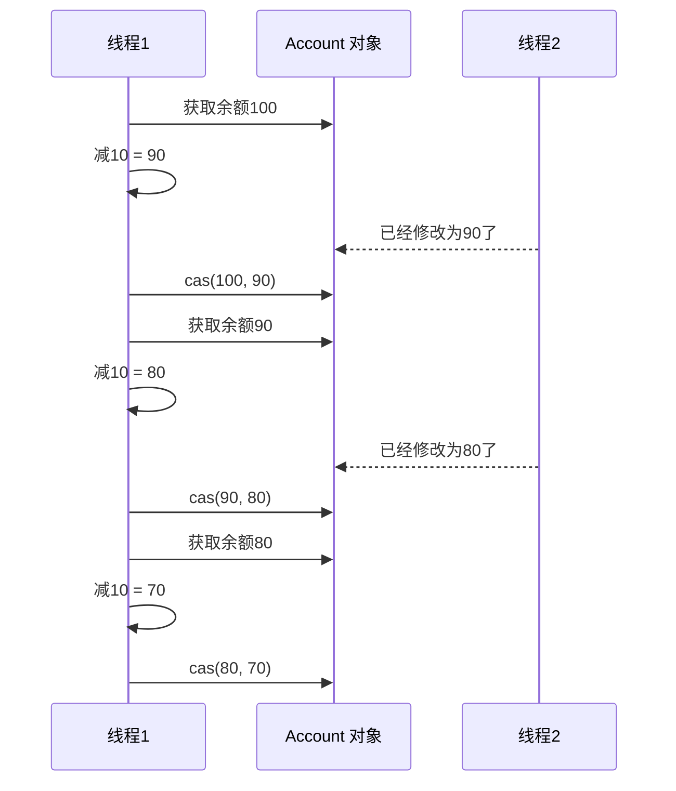

- CAS与volatile
- 原子整数
- 原子引用
- 原子累加器
- Unsafe

## 问题提出

有如下需求，保证account.withdraw()取款方法的线程安全

```java
public interface Account {
    //获取余额
    Integer getBalance();
    //取款
    void withdraw(Integer amount);
    /**
     * 方法内启动1000个线程，每个线程做-10元的操作
     * 如果初始月为10000，那么正确的结果应当是0
     */
    static void demo(Account account) {
        List<Thread> ts = new ArrayList<>();
        long start = System.nanoTime();
        for (int i = 0; i < 1000; i++) {
            ts.add(new Thread(() -> {
                account.withdraw(10);
            }));
        }
        ts.forEach(Thread::start);
        ts.forEach(t -> {
            try {
                t.join();
            } catch (InterruptedException e) {
                e.printStackTrace();
            }
        });
        System.out.println(account.getBalance() + " cost:" + (System.nanoTime() - start)/1000_000 + "ms");
    }
}
public class AccountUnsafe implements Account {
    private Integer balance;

    public AccountUnsafe(Integer balance) {
        this.balance = balance;
    }

    @Override
    public Integer getBalance() {
        return this.balance;
    }

    @Override
    public void withdraw(Integer amount) {
        this.balance -= amount;
    }
}
public class TestAccount {
    public static void main(String[] args) {
        Account account = new AccountUnsafe(10000);
        Account.demo(account);
    }
}
```

打印结果大于0

解决方案

```java
public class AccountCas implements Account {
    private AtomicInteger balance;

    public AccountCas(Integer balance) {
        this.balance = new AtomicInteger(balance);
    }

    @Override
    public Integer getBalance() {
        return this.balance.get();
    }

    @Override
    public void withdraw(Integer amount) {
        while (true) {
            // 获取余额的最新值
            int prev = balance.get();
            // 要修改的余额
            int next = prev - amount;
            // 真正修改
            if (balance.compareAndSet(prev, next)) {
                break;
            }
        }
    }
}
```

## CAS与volatile

前面看到的AtomicInteger的解决方法，内部并没有用锁来保护共享变量的线程安全，那么它是如何实现呢？

```java
    @Override
    public void withdraw(Integer amount) {
        while (true) {
            // 获取余额的最新值
            int prev = balance.get();
            // 要修改的余额
            int next = prev - amount;
            // 真正修改
            if (balance.compareAndSet(prev, next)) {
                break;
            }
        }
    }
```

其中关键的是compareAndSet,它的简称就是CAS(也有Compare And Swap的说法)，它必须是原子操作



>  注意
>
> 其实CAS的底层是lock cmpxchg指令（X86架构），在单核CPU和多核CPU下都能够保证【比较-交换】的原子性
>
> 在多核状态下，某个执行到带lock的指令时，CPU会让总线锁住，当这个核把此指令执行完毕，再开启总线。这个过程中不会被线程的调度机制所打断，保证了多个线程对内存操作的准确行，是原子的。

### volatile

获取共享变量时，为了保证该变量的可见性，需要使用volatile修饰

它可以用来修饰成员变量核静态成员变量，它可以避免线程从自己的工作缓存中查找变量的值，必须到主存中获取它的值，线程操作volatile变量都是直接操作主存。即一个线程对volatile变量的修改，对另一个线程可见

> 注意
>
> volatile仅仅保证了共享变量的可见性，让其他线程能够看到最新值，但不能解决指令交错问题（不能保证原子性）

CAS必须借助volatile才能读取到共享变量的最新值来实现【比较并交换】的效果

### 为什么无锁效率高

