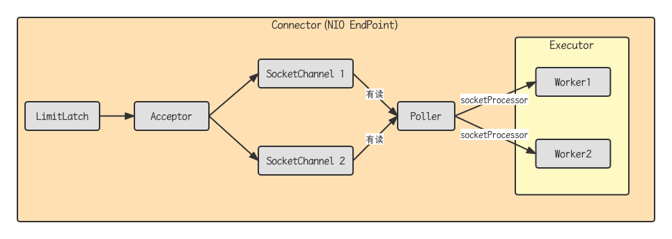

## 线程池状态

ThreadPoolExecutor使用int的高3位来表示线程池状态，低29位表示线程数量

| 状态名     | 高3位 | 接收新任务 | 处理阻塞队列任务 | 说明                                     |
| ---------- | ----- | ---------- | ---------------- | ---------------------------------------- |
| RUNNING    | 111   | Y          | Y                | -                                        |
| SHUTDOWN   | 000   | N          | Y                | 不会接收新任务，但会处理阻塞队列剩余任务 |
| STOP       | 001   | N          | N                | 会中断正在执行的任务，并抛弃阻塞队列任务 |
| TIDYING    | 010   | -          | -                | 任务全执行完毕，活动线程为0即将进入终结  |
| TERMINATED | 011   | -          | -                | 终结状态                                 |

从数字上比较，TERMINATED > TIDYING > STOP > SHUTDOWN > RUNNING

这些信息存储在一个原子变量ctl中，目的是将线程池状态与线程个数合二为一，这样就可以用一次cas原子操作进行赋值

```java
// c为旧值，ctlOf返回结果为新值
ctl.compareAndSet(c, ctlOf(targetState, workerCount(c)));
// rs为高3位代表线程池状态，wc为低29位代表线程个数，ctl是合并它们
private static int ctlOf(int rs, int wc) { return rs | wc; }
```

## 构造方法

```java
public ThreadPoolExecutor(int corePoolSize, int maximumPoolSize, long keepAliveTime, TimeUnit unit, BlockingQueue<Runnable> workQueue, ThreadFactory threadFactory, RejectedExecutionHadler hadler)
```

- corePoolSize核心线程数目（最多保留的线程数）
- maximumPoolSize最大线程数
- keepAliveTime生存时间-针对救急线程
- unit时间单位-针对救急线程
- workQueue阻塞队列
- threadFactory线程工厂-可以为线程创建时起个名字
- handler拒绝策略

## 工作过程

- 线程池中刚开始没有线程，当一个任务提交给线程池后，线程池会创建一个新线程来执行任务
- 当线程数达到corePoolSize并没有线程空闲，这时再加入任务，新加的任务会被加入workQueue队列排队，直到有空闲的线程
- 如果队列选择了有界队列，那么任务超过了队列大小是，会创建maximumPoolSize - corePoolSize数目的线程来救急
- 如果线程达到了maximumPoolSize仍然有新任务这时会执行拒绝策略。拒绝策略jdk提供了4种实现，其他著名框架也提供了实现
  - AbortPolicy让调用者抛出RejectedExecutionExection异常，这是默认策略
  - CallerRunsPolicy让调用者运行任务
  - DiscardPolicy放弃本次任务
  - DiscardOldestPolicy放弃队列中最早的任务，本任务取而代之
  - Dubbo的实现，在抛出RejectedExecutionExection异常之前会记录日志，并dump线程信息，方便定位问题
  - Netty的实现，是创建一个新线程来执行任务
  - ActiveMQ的实现，带超时等待(60s)尝试放入队列，类似我们自定义的拒绝策略
  - PinPoint的实现，它使用了一个拒绝策略，会逐一尝试策略链中每种拒绝策略
- 当高峰过去后，超过corePoolSize的救急线程如果一段时间没有任务做，需要结束节省资源，这个时间由keepAliveTime和unit来控制

## newFixedThreadPool

```java
public static ExecutorService newFixedThreadPool(int threads) {
    return new ThreadPoolExecutor(threads, threads, 0L, TimeUnit.MILLISECONDS, new LinkedBlockingQueue<Runnable>());
}
```

特点

- 核心线程数 == 最大线程数（没有救急线程被创建），因此也无需超时时间
- 阻塞队列是无界的，可以放任意数量的任务

> 适用于任务量已知，相对耗时的任务

## newCachedThreadPool

```java
public static ExecutorService newCachedThreadPool() {
    return new ThreadPoolExecutor(0, Integer.MAX_VALUE, 60L, TimeUnit.SECONDS, new SynchronousQueue<Runnable>());
}
```

特点

- 核心线程数是0，最大线程数是Integer.MAX_VALUE,救急线程的空闲生存时间是60s, 意味着
  - 全部都是救急线程（60s后可以回收）
  - 救急线程可以无限创建
- 队列采用了SynchronousQueue实现特点是，它没有容量，没有线程来取是放不进去的（一手交钱，一手交货）

```java
@Slf4j
public class TestSynchronousQueue {
    public static void main(String[] args) throws InterruptedException {
        SynchronousQueue<Integer> integers = new SynchronousQueue<>();
        new Thread(() -> {
            try {
                log.debug("putting {}", 1);
                integers.put(1);
                log.debug("{} putted", 1);
                log.debug("putting {}", 2);
                integers.put(2);
                log.debug("{} putted", 2);
            } catch (InterruptedException e) {
                throw new RuntimeException(e);
            }
        }, "t1").start();
        Thread.sleep(1000);
        new Thread(() -> {
            try {
                log.debug("taking {}", 1);
                integers.take();
            } catch (InterruptedException e) {
                throw new RuntimeException(e);
            }
        }, "t2").start();
        Thread.sleep(1000);
        new Thread(() -> {
            try {
                log.debug("taking {}", 2);
                integers.take();
            } catch (InterruptedException e) {
                throw new RuntimeException(e);
            }
        }, "t3").start();
    }
}
```

打印结果

```
09:31:11.886 [t1] DEBUG com.bytebuf.executors.TestSynchronousQueue - putting 1
09:31:12.886 [t2] DEBUG com.bytebuf.executors.TestSynchronousQueue - taking 1
09:31:12.886 [t1] DEBUG com.bytebuf.executors.TestSynchronousQueue - 1 putted
09:31:12.887 [t1] DEBUG com.bytebuf.executors.TestSynchronousQueue - putting 2
09:31:13.891 [t3] DEBUG com.bytebuf.executors.TestSynchronousQueue - taking 2
09:31:13.892 [t1] DEBUG com.bytebuf.executors.TestSynchronousQueue - 2 putted
```

> 整个线程池表现为线程数会根据任务量不断增长，没有上限，当任务执行完毕，空闲一分钟后会释放线程
>
> 适合任务数比较密集，但每个任务执行时间较短的情况

## newSingleThreadExecutor

```java
public static ExecutorService newSingleThreadExecutor() {
  return new FinalizableDelegatedExecutorService(new ThreadPoolExecutor(1, 1, 0L, TimeUnit.MILLISECONDS, new LinkedBlockingQueue<Runnable>()));
}
```

使用场景：

希望多个任务排队执行。线程数固定为1，任务数多于1时，会放入无界队列排队。任务执行完毕，这唯一的线程也不会释放

区别：
- 自己创建一个单线程串行执行任务，如果任务执行失败而终止那么没有任何补救措施，而线程池还会创建一个线程，保证池的正常工作
- Executors.newSingleThreadExecutor()线程个数始终为1，不能修改
- FinializableDelegatedExecutorService应用的装饰器模式，只对外暴露了ExecutorService接口，因此不能调用ThreadPoolExecutor中特有的方法
- Executors.newFixedThreadPool()初始为1，一会还可以修改。对外暴露的是ThreadPoolExecutor对象，可以强转后调用setCorePoolSize等方法进行修改

## 提交任务

```java
// 执行任务
void execute(Runnable command);
// 提交任务task, 用返回值Future获得任务执行结果
<T> Future<T> submit(Callable<T> task);
// 提交tasks中所有任务
<T> List<Future<T>> invokeAll(Collection<? extends Callable<T>> tasks) throws InterruptionException;
// 提交tasks中所有任务,带超时时间
<T> List<Future<T>> invokeAll(Collection<? extends Callable<T>> tasks, long timeout, TimeUnit unit) throws InterruptionException;
// 提交tasks中所有任务，哪个任务先成功执行，返回此任务执行结果，其它任务取消
<T> Future<T> invokeAny(Collection<? extends Callable<T>> tasks) throws InterruptionException;
// 提交tasks中所有任务，哪个任务先成功执行，返回此任务执行结果，其它任务取消,带超时时间
<T> Future<T> invokeAny(Collection<? extends Callable<T>> tasks, long timeout, TimeUnit unit) throws InterruptionException;
```

## 关闭线程池

- shutdown(): 线程池状态变为SHUTDOWN, 不会接收新任务，但已提交任务会执行完毕，此方法不会阻塞调用线程的执行

```java
    public void shutdown() {
        final ReentrantLock mainLock = this.mainLock;
        mainLock.lock();
        try {
            checkShutdownAccess();
            // 修改线程池状态
            advanceRunState(SHUTDOWN);
            // 仅会打断空闲线程
            interruptIdleWorkers();
            onShutdown(); // hook for ScheduledThreadPoolExecutor
        } finally {
            mainLock.unlock();
        }
        // 尝试终结（没有运行的线程可以立刻中介，如果还有运行的线程也不会等）
        tryTerminate();
    }
```

- shutdownNow(): 线程池状态变为STOP, 不会接收新任务，会将队列中的任务返回，并用interrupt的方式中断正在执行的任务

```java
    public List<Runnable> shutdownNow() {
        List<Runnable> tasks;
        final ReentrantLock mainLock = this.mainLock;
        mainLock.lock();
        try {
            checkShutdownAccess();
            // 修改线程池的状态
            advanceRunState(STOP);
            // 打断所有的线程
            interruptWorkers();
            // 获取队列中剩余任务
            tasks = drainQueue();
        } finally {
            mainLock.unlock();
        }
        // 尝试终结
        tryTerminate();
        return tasks;
    }
```

- 其他方法

```java
// 不在RUNNING状态的线程池，此方法就返回true
boolean isShutdown();
// 线程池状态是否是TERMINATED
boolean isTerminated();
// 调用shutdown后，由于调用线程并不会等待所有任务运行结束，因此如果他想在线程池TERMINATED后做些事情，可以利用此方法等待
boolean awaitTermination(long timeout, TimeUnit unit) throws InterruptedException;
```

## 任务调度线程池

在【任务调度线程池】功能加入之前，可以使用java.util.Timer来实现定时功能，Timer的优点在于简单易用，但由于所有任务都是由同一个线程来调度，因此所有任务都是串行执行的，同一时间只能有一个任务在执行，前一个任务的延迟或异常都将会影响到之后的任务。

```java
    public static void main(String[] args) {
        Timer timer = new Timer();
        TimerTask task1 = new TimerTask() {
            @Override
            public void run() {
                log.debug("task 1");
                sleep(1000);
            }
        };
        TimerTask task2 = new TimerTask() {
            @Override
            public void run() {
                log.debug("task 2");
            }
        };
        // 使用timer添加两个任务，希望它们都在1s后执行
        // 但由于timer内只有一个线程来顺序执行队列中的任务，因此【任务1】的延迟，影响了【任务2】的执行
        timer.schedule(task1, 1000);
        timer.schedule(task2, 1000);
    }
```

## newScheduleThreadPool

```java
    public static void main(String[] args) {
        ScheduledExecutorService pool = Executors.newScheduledThreadPool(2);
        pool.schedule(() -> {
            log.debug("task 1");
            sleep(2000);
        }, 1, TimeUnit.SECONDS);
        pool.schedule(() -> {
            log.debug("task 2");
        }, 1, TimeUnit.SECONDS);
    }
```

```java
@Slf4j
public class TestSchedule {
    /**
     * 让每周四18:00:00定时执行任务
     * @param args
     */
    public static void main(String[] args) {
        // 获取当前时间
        LocalDateTime now = LocalDateTime.now();
        log.debug("now {}", now);
        // 获取周四时间
        LocalDateTime time = now.withHour(18).withMinute(0).withSecond(0).withNano(0).with(DayOfWeek.TUESDAY);
        // 如果当前时间 > 周四，必须找到下周四
        if (now.compareTo(time) > 0) {
            time = time.plusWeeks(1);
        }
        log.debug("time {}", time);
        // initialDelay代表当前时间和周四的时间差， period一周的间隔时间
        long initialDelay  = Duration.between(now, time).toMillis();
        long period = 1000 * 60 * 60 * 24 * 7;
        ScheduledExecutorService pool = Executors.newScheduledThreadPool(1);
        pool.scheduleAtFixedRate(() -> {
            log.debug("running");
        }, initialDelay, period, TimeUnit.MILLISECONDS);
    }
}
```

## Tomcat线程池



- LimitLatch用来限流，可以控制最大连接个数，类似JUC中的Semaphore
- Acceptor只负责【接收新的socket连接】
- Poller只负责监听socket channel是否有【可读的IO事件】
- 一旦可读，封装一个任务对象【socketProcessor】，提交给Executor线程池处理
- Executor线程池中的工作线程最终负责【处理请求】

Tomcat线程池扩展了ThreadPoolExecutor,行为稍有不同

- 如果线程数达到maximumPoolSize
  - 这时不会立刻抛出RejectExecutionException异常
  - 而是再次尝试将任务放入队列，如果还失败，才抛出RejectExecutionException异常

```java
    public void execute(Runnable command, long timeout, TimeUnit unit) {
        this.submittedCount.incrementAndGet();
        try {
            super.execute(command);
        } catch (RejectedExecutionException var9) {
            if (!(super.getQueue() instanceof TaskQueue)) {
                this.submittedCount.decrementAndGet();
                throw var9;
            }
            TaskQueue queue = (TaskQueue)super.getQueue();
            try {
                if (!queue.force(command, timeout, unit)) {
                    this.submittedCount.decrementAndGet();
                    throw new RejectedExecutionException(sm.getString("threadPoolExecutor.queueFull"));
                }
            } catch (InterruptedException var8) {
                this.submittedCount.decrementAndGet();
                throw new RejectedExecutionException(var8);
            }
        }
    }
```

TaskQueue.java

```java
    public boolean force(Runnable o, long timeout, TimeUnit unit) throws InterruptedException {
        if (this.parent != null && !this.parent.isShutdown()) {
            return super.offer(o, timeout, unit);
        } else {
            throw new RejectedExecutionException(sm.getString("taskQueue.notRunning"));
        }
    }
```

Connector配置

| 配置项              | 默认值 | 说明                                 |
| ------------------- | ------ | ------------------------------------ |
| acceptorThreadCount | 1      | acceptor线程数量                     |
| pollerThreadCount   | 1      | poller线程数量                       |
| minSpareThreads     | 10     | 核心线程数量，即corePoolSize         |
| maxThreads          | 100    | 最大线程数量，即maximumPoolSize      |
| executor            | -      | Executor名称，用来引用下面的Executor |

Executor线程配置

| 配置项                  | 默认值            | 说明                           |
| ----------------------- | ----------------- | ------------------------------ |
| threadPriority          | 5                 | 线程优先级                     |
| daemon                  | true              | 是否是守护线程                 |
| minSpareThreads         | 25                | 核心线程数，即corePoolSize     |
| maxThreads              | 200               | 最大线程数，即maximumPoolSize  |
| maxIdleTime             | 60000             | 线程生存时间，默认1分钟        |
| maxQueueSize            | Integer.MAX_VALUE | 队列长度                       |
| prestartminSpareThreads | false             | 核心线程是否在服务器启动时启动 |

##  正确处理执行任务异常

方法1：主动捉异常

```java
ExecutorService pool = Executors.newFixedThreadPool(1);
pool.submit(() -> {
 try {
 		log.debug("task1");
 		int i = 1 / 0;
 } catch (Exception e) {
 		log.error("error:", e);
 }
});
```

方法2：使用 Future

```java
ExecutorService pool = Executors.newFixedThreadPool(1);
Future<Boolean> f = pool.submit(() -> {
 		log.debug("task1");
 		int i = 1 / 0;
 		return true;
});
log.debug("result:{}", f.get());
```