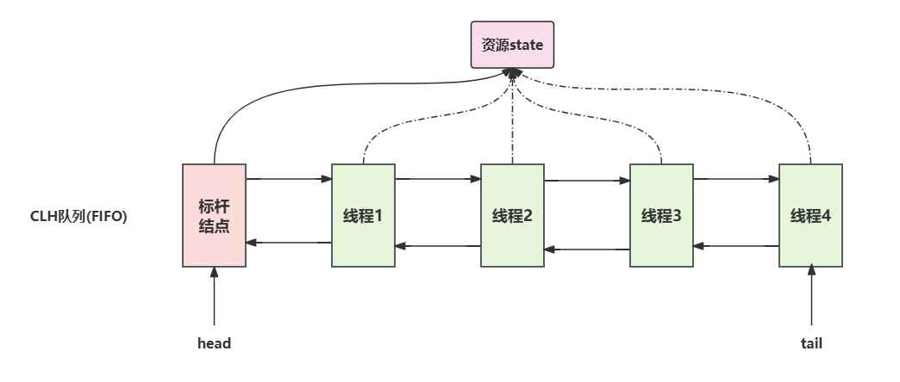

## 概述



- AQS维护了一个volatile int state(代表共享资源)和一个FIFO线程等待队列（多线程争用资源被阻塞时会进入此队列）
- AQS定义两种资源共享方式：Exclusive, Share
- isHeldExclusively方法：该线程是否正在独占资源
- tryAcquire/tryRelease: 独占的方式尝试获取和释放资源
- tryAcquireShared / tryReleaseShared: 共享方式尝试获取和释放资源
- ReentrantLock重入锁为例，state初始为0，表示未锁定状态
  - A线程lock()时，会调用tryAcquire()独占该锁并将state+1
  - 此后，其他线程再tryAcquire()时就会失败，直到A线程unlock()到state=0(即释放锁)为止，其它线程才有机会获取该锁
  - 当然，释放锁之前，A线程自己是可以重复获取此锁的(state累加)，这就是可重入的概念
  - 但要注意，获取多少次就要释放多少次，这样才能保住state是能回到零的
- 以CountDownLatch为例，任务分为N个子线程去执行，state也初始化为N(注意N要与线程个数一致)
  - 这N个子线程是并行执行的，每个子线程执行完后countDown()一次，state会CAS减1
  - 等到所有子线程都执行完后（即state=0）,会unpark()调用线程
  - 然后主线程调用就会从await()函数返回，继续后续动作

全称是AbstractQueuedSynchronizer,是阻塞式锁和相关的通过器工具的框架

特点：

- 用state属性来表示资源的状态（分独占模式和共享模式），子类需要如何维护这个状态，控制如何获取锁和释放锁
  - getState - 获取state状态
  - setState - 设置state状态
  - compareAndSetState - 乐观锁设置state状态
  - 独占模式式只有一个线程能够访问资源，而共享模式可以允许多个线程访问资源
- 提供了基于FIFO的等待队列，类似于Monitor的EntryList
- 条件变量来实现等待，唤醒机制，支持多个条件变量，类似于Monitor的WaitSet

子类主要实现这样一些方法（默认抛出UnsupportedOperationException）

- tryAcquire
- tryRelease
- tryAcquireShared
- tryReleaseShared
- isHeldExclusively

获取锁的方式

```java
// 如果获取锁失败
if (!tryAcquire(arg)) {
    // 入队，可以选择阻塞当前线程
}
```

释放锁的方式

```java
// 如果释放锁成功
if (tryRelease(arg)) {
    // 让阻塞线程恢复运行
}
```

自定义锁（不可重入）

```java
public class MySync extends AbstractQueuedSynchronizer {
    @Override
    protected boolean tryAcquire(int arg) {
        if (compareAndSetState(0, 1)) {
            // 加上了锁，并设置owner为当前线程
            setExclusiveOwnerThread(Thread.currentThread());
            return true;
        }
        return false;
    }
    @Override
    protected boolean tryRelease(int arg) {
        setExclusiveOwnerThread(null);
        setState(0);
        return true;
    }
    /**
     * 是否持有独占锁
     * @return
     */
    @Override
    protected boolean isHeldExclusively() {
        return getState() == 1;
    }
    public Condition newCondition() {
        return new ConditionObject();
    }
}
@Slf4j
public class MyLock implements Lock {
    public static void main(String[] args) {
        MyLock lock = new MyLock();
        new Thread(() -> {
            lock.lock();
            try {
                log.debug("locking...");
                Thread.sleep(1000L);
            } catch (InterruptedException e) {
                e.printStackTrace();
            } finally {
                log.debug("unlocking...");
                lock.unlock();
            }
        }, "t1").start();
        new Thread(() -> {
            lock.lock();
            try {
                log.debug("locking...");
            } finally {
                log.debug("unlocking...");
                lock.unlock();
            }
        }, "t2").start();
    }
    MySync sync = new MySync();
    // 加锁
    @Override
    public void lock() {
        sync.acquire(1);
    }
    // 加锁，可打断
    @Override
    public void lockInterruptibly() throws InterruptedException {
        sync.acquireInterruptibly(1);
    }
    // 尝试加锁（一次）
    @Override
    public boolean tryLock() {
        return sync.tryAcquire(1);
    }
    // 尝试加锁，带超时
    @Override
    public boolean tryLock(long time, TimeUnit unit) throws InterruptedException {
        return sync.tryAcquireNanos(1, unit.toNanos(time));
    }
    // 解锁
    @Override
    public void unlock() {
        sync.release(1);
    }
    // 创建条件变量
    @Override
    public Condition newCondition() {
        return sync.newCondition();
    }
}
```

打印结果

```
18:47:46.013 [t1] DEBUG com.bytebuf.concurrent.aqs.MyLock - locking...
18:47:47.016 [t1] DEBUG com.bytebuf.concurrent.aqs.MyLock - unlocking...
18:47:47.016 [t2] DEBUG com.bytebuf.concurrent.aqs.MyLock - locking...
18:47:47.016 [t2] DEBUG com.bytebuf.concurrent.aqs.MyLock - unlocking...
```

