## 非公平锁实现原理

### 加锁解锁流程

先从构造器开始看，默认为非公平锁

```java
public ReentrantLock() {
    sync = new NonfairSync();
}
```

NonfairSync继承自AQS, 没有竞争时

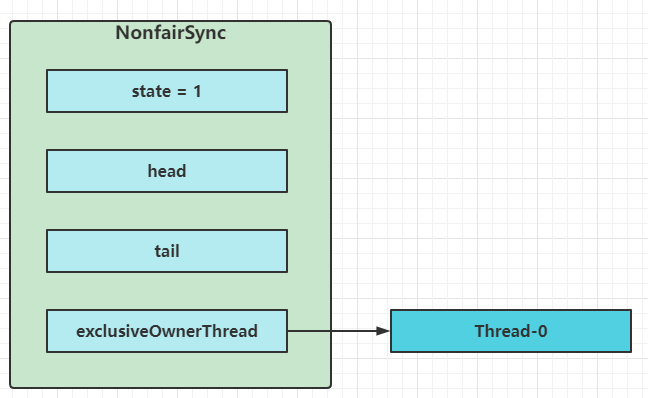

第一个竞争出现时

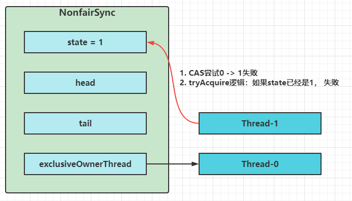

```java
final void lock() {
    if (compareAndSetState(0, 1))
        setExclusiveOwnerThread(Thread.currentThread());
    else
        acquire(1);
}
```

Thread-1执行了

1. CAS尝试将state由0改为1，结果失败
2. 进入tryAcquire逻辑，这时state已经时1，结果仍然失败
3. 接下来进入addWaiter逻辑，构造Node队列
   1. 图中黄色三角表示该Node的waitStatus状态，其中0为默认正常状态
   2. Node的创建时懒惰的
   3. 其中第一个Node称为Dummy(哑元)或哨兵，用来占位，并不关联线程

```java
public final void acquire(int arg) {
    if (!tryAcquire(arg) &&
        acquireQueued(addWaiter(Node.EXCLUSIVE), arg))
        selfInterrupt();
}
```

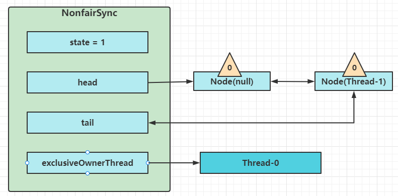

当线程进入acquireQueued逻辑

1. acquireQueued会在一个死循环中不断尝试获得锁，失败后进入park阻塞
2. 如果自己是紧接着head(排第二位)，那么再次tryAcquire尝试获取锁，当然这时state仍为1，失败
3. 进入shouldParkAfterFailedAcquire逻辑，将前驱node,即head的waitStatus改为-1，这次返回false

```java
    final boolean acquireQueued(final Node node, int arg) {
        boolean failed = true;
        try {
            boolean interrupted = false;
            for (;;) {
                final Node p = node.predecessor();
                if (p == head && tryAcquire(arg)) {
                    setHead(node);
                    p.next = null; // help GC
                    failed = false;
                    return interrupted;
                }
                if (shouldParkAfterFailedAcquire(p, node) &&
                    parkAndCheckInterrupt())
                    interrupted = true;
            }
        } finally {
            if (failed)
                cancelAcquire(node);
        }
    }
```

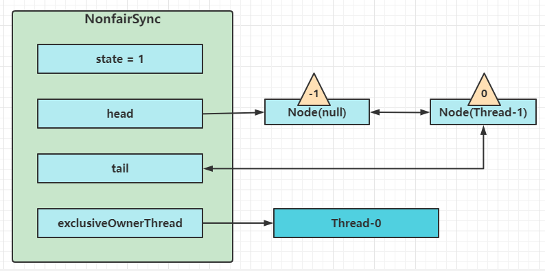

4. shouldParkAfterFailedAcquire执行完毕回到acquireQueued,再次tryAcquire尝试获取锁，当然这时state仍为1，失败
5. 当再次进入shouldParkAfterFailedAcquire时，这时因为其前驱node的waitStatus已经是-1，这次返回true
6. 进入parkAndCheckInterrupt,Thread-1 park(灰色表示)

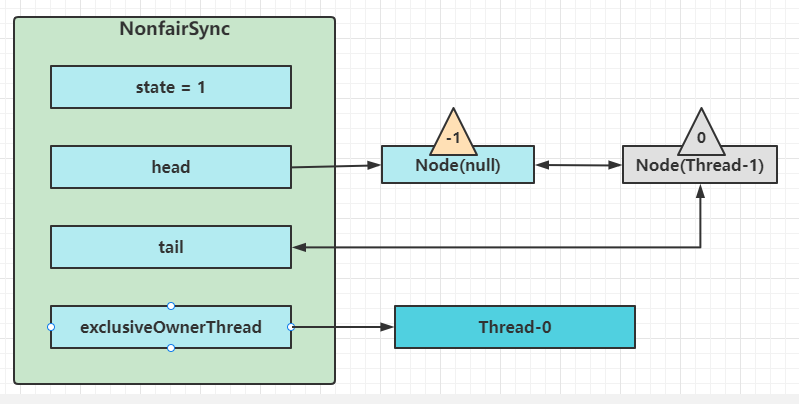

再次有多个线程经历上述过程竞争失败，变成这个样子

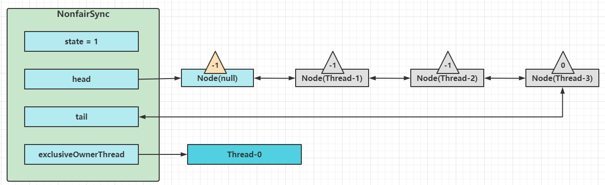

Thread-0释放锁，进入tryRelease流程，如果成功

- 设置exclusiveOwnerThread为null
- state = 0

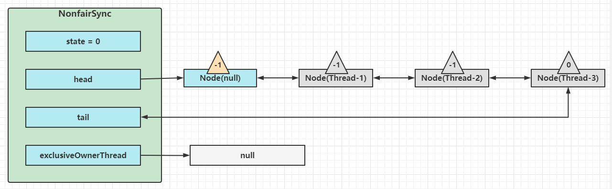

当前队列不为null,并且head的waitStatus = -1,进入unparkSuccessor流程

找到队列中离head最近的一个Node(没有取消的)，unpark恢复其运行，本例中即为Thread-1

回到Thread-1的acquireQueued流程

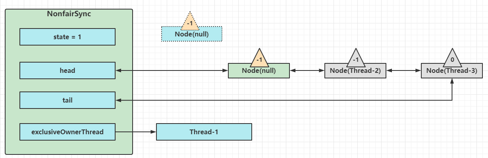

如果加锁成功（没有竞争），会设置

- exclusiveOwnerThread为Thread-1, state=1
- head指向刚刚Thread-1所在的Node,该Node清空Thread
- 原本的head因为从链表断开，而可被垃圾回收

如果这时候有其它线程来竞争（非公平的体现），例如这时候有Thread-4来了

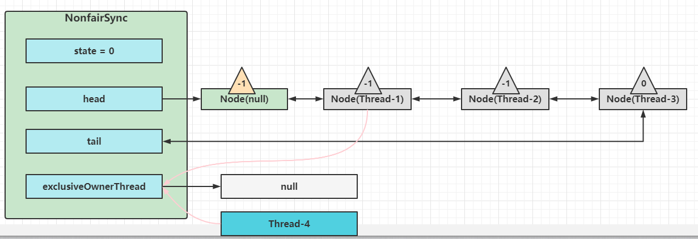

如果不巧被Thread-4占了先

- Thread-4被设置为exclusiveOwnerThread, state = 1
- Thread-1再次进入acquireQueued流程，获取锁失败，重新进入park阻塞

## 可重入原理

```java
final boolean nonfairTryAcquire(int acquires) {
    final Thread current = Thread.currentThread();
    int c = getState();
    if (c == 0) {
        if (compareAndSetState(0, acquires)) {
            setExclusiveOwnerThread(current);
            return true;
        }
    }
    // 如果已经获得了锁，线程还是当前线程，表示发生了锁重入
    else if (current == getExclusiveOwnerThread()) {
        // state++
        int nextc = c + acquires;
        if (nextc < 0) // overflow
            throw new Error("Maximum lock count exceeded");
        setState(nextc);
        return true;
    }
    return false;
}
protected final boolean tryRelease(int releases) {
    // state--
    int c = getState() - releases;
    if (Thread.currentThread() != getExclusiveOwnerThread())
        throw new IllegalMonitorStateException();
    boolean free = false;
    // 支持锁重入，只有state减为0，才释放成功
    if (c == 0) {
        free = true;
        setExclusiveOwnerThread(null);
    }
    setState(c);
    return free;
}
```

## 可打断原理

### 不可打断模式

在此模式下，即使它被打断，仍会驻留在AQS队列中，等获取锁后方能继续运行（是继续运行！只是打断标志设置为true）

```java
private final boolean parkAndCheckInterrupt() {
    // 如果打断标记已经是true, 则park会失效
    LockSupport.park(this);
    // interrupted会清除打断标记
    return Thread.interrupted();
}
final boolean acquireQueued(final Node node, int arg) {
    boolean failed = true;
    try {
        boolean interrupted = false;
        for (;;) {
            final Node p = node.predecessor();
            if (p == head && tryAcquire(arg)) {
                setHead(node);
                p.next = null; // help GC
                failed = false;
                // 还是需要获得锁后，才能返回打断状态
                return interrupted;
            }
            if (shouldParkAfterFailedAcquire(p, node) &&
                parkAndCheckInterrupt())
                // 如果是因为interrupt被唤醒后，返回打断状态为true
                interrupted = true;
        }
    } finally {
        if (failed)
            cancelAcquire(node);
    }
}
public final void acquire(int arg) {
    if (!tryAcquire(arg) &&
        acquireQueued(addWaiter(Node.EXCLUSIVE), arg))
        // 如果打断状态为true
        selfInterrupt();
}
static void selfInterrupt() {
    // 重新产生一次中断
    Thread.currentThread().interrupt();
}
```

### 可打断模式

```java
public final void acquireInterruptibly(int arg)
    throws InterruptedException {
    if (Thread.interrupted())
        throw new InterruptedException();
    // 如果没有获得锁，进入
    if (!tryAcquire(arg))
        doAcquireInterruptibly(arg);
}
// 可打断的获取锁流程
private void doAcquireInterruptibly(int arg)
    throws InterruptedException {
    final Node node = addWaiter(Node.EXCLUSIVE);
    boolean failed = true;
    try {
        for (;;) {
            final Node p = node.predecessor();
            if (p == head && tryAcquire(arg)) {
                setHead(node);
                p.next = null; // help GC
                failed = false;
                return;
            }
            if (shouldParkAfterFailedAcquire(p, node) &&
                parkAndCheckInterrupt())
                // 在pakr过程中如果被interrupt会进入此
                // 这时候抛出异常，而不会再次进入for(;;)
                throw new InterruptedException();
        }
    } finally {
        if (failed)
            cancelAcquire(node);
    }
}
```

## 公平锁实现原理

```java
static final class FairSync extends Sync {
    private static final long serialVersionUID = -3000897897090466540L;
    final void lock() {
        acquire(1);
    }
    // AQS继承过来的方法
    public final void acquire(int arg) {
    if (!tryAcquire(arg) &&
        acquireQueued(addWaiter(Node.EXCLUSIVE), arg))
        // 如果打断状态为true
        selfInterrupt();
	}
    // 与公平锁的主要区别在于tryAcquire方法的实现
    protected final boolean tryAcquire(int acquires) {
        final Thread current = Thread.currentThread();
        int c = getState();
        if (c == 0) {
            // 先检查AQS队列中是否有前驱节点，没有才去竞争
            if (!hasQueuedPredecessors() &&
                compareAndSetState(0, acquires)) {
                setExclusiveOwnerThread(current);
                return true;
            }
        }
        else if (current == getExclusiveOwnerThread()) {
            int nextc = c + acquires;
            if (nextc < 0)
                throw new Error("Maximum lock count exceeded");
            setState(nextc);
            return true;
        }
        return false;
    }
    // AQS继承过来的方法，方便阅读，放在此处
    public final boolean hasQueuedPredecessors() {
        Node t = tail; // Read fields in reverse initialization order
        Node h = head;
        Node s;
        // h != t时表示队列中有Node
        return h != t &&
            // (s = h.next) == null 表示队列中没有老二
            ((s = h.next) == null || 
             // 或者队列中老二线程不是此线程
             s.thread != Thread.currentThread());
    }
}
```

## 条件变量实现原理

每个条件变量其实就对应着一个等待队列，其实现类是ConditionObject

### await流程

开始Thread-0持有锁，调用await，进入ConditionObject的addConditionWaiter流程，创建的Node状态为-2(Node.CONDITION),关联Thread-0,加入等待队列尾部

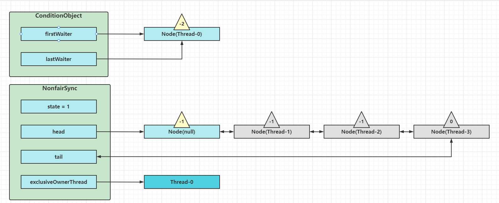

接下来进入AQS的fullyRelease流程，释放同步器上的锁

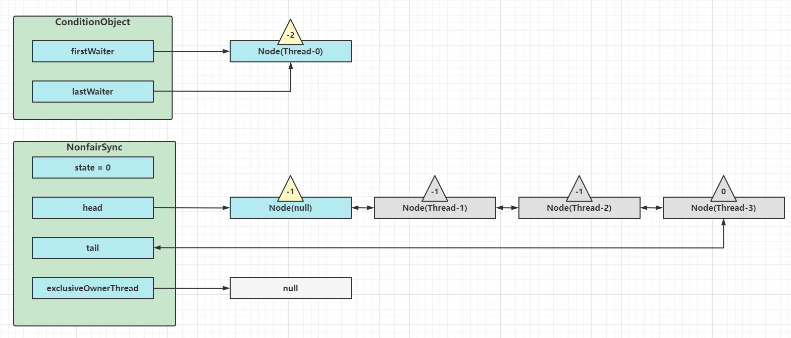

unparkAQS队列中的下一个节点，竞争锁，假设没有其他竞争线程，那么Thread-1竞争成功，park阻塞Thread-0

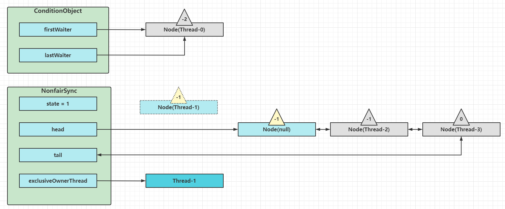

### signal流程

假设Thread-1要来唤醒Thread-0,进入ConditionObject的doSignal流程，取得等待队列中第一个Node,即Thread-0所在Node

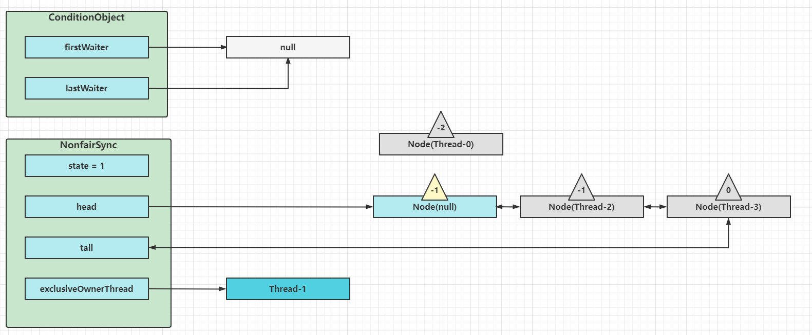

执行transferForSignal流程，将该Node加入AQS队列尾部，将Thread-0的waitStatus改为0， Thread-3的waitStatus改为-1

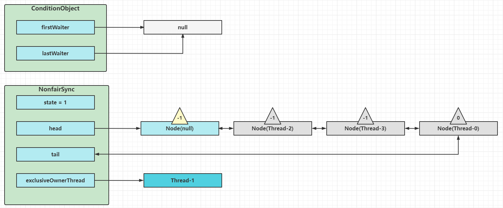

Thread-1释放锁，进入unlock流程
