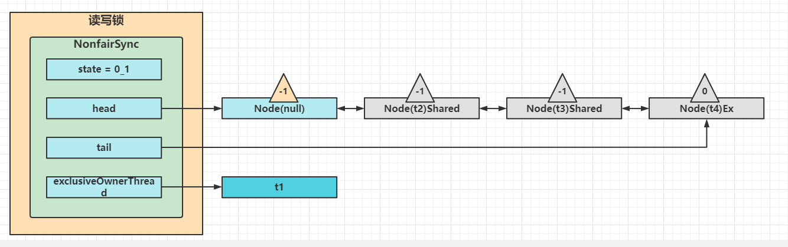
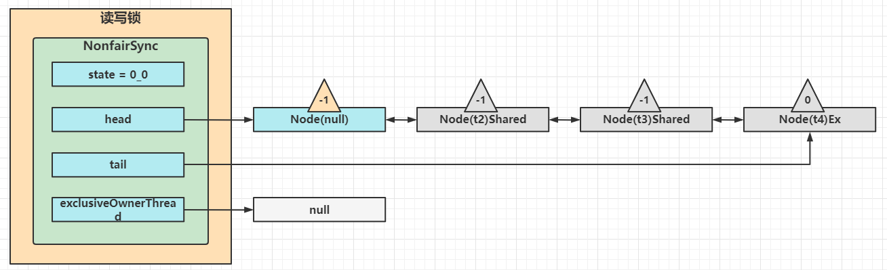
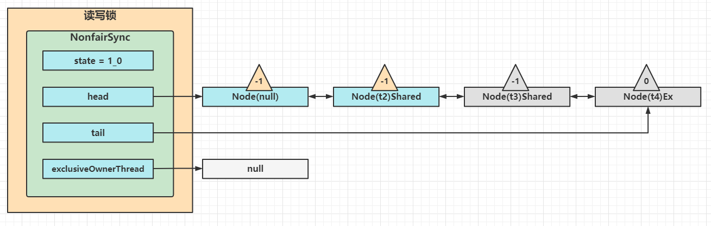
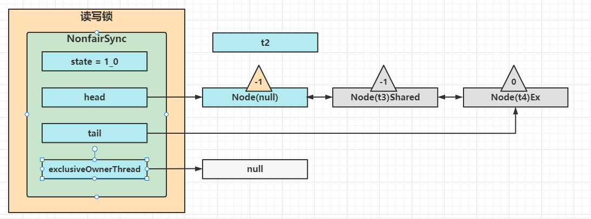
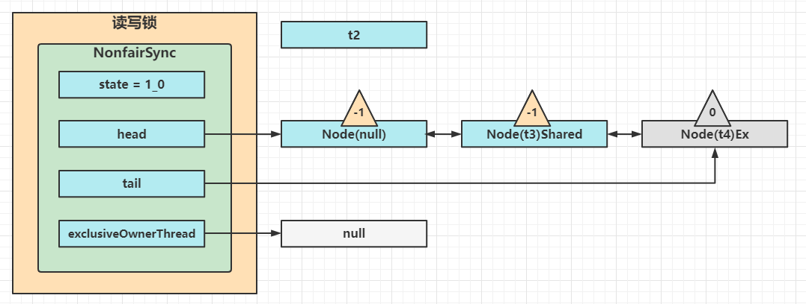
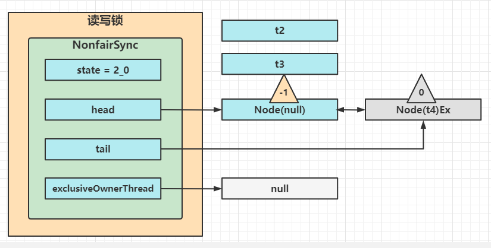
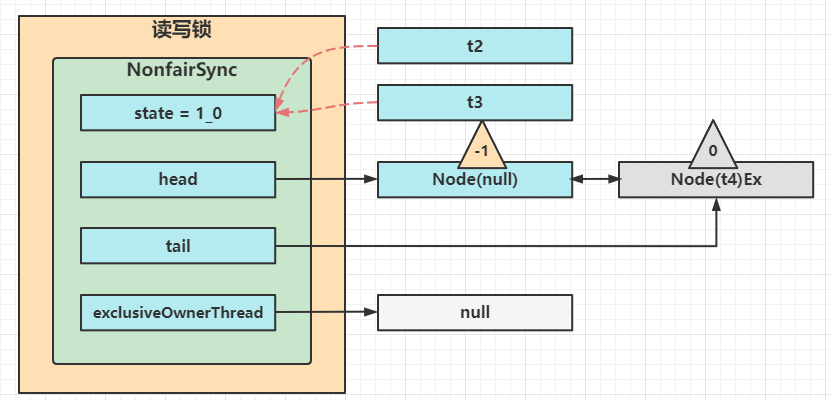
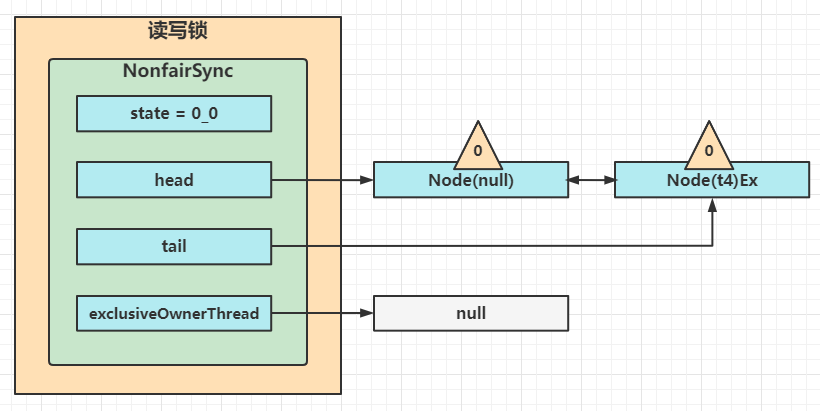
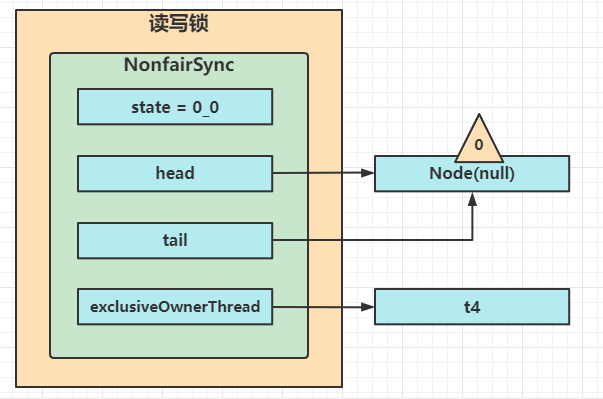

## ReentrantReadWriteLock

当读操作远远高于写操作时，这时候用读写锁让读-读可以并发，提高性能

类似与数据库中的select * from table lock in share mode

提供一个数据容器类内部分别使用读锁保护数据的read()方法，写锁保护数据的write()方法

```java
@Slf4j
public class DataContainer {
    public static void main(String[] args) throws InterruptedException {
        DataContainer container = new DataContainer();
        new Thread(() -> {
            container.read();
        }, "t1").start();
        Thread.sleep(1000);
        new Thread(() -> {
            container.write();
        }, "t2").start();
    }
    private Object data;
    private ReentrantReadWriteLock rw = new ReentrantReadWriteLock();
    ReentrantReadWriteLock.ReadLock read = rw.readLock();
    ReentrantReadWriteLock.WriteLock write = rw.writeLock();
    public Object read() {
        log.debug("获取读锁");
        read.lock();
        try {
            log.debug("读锁");
            return data;
        } finally {
            log.debug("释放读锁");
            read.unlock();
        }
    }
    public void write() {
        log.debug("获取写锁");
        write.lock();
        try {
            log.debug("写入");
        } finally {
            log.debug("释放写锁");
            write.unlock();
        }
    }
}
```

- 读锁不支持条件变量
- 重入时升级不支持：即持有读锁的情况下区获取写锁，会导致写锁永久等待

```java
read.lock();
try {
    write.lock();
    try {
        
    } finally {
        write.unlock();
    }
} finally {
    read.unlock();
}
```

- 重入时降级支持：即持有写锁的情况下去获取读锁

```java
class CacheData {
    Object data;
    // 是否有效，如果失效，需要重新计算data
    volatile boolean cacheValid;
    final ReentrantReadWriteLock rw = new ReentrantReadWriteLock();
    final ReentrantReadWriteLock.ReadLock read = rw.readLock();
    final ReentrantReadWriteLock.WriteLock write = rw.writeLock();
    void processCacheData() {
        read.lock();
        if(!cacheValid) {
            // 获取写锁前必须释放读锁
            read.unlock();
            write.lock();
            try {
                // 判断是否有其他线程已经获取了写锁，更新了缓存，避免重复更新
                if (!cacheValid) {
                    data = ...;
                    cacheValid = true;
                }
                // 降级为读锁，释放写锁，这样能够让其它线程读取缓存
                read.lock();
            } finally {
                write.unlock();
            }
        }
        // 自己用完数据，释放读锁
        try {
            use(data);
        } finally {
            read.lock();
        }
    }
}
```

## 读写锁原理

### 图解流程

读写锁用的是同一个Sync同步器，因此等待队列、state等也是同一个

### t1 write.lock, t2 read.lock

1. t1成功上锁，流程与ReentrantLock加锁相比没有特殊之处，不同的是写锁状态占了state的低16位，而读锁使用的是state的高16位


2. t2执行read.lock,这时进入读锁的sync.acquireShared(1)流程，首先会进入tryAcquireShared流程，如果有写锁独占，那么tryAcquireShared返回-1，表示失败
   - -1表示失败
   - 0表示成功，但后继节点不会继续唤醒
   - 正数表示成功，而且数值是还有几个后继节点需要唤醒，读写锁返回1


3. 这时会进入sync.doAcquireShared(1)流程，首先也是调用addWaiter添加节点，不同之处在于节点被设置为Node.SHARED模式而非Node.EXCLUSIVE模式，注意此时t2仍处于活跃状态


4. t2会看看自己的节点是不是老二，如果是，还会再次调用tryAcquireShared(1)来尝试获取锁
5. 如果没有成功，在doAcquireShared内for(;;)循环一次，把前驱节点waitStatus改为-1， 再for(;;)循环一次尝试tryAcquireShared(1)如果还不成功，那么在parkAndCheckInterrupt()处park


### t3 read.lock, t4.write.lock

这种状态下，假设又有t3线程加读锁和t4线程加写锁，这期间t1仍然持有锁，就变成了下面这个样子



### t1.unlock

这时会走到写锁的sync.release(1)流程，调用sync.tryRelease(1)成功，变成下面这个样子



接下来执行唤醒流程synch.unparkSuccessor,即让老二恢复运行，这时t2在doAcquireShared内parkAndCheckInterrupt()处恢复运行

这回再来一次for(;;)执行tryAcquireShared成功则让读锁计数加一



这时t2已经恢复运行，接下来t2调用setHeadAndPropagate(node, 1),它原本所在节点被设置为头节点



事情还没完，在setHeadAndPropagate方法内还会检查下一个节点是否是shared, 如果是则调用doReleaseShared()将head的状态从-1改为0并唤醒老二，这时t3在doAcquireShared内parkAndCheckInterrupt()处恢复运行



这回再来一次for(;;)执行tryAcquireShared成功则让读锁计数加一,这时候t3已经恢复运行，接下来t3调用setHeadAndPropagate(node, 1)，它原本所在节点被设置为头节点



下一个节点不是shared了，因此不会继续唤醒t4所在节点

### t2 read.unlock, t3 read.unlock

t2进入sync.releaseShared(1)中，调用tryReleaseShared(1)让计数减一，但由于计数还不为零



t3进入sync.releaseShared(1)中，调用tryRelaseShared(1)让计数减一，这回计数为零了，进入doReleaseShared()将头节点从-1改为0并唤醒老二，即



之后t4在acquireQueued中parkAndCheckInterrupt处恢复运行，再次for(;;)这次自己是老二，并且没有其他竞争，tryAcquire(1)成功，修改头节点，流程结束



## StampedLock

该类自JDK8加入，是为了进一步优化读性能，它的特点是在使用读锁，写锁的时候必须配合【戳】使用

加解读锁

```java
long stamp = lock.readLock();
lock.unlockRead(stamp);
```

加解写锁

```java
long stamp = lock.writeLock();
lock.unlockWrite(stamp);
```

乐观读，StampedLock支持tryOptimisticRead()方法（乐观读），读取完毕后需要做一次校验戳，如果校验通过，表示这期间确实没有写操作，数据可以安全通过，需要重新获取读锁，保证数据安全

```java
long stamp = lock.tryOptimisticRead();
// 校验
if (!lock.validate(stamp)) {
    // 锁升级
}
```

提供一个数据容器类内部分别使用读锁保护数据的read()方法，写锁保护的write()方法

```java
@Slf4j
public class DataContainerStamped {
    public static void main(String[] args) {
        DataContainerStamped container = new DataContainerStamped(1);
        new Thread(() ->  container.read(1000), "t1").start();
        new Thread(() ->  container.write(100), "t2").start();
    }
    private int data;
    private final StampedLock lock = new StampedLock();
    public DataContainerStamped(int data) {
        this.data = data;
    }
    public int read(int readTime) {
        long stamp = lock.tryOptimisticRead();
        log.debug("optimistic read locking... {}", stamp);
        sleep(readTime);
        if (lock.validate(stamp)) {
            log.debug("read finish ... {}", stamp);
            return data;
        }
        // 锁升级 - 读锁
        log.debug("updating to read lock... {}", stamp);
        try {
            stamp = lock.readLock();
            log.debug("read lock {}", stamp);
            sleep(readTime);
            log.debug("read finish ... {}", stamp);
            return data;
        } finally {
            log.debug("read unlock {}", stamp);
            lock.unlockRead(stamp);
        }
    }
    public void write(int newData) {
        long stamp = lock.writeLock();
        log.debug("write lock {}", stamp);
        try {
            this.data = newData;
            sleep(2000);
        } finally {
            log.debug("write unlock {}", stamp);
            lock.unlockWrite(stamp);
        }
    }
    private void sleep(long timeout) {
        try {
            Thread.sleep(timeout);
        } catch (InterruptedException e) {
            e.printStackTrace();
        }
    }
}
```

输出结果

```
21:07:10.344 [t1] DEBUG com.bytebuf.concurrent.aqs.DataContainerStamped - optimistic read locking... 256
21:07:10.344 [t2] DEBUG com.bytebuf.concurrent.aqs.DataContainerStamped - write lock 384
21:07:11.363 [t1] DEBUG com.bytebuf.concurrent.aqs.DataContainerStamped - updating to read lock... 256
21:07:12.368 [t2] DEBUG com.bytebuf.concurrent.aqs.DataContainerStamped - write unlock 384
21:07:12.368 [t1] DEBUG com.bytebuf.concurrent.aqs.DataContainerStamped - read lock 513
21:07:13.372 [t1] DEBUG com.bytebuf.concurrent.aqs.DataContainerStamped - read finish ... 513
21:07:13.372 [t1] DEBUG com.bytebuf.concurrent.aqs.DataContainerStamped - read unlock 513
```

- StampedLock不支持条件变量
- StampedLock不支持可重入
