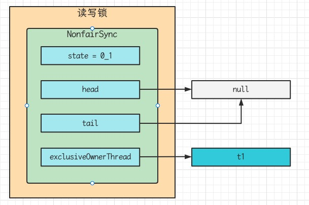
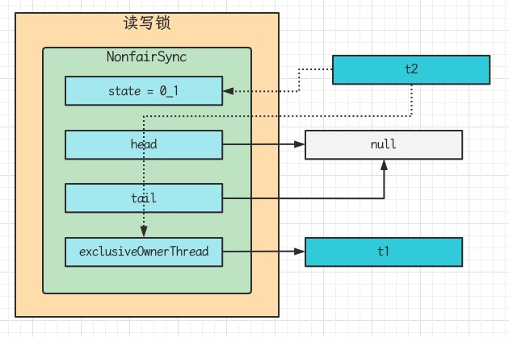
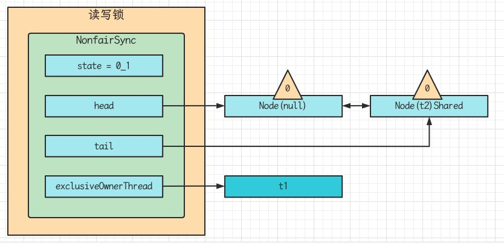
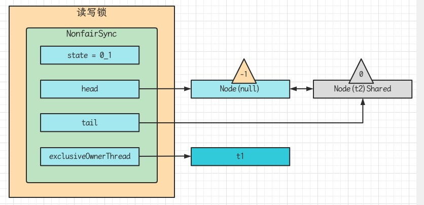

## ReentrantReadWriteLock

当读操作远远高于写操作时，这时候用读写锁让读-读可以并发，提高性能

类似与数据库中的select * from table lock in share mode

提供一个数据容器类内部分别使用读锁保护数据的read()方法，写锁保护数据的write()方法

```java
@Slf4j
public class DataContainer {
    public static void main(String[] args) throws InterruptedException {
        DataContainer container = new DataContainer();
        new Thread(() -> {
            container.read();
        }, "t1").start();
        Thread.sleep(1000);
        new Thread(() -> {
            container.write();
        }, "t2").start();
    }
    private Object data;
    private ReentrantReadWriteLock rw = new ReentrantReadWriteLock();
    ReentrantReadWriteLock.ReadLock read = rw.readLock();
    ReentrantReadWriteLock.WriteLock write = rw.writeLock();
    public Object read() {
        log.debug("获取读锁");
        read.lock();
        try {
            log.debug("读锁");
            return data;
        } finally {
            log.debug("释放读锁");
            read.unlock();
        }
    }
    public void write() {
        log.debug("获取写锁");
        write.lock();
        try {
            log.debug("写入");
        } finally {
            log.debug("释放写锁");
            write.unlock();
        }
    }
}
```

- 读锁不支持条件变量
- 重入时升级不支持：即持有读锁的情况下区获取写锁，会导致写锁永久等待

```java
read.lock();
try {
    write.lock();
    try {
        
    } finally {
        write.unlock();
    }
} finally {
    read.unlock();
}
```

- 重入时降级支持：即持有写锁的情况下去获取读锁

```java
class CacheData {
    Object data;
    // 是否有效，如果失效，需要重新计算data
    volatile boolean cacheValid;
    final ReentrantReadWriteLock rw = new ReentrantReadWriteLock();
    final ReentrantReadWriteLock.ReadLock read = rw.readLock();
    final ReentrantReadWriteLock.WriteLock write = rw.writeLock();
    void processCacheData() {
        read.lock();
        if(!cacheValid) {
            // 获取写锁前必须释放读锁
            read.unlock();
            write.lock();
            try {
                // 判断是否有其他线程已经获取了写锁，更新了缓存，避免重复更新
                if (!cacheValid) {
                    data = ...;
                    cacheValid = true;
                }
                // 降级为读锁，释放写锁，这样能够让其它线程读取缓存
                read.lock();
            } finally {
                write.unlock();
            }
        }
        // 自己用完数据，释放读锁
        try {
            use(data);
        } finally {
            read.lock();
        }
    }
}
```

## 读写锁原理

### 图解流程

读写锁用的是同一个Sync同步器，因此等待队列、state等也是同一个

### t1 write.lock, t2 read.lock

1. t1成功上锁，流程与ReentrantLock加锁相比没有特殊之处，不同的是写锁状态占了state的低16位，而读锁使用的是state的高16位



2. t2执行read.lock,这时进入读锁的sync.acquireShared(1)流程，首先会进入tryAcquireShared流程，如果有写锁独占，那么tryAcquireShared返回-1，表示失败
   - -1表示失败
   - 0表示成功，但后继节点不会继续唤醒
   - 正数表示成功，而且数值是还有几个后继节点需要唤醒，读写锁返回1



3. 这时会进入sync.doAcquireShared(1)流程，首先也是调用addWaiter添加节点，不同之处在于节点被设置为Node.SHARED模式而非Node.EXCLUSIVE模式，注意此时t2仍处于活跃状态



4. t2会看看自己的节点是不是老二，如果是，还会再次调用tryAcquireShared(1)来尝试获取锁
5. 如果没有成功，在doAcquireShared内for(;;)循环一次，把前驱节点waitStatus改为-1， 再for(;;)循环一次尝试tryAcquireShared(1)如果还不成功，那么在parkAndCheckInterrupt()处park


