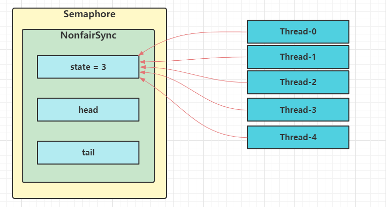
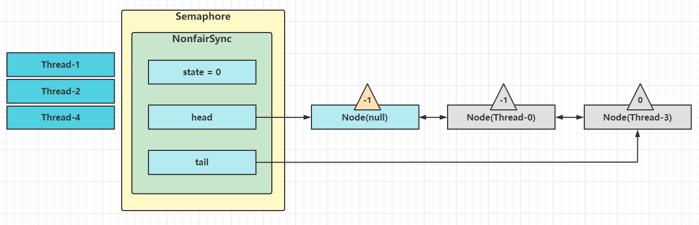
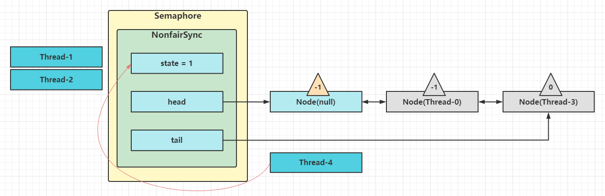
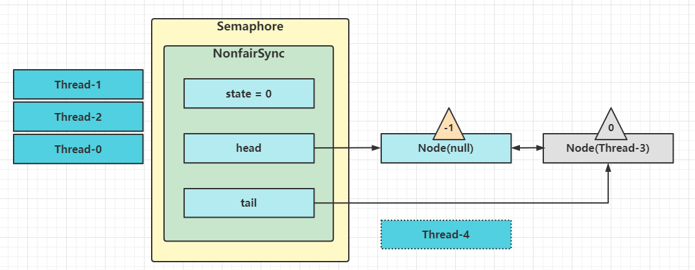

信号量，用来限制能同时访问共享资源的线程上限

```java
@Slf4j
public class TestSemaphore {
    public static void main(String[] args) {
        Semaphore semaphore = new Semaphore(3);
        for (int i = 0; i < 10; i++) {
            new Thread(() -> {
                try {
                    semaphore.acquire();
                } catch (InterruptedException e) {
                    e.printStackTrace();
                }
                try {
                    log.debug("running...");
                    Thread.sleep(1000);
                    log.debug("end...");
                } catch (InterruptedException e) {
                    e.printStackTrace();
                } finally {
                    semaphore.release();
                }
            }).start();
        }
    }
}
```

## Semaphore应用

- 使用Semaphore限流，在访问高峰期间，让请求线程阻塞，高峰期间过去再释放许可，当然它只适合限制单机线程数量，并且仅是限制线程，而不是限制资源数（例如连接数，请对比Tomcat LimitLatch的实现）
- 用Semaphore实现简单连接池，对比【享元模式】的实现（java notify），性能和可读性显然更好，注意下面的实现中线程数和数据库连接数是相等的

```java
@Slf4j
public class ConnectionPool {
    //连接池大小
    private int poolSize;
    //连接数组
    private Connection[] conns;
    //连接是否被占用标记
    private AtomicIntegerArray states;
    private Semaphore semaphore;
    //初始化连接池
    public ConnectionPool(int poolSize) {
        this.semaphore = new Semaphore(poolSize);
        this.poolSize = poolSize;
        conns = new Connection[poolSize];
        states = new AtomicIntegerArray(new int[poolSize]);
        for (int i = 0; i < poolSize; i++) {
            conns[i] = new MockConnection("conn" + (i + i));
        }
    }
    public Connection borrow() {
        try {
            semaphore.acquire();
        } catch (InterruptedException e) {
            e.printStackTrace();
        }
        for (int i = 0; i < poolSize; i++) {
            //获取空闲连接
            if (states.get(i) == 0) {
                if (states.compareAndSet(i, 0 , 1)) {
                    log.debug("borrow {}", conns[i]);
                    return conns[i];
                }
            }
        }
        return null;
    }
    public void free(Connection connection) {
        for (int i = 0; i < poolSize; i++) {
            if (conns[i] == connection) {
                states.set(i, 0);
                log.debug("free {}", connection);
                semaphore.release();
                break;
            }
        }
    }
}
```

## Semaphore原理

### 加锁解锁流程

Semaphore有点想一个停车场，permits就好像停车位数量，当线程获得了permits就像是获得了停车位，然后停车场显示空余车位减一

刚开始permits(state)为3，这时5个线程来获取资源



假设其中Thread-1, Thread-2, Thread-4 cas竞争成功，而Thread-0和Thread-3竞争失败，进入AQS队列park阻塞



这时Thread-4释放了permits,状态如下



接下来Thread-0竞争成功，permits再次设置为0，设置自己为head节点，断开原来的head节点，unpark接下来的Thread-3节点，但由于permits是0，因此Thread-3在尝试不成功后再次进入park状态

