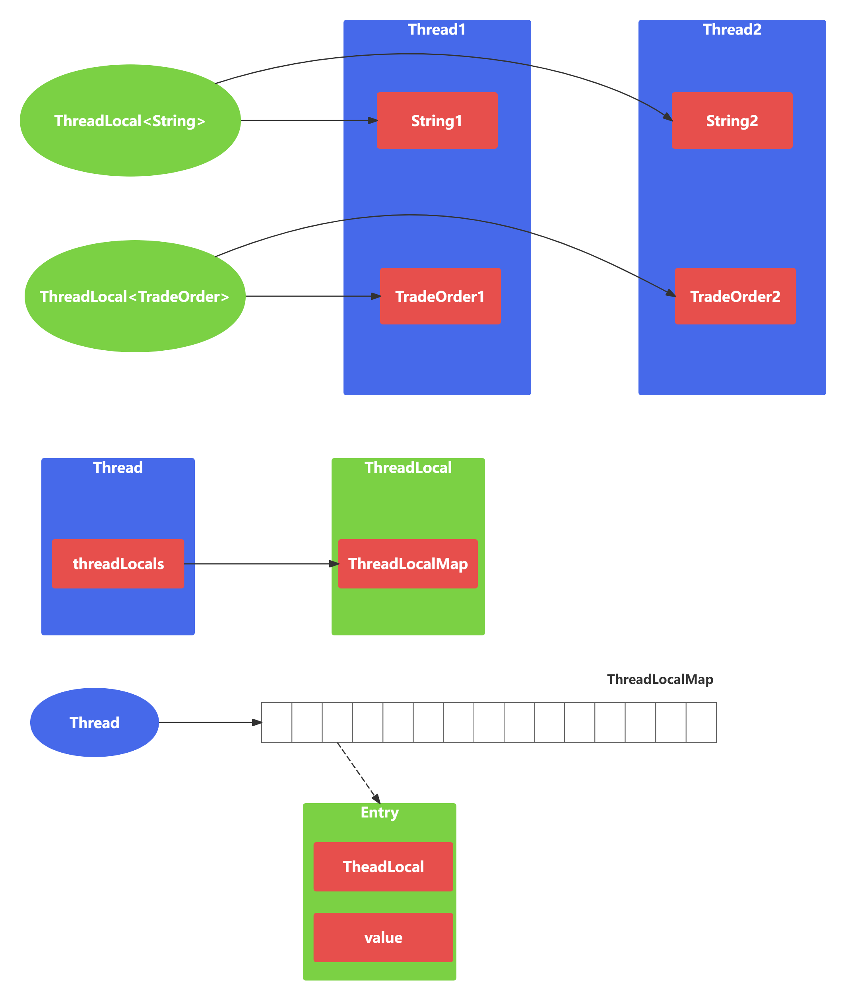

- ThreadLocal可以实现【资源对象】的线程隔离，让每个线程各用各的【资源对象】，避免争用引发的线程安全问题
- ThreadLocal同时实现了线程内的资源共享
- 其原理是，每个线程内有一个ThreadLocalMap类型的成员遍历，用来存储资源对象
  1. 调用set方法，就是以ThreadLocal自己作为key,资源对象作为value,放入当前线程的ThreadLocalMap集合中
  2. 调用get方法，就是以ThreadLocal自己作为key,当当前线程中查找关联的资源值
  3. 调用remove方法，就是以ThreadLocal自己作为key,移除当前线程关联的资源值
- 为什么ThreadLocalMap中的key(即ThreadLocal)要设计为弱引用
  1. Thread可能需要长时间运行（如线程池中的线程），如果key不再使用，需要在内存不足(GC)时释放其占有的内存
  2. 但GC仅是让key的内存释放，后续还要根据key是否为null来进一步释放值的内存，释放时机有
     1. 获取key发现null key
     2. set key时，会使用启发式扫描，清除临近的null key, 启发次数与元素个数，是否发现null key有关
     3. remove时（推荐），因为一般使用ThreadLocal时都把它作为静态变量，因此GC无法回收

```java
@Slf4j
public class TestThreadLocal {
    public static void main(String[] args) {
        test1();
    }
    private static void test2() {
        for (int i = 0; i < 2; i++) {
            new Thread(() -> {
                log.debug("{}", Utils.getConnection());
                log.debug("{}", Utils.getConnection());
                log.debug("{}", Utils.getConnection());
            }, "t" + (i + 1)).start();
        }
    }
    private static void test1() {
        for (int i = 0; i < 5; i++) {
            new Thread(() -> {
                log.debug("{}", Utils.getConnection());
            }, "t" + (i + 1)).start();
        }
    }
    static class Utils {
        private static final ThreadLocal<Connection> tl = new ThreadLocal<>();
        public static Connection getConnection() {
            Connection connection = tl.get();
            if (connection == null) {
                connection = innerGetConnection();
                tl.set(connection);
            }
            return connection;
        }

        private static Connection innerGetConnection() {
            try {
                return DriverManager.getConnection("jdbc:mysql://localhost:3306/mysql?useSSL=false", "root", "123456");
            } catch (SQLException e) {
                e.printStackTrace();
                return null;
            }
        }
    }
}
```

## ThreadLocalMap中Entry的设计原理

- Entry继承自弱引用类WeakReference, Entry的key是弱引用，value是强引用
- 为什么Entry的key是弱引用？如果key都是强引用，当ThreadLocal不再使用时，然而ThreadLocalMap中还是存在对ThreadLocal的强引用，那么GC是无法回收的，从而造成内存浪费
- 应该如何避免ThreadLocalMap内存泄漏？在执行ThreadLocal.set()/get()方法时，ThreadLocal会清除ThreadLocalMap中key为NULL的Entry对象，让它还能够被GC回收
