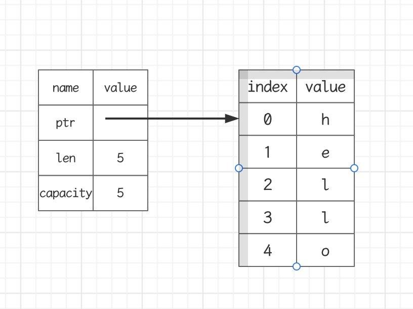
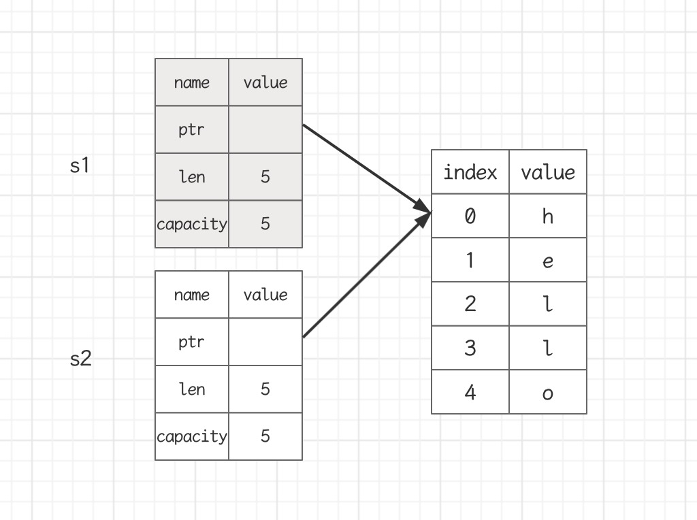
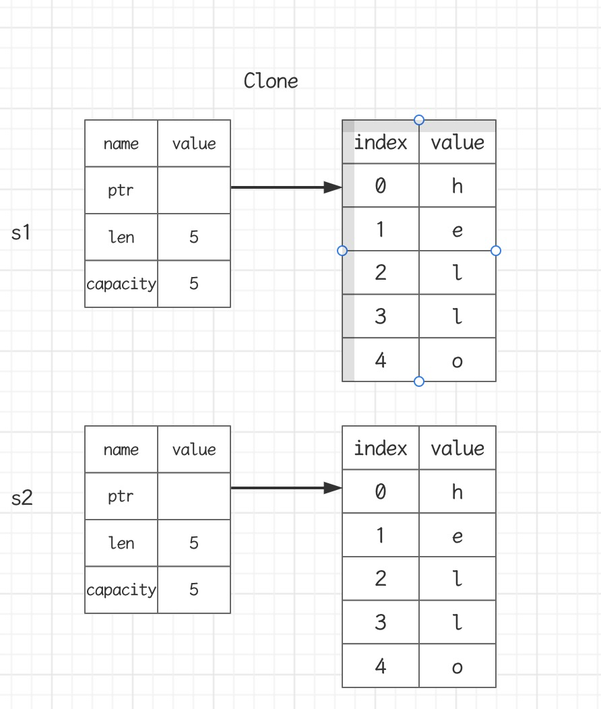
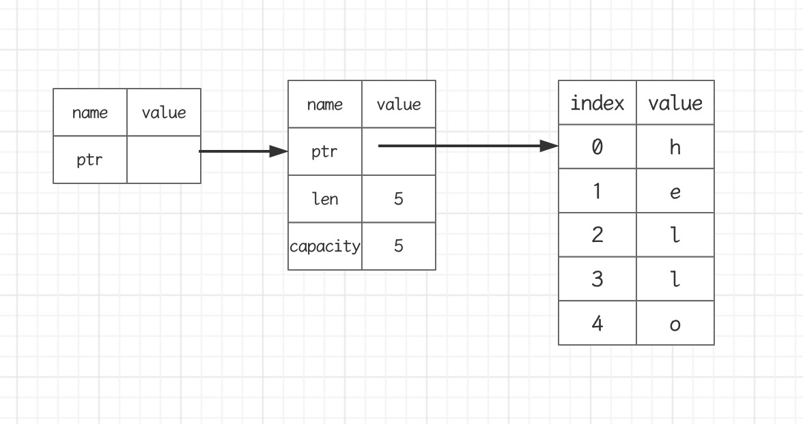

- 所有权是Rust最独特的特性，它让Rust无需GC就可以保证内存安全

## 什么是所有权

- Rust的核心就是所有权
- 所有程序在运行时都必须管理它们使用计算机内存的方式
  - 有些语言有垃圾收集机制，在程序运行时，它们会不断地寻找不再使用的内存
  - 在其他语言中，程序员必须显示的分配和释放内存
- Rust采用的第三种方式
  - 内存是通过一个所有权系统来管理的，其中包含一组编译器在编译检查的规则
  - 当程序运行时，所有权特性不会减慢程序的运行速度

### 栈内存 VS 堆内存

- 在像Rust这样的系统级编程语言里，一个值是在stack上还是在heap上对语言的行为和你为什么要做某些决定是有更大的影响的
- 在你的代码运行的时候，Stack和Heap都是你可用的内存，但他们的结构很不相同

#### 存储数据

- Stack按值得接收顺序来存储，按相反的顺序将它们移除(后进先出，LIFO)
  - 添加数据叫做压入栈
  - 移除数据叫做弹出栈
- 所有存储在Stack上的数据必须拥有已知的固定的大小
  - 编译时大小未知的数据或运行时大小可能发生变化的数据必须存放在heap上
- Heap内存组织性差一些
  - 当你把数据放入heap时，你会请求一定数量的空间
  - 操作系统在heap里找到一块足够大的空间，把它标记为在用，并返回一个指针，也就是这个空间的地址
  - 这个过程在heap上进行分配，有时仅仅称为分配
- 把值压入stack上不叫分配
- 因为指针是已知固定大小的，可以把指针存放在stack上
  - 但如果想要实际数据，你必须使用指针来定位
- 把数据压到stack上要比在heap上分配快得多
  - 因为操作系统不需要寻找用来存储数据得空间，那个位置永远都在stack得顶端
- 在heap上分配空间需要做更多的工作
  - 操作系统首先需要找到一个足够大的空间来存放数据，然后要做好记录方便下次分配

### 访问数据

- 访问heap种的数据要比访问stack种的数据慢，因为需要通过指针才能找到heap中的数据
  - 对于现代处理器来说，由于缓存的缘故，如果指令在内存中跳转的次数越少，那么速度就越快
- 如果数据存放的距离比较远，那么处理器的处理速度就会更快一些(stack上)
- 如果数据之间的距离比较远，那么处理速度就会慢一些(heap上)
  - 在heap上分配大量的空间也是需要时间的

### 函数调用

- 当你的代码调用函数时，值被传入到函数(也包括指向heap的指针)。函数本地的变量被压到stack上。当函数结束后，这些值会从stack上弹出

### 所有权存在的原因

- 所有权解决的问题
  - 跟踪代码的哪些部分正在使用heap的哪些数据
  - 最小化heap上的重复数据量
  - 清理heap上未使用的数据以避免空间不足
- 一旦懂的了所有权，那么就不需要经常去想stack和heap了
- 但是知道管理heap数据是所有权存在的原因，这有助于解释它为什么这样工作

## 所有权与函数

### 所有权规则

- 每个值都有一个变量，这个变量是该值的所有者
- 每个值同时只能有一个所有者
- 当所有者超出作用域(scope)时，该值将被删除

### 变量作用域

- scope就是程序中一个项目的有效范围

```rust
fn main() {
  //s不可用
  let s = "hello"; //s 可用
  // 可以对s进行相关操作
} //s作用域到此结束，s不再可用
```

### String类型

- String比那些基础标量数据类型更复杂
- 字符串字面值：程序里手写的那些字符串值，它们是不可变的
- Rust还有第二种字符串类型：String
  - 在heap上分配。能够存储在编译时未知数量的文本

### 创建String类型的值

- 可以使用from函数从字符串字面值创建出String类型
- let s = String::from("hello");
  - "::"表示from是String类型下的函数
- 这类字符串是可以被修改的

```rust
fn main() {
    let mut s = String::from("hello");
    s.push_str(", world");
    println!("{}", s);
}
```

- 为什么String类型的值可以修改，而字符串字面值却不能修改
  - 因为他们处理内存的方式不同

### 内存和分配

- 字符串字面值，在编译时就知道它的内容了，其文本内容直接被硬编码到最终的可执行文件里
  - 速度快，高效。是因为其不可变性
- String类型，为了支持可变性，需要在heap上分配内存来保存编译时未知的文本内容
  - 操作系统必须在运行时来请求内存：这步通过调用String::from来实现
  - 当用完String之后，需要使用某种方式将内存返回给操作系统：这步，在拥有GC的语言中，GC会跟踪并清理不再使用的内存
  - 没有GC,就需要我们去识别内存何时不再使用，并调用代码将它返回
  - 如果忘了，那就浪费内存
  - 如果提前做了，变量就会非法
  - 如果做了两次，也是Bug, 必须一次分配对应一次释放
- Rust采用了不同的方式：对于某个值来说，当拥有它的变量走出作用域范围时，内存会立即自动的交还给操作系统
- drop函数

### 变量和数据的交互方式：移动(Move)

- 多个变量可以与同一个数据使用一种独特的方式来交互

- let x = 5; let y = x;

- 整数是已知且固定大小的简单的值，这两个5被压到了stack中

- String版本：let s1 = String::from("hello"); let s2 = s1;情况和上面不同，将s1赋值个s2后，s1就失效了，后面的代码中也不用再次使用s1了

- 一个String由3部分组成：

  - 一个指向存放字符串内容的内存的指针
  - 一个长度
  - 一个容量

  

- 上面这写东西放在stack上

- 存放字符串内容的部分在heap上

- 长度len,就是存放字符串内容所需的字节数

- 容量capacity是指String从操作系统总共获得内存的总字节数

- 当把s1赋给s2, String的数据被复制了一份：

  - 在stack上复制了一份指针，长度，容量
  - 并没有复制指针所指向的heap上的数据

- 当变量离开作用域时，Rust会自动调用drop函数，并将变量使用的heap内存是否

- 当s1, s2离开作用域时，它们都会尝试释放相同的内容

  - 二次释放(double free)bug

- 为了保证内存安全

  - Rust没有尝试复制被分配的内存
  - Rust让s1失效：当s1离开作用域的时候，Rust不需要释放任何东西

  ```rust
  fn main() {
    let s1 = String::from("hello");
    let s2 = s1;
    // s1已失效，不能再使用
    // println("{}", s1); 编译失败s1已失效
  }
  ```



- 浅拷贝(shallow copy)
- 深拷贝(deep copy)
- 你也许会将复制指针，长度容量视为浅拷贝，但由于Rust让s1失效了，所以我们用一个新的术语:移动(Move)
- 隐含的一个设计原则：Rust不会自动创建数据的深拷贝
  - 就运行时性能而言，任何自动赋值的操作都是廉价的

### 变量和数据的交互方式：克隆(Clone)

- 如果真想对heap上面的String数据进行深度拷贝，而不仅仅是stack上的数据，可以使用clone方法

```rust
fn main() {
  let s1 = String::from("hello");
  let s2 = s1.clone();
  println!("{}, {}", s1, s2);
}
```



### Stack上的数据: 复制

- Copy trait: 可以用于像整数这样完全存放在stack上面的类型
- 如果一个类型实现了Copy这个trait,那么旧的变量在赋值后仍然可用
- 如果一个类型或者该类型的一部分实现了Drop trait,那么Rust不允许让它再去实现Copy trait了

### 一些拥有Copy trait的类型

- 任何简单标量组合类型都可以是Copy的
- 任何需要分配内存或某种资源的都不是Copy的
- 一些拥有Copy trait的类型
  - 所有的整数类型，如u32
  - bool
  - char
  - 所有的浮点类型, f32, f64
  - Tuple(元组)，如果其所有的字段都是Copy的(i32, i32)是，(i32, String)不是

### 所有权与函数

- 在语义上，将值传递给函数和把值赋给变量是类似的
  - 将值传递给函数将发生移动或复制

```rust
fn main() {
    let s = String::from("hello");
    take_ownership(s);
    let x = 5;
    makes_copy(x);
}

fn take_ownership(some_string: String) {
    println!("{}", some_string);
}

fn makes_copy(some_number: i32) {
    println!("{}", some_number)
}
```

### 返回值与作用域

- 函数在返回值的过程中同样也会发生所有权的转移

```rust
fn main() {
    let s1 = givers_ownership();
    let s2 = String::from("hello");
    let s3 = takes_and_gives_back(s2);
}

fn givers_ownership() -> String {
    let some_string = String::from("hello");
    some_string
}

fn takes_and_gives_back(some_string: String) -> String {
    some_string
}
```

- 一个变量的所有权总是遵循同样的模式
- 把一个值赋值给其它变量时就会发生移动
- 当一个包含heap数据的变量离开作用域时，它的值就会被drop函数清理，除非数据的所有权移动到另一个变量上了

```rust
fn main() {
    let s1 = String::from("hello");
    let (s2, len) = calculate_length(s1);
    println!("The length of {} is {}", s2, len);
}

fn calculate_length(s: String) -> (String, usize) {
    let length = s.len();
    (s, length)
}
```

### 如何让函数使用某个值，但不获得其所有权

- Rust有一个特性叫做引用(Reference)

## 引用和借用

```rust
fn main() {
    let s1 = String::from("hello");
    let len = calculate_length(&s1);
    println!("The length of {} is {}", s1, len);
}

fn calculate_length(s: &String) -> usize {
    s.len()
}
```

- 参数的类型是&String而不是String
- &符号就是表示引用：允许你引用某些值而不取的所有权



### 借用

- 我们把引用作为函数参数这个行为叫做借用
- 是否可以修改借用的东西 - 不行
- 和变量一样，引用默认也是不可变的

```rust
fn main() {
    let mut s1 = String::from("hello");
    let len = calculate_length(&mut s1);
    println!("The length of {} is {}", s1, len);
}

fn calculate_length(s: &mut String) -> usize {
    s.push_str(", world");
    s.len()
}
```

### 可变引用

- 可变引用有一个重要的限制：在特定作用域内，对某一块数据，只能有一个可变的引用
  - 这样做的好处是在编译时防止数据竞争

```rust
fn main() {
  let mut s = String::from("hello");
  let s1 = &mut s;
  let s2 = &mut s; //编译失败，不能同时存在两个可变引用
}
```

- 一下三种行为会发生数据竞争
  - 两个或多个指针同时访问同一个数据
  - 至少有一个指针用于写入数据
  - 没有使用任何机制来同步对数据的访问
- 可以通过创建新的作用域，来允许非同时的创建多个可变引用

```rust
fn main() {
  let mut s = String::from("hello");
  {
    let s1 = &mut s;
  }
  let s2 = &mut s;
}
```

- 另外一个限制

  - 不可以同时拥有一个可变引用和一个不变引用
  - 多个不变的引用是可以的

  ```rust
  fn main() {
    let mut s = String::from("hello");
    let r1 = &s;
    let r2 = &s; //多个不变引用是可以的
    let s1 = &mut s; //编译失败不能同时存在不变和可变的引用
  }
  ```

### 悬空引用Dangling References

- 悬空指针(Dangling Pointer)一个指针引用了内存中的某个地址，而这块内存可能已经释放并分配给其他人使用了

- 在Rust里，编译器可保证引用永远都不是悬空引用

  - 如果你引用了某些数据，编译器将保证在引用离开作用域之前数据不会离开作用域

  ```rust
  fn main() {
    let r = dangle();
  }
  fn dangle() -> &String { //编译失败，不允许这样做
    let s = String::from("hello");
    &s
  }
  ```

### 引用的规则

- 在任何给定的时刻，只能满足下列条件之一
  - 一个可变的引用
  - 任意数量不可变的引用
- 引用必须一直有效

## 切片

- Rust的另外一种不持有所有权的数据类型：切片(slice)
- 编写一个函数：
  - 它接收字符串作为参数
  - 返回它在这个字符串里找到的第一个单词
  - 如果函数没有找到任何空格，那么整个字符串就被返回

```rust
fn main() {
    let mut s = String::from("hello world");
    let world_index = first_world(&s);
    s.clear();
    println!("{}", world_index);   
}

fn first_world(s: &String) -> usize {
    let bytes = s.as_bytes();
    for(i, &item) in bytes.iter().enumerate() {
        if item == b' ' {
            return i
        }
    }
    s.len()
}
```

### 字符串切片

- 字符串切片是指字符串一部分内容的引用
- 形式：[开始索引 .. 结束索引]
  - 开始索引就是切片起始位置的索引值
  - 结束索引就是切片终止位置的下一个索引值

```rust
fn main() {
    let s = String::from("hello world");
    let world_index = first_world(&s);
    println!("{}", world_index);   
}

fn first_world(s: &String) -> &str {
    let bytes = s.as_bytes();
    for(i, &item) in bytes.iter().enumerate() {
        if item == b' ' {
            return &s[..i]
        }
    }
    &s[..]
}
```

```rust
fn main() {
    let s = String::from("hello world");
    let hello = &s[..5];
    let world = &s[6..];
    let whole = &s[..];
    println!("{}, {}, {}", hello, world, whole); 
}
```

- 字符串切片的范围索引必须发生在有限的UTF-8字符边界内
- 如果尝试从一个多字节的字符中创建字符串切片，程序会报错并退出

### 字符串字面值是切片

- 字符串字面值被直接存储在二进制程序中
- let s = "hello world";
- 变量s的类型是&str, 它是一个指向二进制程序特定位置的切片
  - &str是不可变引用，所以字符串字面值也是不可变的

### 将字符串切片作为参数传递

- fn first_world(s: &String) -> &str {}
- 有经验的Rust开发者会采用&str作为参数类型，因为这样就可以同时接收String和&str类型的参数了
- fn first_world(s: &str) -> &str {}
  - 使用字符串切片，直接调用该函数
  - 使用String, 可以创建一个完整的String切片来调用该函数
- 定义函数时使用字符串切片来代替字符串引用会使我们的API更加通用，且不会损失任何功能

```rust
fn main() {
  let a = [1, 2, 3, 4, 5];
  let slice = &a[1..3];
}
```

