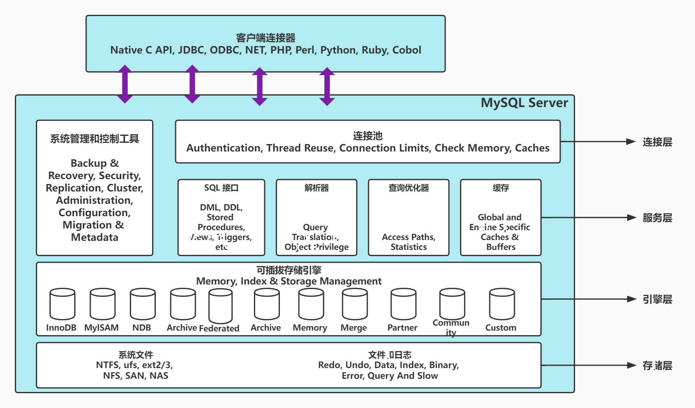

## MySQL体系结构



- 连接层：最上层是一些客户端和连接服务，主要完成一些类似与连接处理，授权认证，及相关的安全方案。服务器也会为安全接入的每个客户端验证它所具有的操作权限
- 服务层：第二层架构主要完成大多数的核心服务功能，如SQL接口，并完成缓存的查询，SQL的分析和优化，部分内置函数的执行。所有跨存储引擎的功能也在这一层实现。如过程，函数等
- 引擎层：存储引擎真正的负责了MySQL中数据的存储和提取，服务器通过API和存储引擎进行通信。不同的存储引擎具有不同的功能，这样我们可以根据自己的需要，来选取合适的存储引擎
- 存储层：主要是将数据存储在文件系统之上，并完成与存储引擎的交互。

## 存储引擎简介

- 存储引擎就是存储数据，建立索引，更新，查询数据等技术的实现方式。存储引擎是基于表的，而不是基于库的，所以存储引擎也可被称为表类型
- 在创建表时，指定存储引擎

```sql
CREATE TABLE 表名(
	字段1 字段1类型 [COMMENT 字段1注释],
  ...
)ENGINE=INNODB [COMMENT 表注释];
```

- 查看当前数据库支持的存储引擎

```sql
SHOW ENGINES;
```

## 存储引擎特点

### InnoDB

- 介绍：InnoDB是一种兼顾高可靠性和高性能的通用存储引擎，在MySQL5.5之后，InnoDB是默认的MySQL存储引擎
- 特点：
  - DML操作遵循ACID模型，支持事务
  - 行级锁，提高并发访问性能
  - 支持外键FOREIGN KEY约束，保证数据的完整性和正确性
- 文件：xxx.ibd: xxx代表的是表名，innoDB引擎的每张表都会对应这样一个表空间文件，存储该表的表结构(frm, sdi), 数据和索引。参数：innodb_file_per_table
- 查看idb文件命令：`ibd2sdi xxx.ibd`
- InnoDB逻辑存储结构


### MyISAM

- 介绍：MyISAM是MySQL早期默认存储引擎
- 特点
  - 不支持事务，不支持外键
  - 支持表锁，不支持行锁
  - 访问速度快
- 文件
  - xxx.sdi: 存储表结构信息
  - xxx.MYD: 存储数据
  - xxx.MYI: 存储索引

### Memory

- 介绍：Memory引擎的表数据是存储在内存中的，由于受到硬件问题，或断电问题的影响，只能将这些表作为临时表或缓存使用
- 特点：内存存放，hash索引(默认)
- 文件：xxx.sdi: 存储表结构信息

## 存储引擎选择

