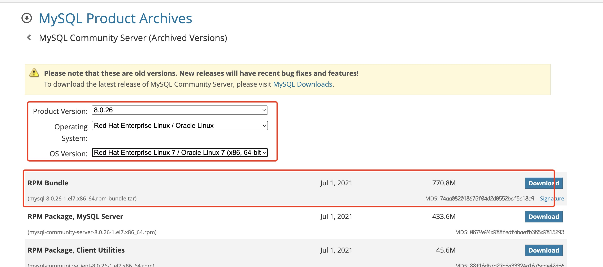

## 准备一台Linux服务器

- Linux版本为CentOS 7

## 下载Linux版MySQL安装包

- https://downloads.mysql.com/archives/community/



##创建目录，并解压

```bash
mkdir mysql
tar -zxvf mysql-8.0.26-1.e17.x86__64.rmp-bundle.tar -C mysql
```

## 安装mysql的安装包

```shell
cd mysql

rpm -ivh mysql-community-common.rpm
rpm -ivh mysql-community-client-plugins.rmp
rpm -ivh mysql-community-libs.rpm
rpm -ivh mysql-community-libs-compat.rpm
yum install openssl-devel
rpm -ivh mysql-community-devel.rpm
rpm -ivh mysql-community-client.rpm
rpm -ivh mysql-communit-server.rpm
```

## 启动MySQL服务

```shell
systemctl start mysqld
systemctl restart mysqld
systemctl stop mysqld
```

## 查询自动生成的root用户密码

```shell
grep 'temporary password' /var/log/mysqld.log
```

## 修改root用户密码

```shell
alter user 'root'@'localhost' identified by '1234';
alter user 'root'@'localhost' identified with mysql_native_password by '1234';
```

- 执行上述的SQL会报错，原因是因为设置的密码太简单，密码复杂度不够。我们可以设置密码的复杂度为简单类型，密码长度为4

```shell
set global validate_password.policy = 0;
set global validate_password.length = 4;
```

## 创建用户

```shell
create user 'root'@'%' indetified with mysql_native_password by '1234';
```

## 给root用户分配权限

```shell
grant all on *.* to 'root'@'%';
```

