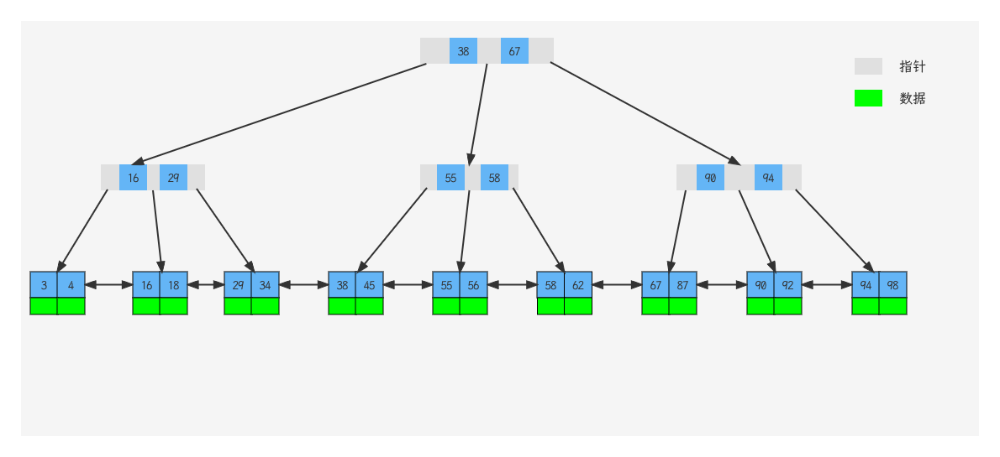

## 索引概述

### 介绍

- 索引(index)是帮助MySQL高效获取数据的数据结构(有序)。在数据之外，数据库系统还维护着满足特定查找算法的数据结构，这些数据结构以某种方式引用(指向)数据，这样就可以在这些数据结构上实现高级查找算法，这种数据结构就是索引

### 优缺点

- 优势：
  - 提高数据检索的效率，降低数据库的IO成本
  - 通过索引对数据进行排序，降低数据排序的成本，降低CPU的消耗
- 劣势
  - 索引也是要占用空间的
  - 索引大大提高了查询效率，同时也降低了更新表的速度，如对表进行INSERT, UPDATE, DELETE时，效率降低

## 索引结构

MySQL的索引是在存储引擎层实现的，不同的存储引擎有不同的结构，主要包含以下几种

| 索引结构            | 描述                                                         |
| ------------------- | ------------------------------------------------------------ |
| B+Tree索引          | 最常见的索引类型，大部分引擎都支持B+树索引                   |
| Hash索引            | 底层数据结构是用哈希表实现的，只有精确匹配索引列的查询才有效，不支持范围查询 |
| R-Tree(空间索引)    | 空间索引是MyISAM引擎的一个特殊索引类型，主要用于地理空间数据类型，通常使用较少 |
| Full-text(全文索引) | 是一种通过建立倒排索引，快速匹配文档的方式，类似于Lucene, Solr, ES |

| 索引       | InnoDB          | MyISAM | Memory |
| ---------- | --------------- | ------ | ------ |
| B+Tree索引 | 支持            | 支持   | 支持   |
| Hash索引   | 不支持          | 不支持 | 支持   |
| R-Tree索引 | 不支持          | 支持   | 不支持 |
| Full-text  | 5.6版本之后支持 | 支持   | 不支持 |

### 二叉树

- 二叉树缺点：顺序插入时，会形成一个链表，查询性能大大降低。大数据量情况下，层级较深，检索速度慢
- 红黑树：大数据量情况下，层级较深，检索速度慢

## B-Tree

- B-Tree(多路平衡查找树)：以一颗最大度数(max-degree)为5(5阶)的b-tree为例(每个节点最多存储4个key, 5个指针)
- 树的度数指的是一个节点的子节点个数


### B+Tree

相对于B-Tree区别

- 所有的数据都会出现在叶子节点
- 叶子节点形成一个单向链表

MySQL索引数据结构对经典的B+Tree进行了优化。在原B+Tree的基础上，增加了一个指向相邻叶子节点的链表指针，就形成了带有顺序指针的B+Tree,提高区间访问的性能。



### Hash索引

- 哈希索引就是采用一定的hash算法，将键值换算成新的hash值，映射到对应的槽位上，然后存储在hash表中
- 如果两个（或多个）键值，映射到同一个槽位上，他们就产生了hash冲突，可以通过链表来解决
- hash索引特点
  - Hash索引只能用于对等比较(=, in),不支持范围查询(between, >, <, ...)
  - 无法利用索引完成排序操作
  - 查询效率高，通常只需要一次检索就可以了，效率通常要高于B+Tree索引
- 存储引擎支持：在MySQL中，支持hash索引的是Memory引擎，而InnoDB中具有自适应hash功能，hash索引是存储引擎根据B+Tree索引在指定条件下自动构建的

### InnoDB引擎选择B+Tree索引结构原因

- 相对于二叉树，层级更少，搜索效率高
- 对于B-Tree，无论是叶子节点还是非叶子节点，都会保存数据，这样导致一页中存储的键值减少，指针跟着减少，要同样保存大量数据，只能增加树的高度，导致性能降低
- 相对于hash索引，B+Tree支持范围匹配及排序操作

## 索引分类

| 分类     | 含义                                                 | 特点                     | 关键字    |
| -------- | ---------------------------------------------------- | ------------------------ | --------- |
| 主键索引 | 针对表中主键创建的索引                               | 默认自动创建，只能有一个 | PRIMARY   |
| 唯一索引 | 避免同一个表中某数据列中的值重复                     | 可以有多个               | UNIQUE    |
| 常规索引 | 快速定位特定数据                                     | 可以有多个               |           |
| 全文索引 | 全文索引查找的是文本中的关键词，而不是比较索引中的值 | 可以有多个               | FULL TEXT |

在InnoDB存储引擎中，根据索引的存储形式，又可以分为以下两种

| 分类                      | 含义                                                       | 特点                 |
| ------------------------- | ---------------------------------------------------------- | -------------------- |
| 聚集索引(Clustered Index) | 将数据存储与索引放到了一块，索引结构的叶子节点保存了行数据 | 必须有，而且只有一个 |
| 二级索引(Secondary Index) | 将数据与索引分开存储，索引结构的叶子节点关联的是对应的主键 | 可以存在多个         |

聚集索引选取规则

- 如果存在主键，主键索引就是聚集索引
- 如果不存在主键，将使用第一个唯一(UNIQUE)索引作为聚集索引
- 如果表没有主键，或者没有合适的唯一索引，则InnoDB会自动生成一个rowid作为隐藏的聚集索引

思考：InnoDB主键索引的B+Tree高度为多高

假设：一行数据大小为1K, 一页中可以存储16行这样的数据。InnoDB的指针占用6个字节的空间，主键即使为bigint,占用字节数为8

高度为2：n * 8 + (n + 1) * 6 = 16 * 1024, 算出n约为1170

1171 * 16 = 18736

高度为3： 1171 * 1171 * 16 = 21939856

## 索引语法

- 创建索引

```sql
CREATE [UNIQUE|FULLTEXT] INDEX index_name ON table_name (index_col_name,...);
```

- 查看索引

```sql
SHOW INDEX FROM table_name;
```

- 删除索引

```sql
DROP INDEX index_name ON table_name;
```

## SQL性能分析

### SQL执行频率

- MySQL客户端连接成功后，通过show [session|global] status命令可以提供服务器状态信息。通过如下指令，可以查看当前数据库的INSERT, UPDATE, DELETE, SELECT的访问频次

```sql
SHOW GLOBAL STATUS LIKE 'Com_______';
```

### 慢查询日志

- 慢查询日志记录了所有执行时间超过指定参数(long_query_time, 单位：秒，默认10秒)的所有SQL语句的日志。MySQL的慢查询日志默认没有开启，需要在MySQL的配置文件(/etc/my.cnf)中配置如下信息

```
# 开启MySQL慢日志查询开关
slow_query_log = 1
# 设置慢日志的时间为2秒，SQL语句执行时间超过2秒，就会视为慢查询，记录慢查询日志
long_query_time = 2
```

- 配置完毕之后，通过以下指令重新启动MySQL服务器进行测试，查看慢日志文件中记录的信息 /var/lib/mysql/localhost-slow.log

### profile详情

- show profiles能够在做SQL优化时帮助我们了解时间都耗费到哪里去了。通过have_profiling参数，能够看到当前MySQL是否支持profile操作

```sql
SELECT @@have_profiling;
```

- 默认profiling是关闭的，可以通过set语句在session/global级别开启profiling

```sql
SET profiling = 1;
```

- 执行一系列的业务SQL的操作，然后通过如下指令查看指令的执行耗时

```sql
# 查看每一条SQL的耗时基本情况
show profiles;
# 查看指定query_id的SQL语句各个阶段的耗时情况
show profile for query query_id;
# 查看指定query_id的SQL语句CPU的使用情况
show profile cpu for query query_id;
```

### explain执行计划

- EXPLAIN或者DESC命令获取MySQL如何执行SELECT语句的信息，包括SELECT语句执行过程中如何连接和连接的顺序。

```sql
# 直接在select语句之前加上关键字explian / desc
explain select 字段 from 表名 where 条件;
```

- explain执行计划各个字段的含义
  - id: select查询的序列号，表示查询中执行select子句或者是操作表的顺序(id相同，执行顺序从上到下；id不同值越大，越先执行)
  - select_type: 表示SELECT的类型，常见的取值有SIMPLE(简单表，即不使用表连接或者子查询)，PRIMARY(主查询，即外层的查询)，UNION(UNION中的第二个或者后面的查询语句)，SUBQUERY(SELECT/WHERE之后包含了子查询)等
  - type: 表示连接类型，性能由好到差的连续类型为NULL, system, const, eq_ref, ref, range, index, all
  - possible_key: 显示可能应用在这张表上的索引，一个或多个
  - key: 实际使用的索引，如果为NULL,则没有使用索引
  - key_len: 表示索引中使用的字节数，该值为索引字段最大可能长度，并非实际使用长度，在不损失精确性的前提下，长度越短越好
  - rows: MySQL认为必须要执行查询的行数，在innodb引擎的表中，是一个估值，可能并不总是准确的
  - filtered: 表示返回结果的行数占需要读取行数的百分比，filtered的值越大越好

## 索引使用

### 验证索引效率

- 在未建立索引之前，执行如下sql语句，查看sql的耗时

```sql
select * from tb_sku where sn = '1111';
```

- 针对字段创建索引

```sql
create index idx_sku_sn on tb_sku(sn);
```

- 然后再次执行相同的SQL语句，再次查看SQL的耗时

```sql
select * from tb_sku where sn = '1111';
```

### 最左前缀法则

- 如果索引了多列（联合索引），要遵守最左前缀法则，最左前缀法则指的是查询从最左列开始，并且不跳过索引中的列。如果跳跃某一列，索引将部分失效（后面的字段索引失效）

```sql
explain select * from tb_user where profession = "软件工程" and age = 31 and status = 0;
explain select * from tb_user where profession = "软件工程" and age = 31;
explain select * from tb_user where profession = "软件工程";
explain select * from tb_user where age = 31 and status = 0;
explain select * from tb_user where status = 0;
```

### 范围查询

- 联合索引中，出现范围查询(<, >),范围查询右侧的列索引失效

```sql
explain select * from tb_user where profession = "软件工程" and age > 31 and status = 0;
explain select * from tb_user where profession = "软件工程" and age >= 31 and status = 0;
```

### 索引列运算

- 不要在索引列上进行运算操作，索引将失效

```sql
explain select * from tb_user where substring(phone,10,2) = '15';
```

### 字符串不加引号

- 字符串类型字段使用时，不加引号，索引将失效

```sql
explain select * from tb_user where profession = "软件工程" and age = 31 and status = 0;
explain select * from tb_user where phone = 123456789;
```

### 模糊查询

- 如果仅仅是尾部模糊匹配，索引不会失效，如果是头部模糊匹配，索引失效

```sql
explain select * from tb_user where profession like '软件%';
explain select * from tb_user where profession like '%工程';
explain select * from tb_user where profession like '%工程%';
```

### or连接的条件

- 用or分割开的条件，如果or前的条件中的列有索引，而后面的列中没有索引，那么设计的索引都不会被用到

```sql
explain select * from tb_user where id = 1 or age = 23;
explain select * from tb_user where phone = '123456789' or age = 23;
```

- 由于age没有索引，所以即使id,phone有索引，索引也会失效，所以需要针对于age也要建立索引

### 数据分布影响

- 如果MySQL评估使用索引比全表更慢，则不会使用索引

```sql
select * from tb_user where phone >= '1234455566';
select * from tb_user where phone >= '2234455566';
```

### SQL提示

- SQL提示，是优化数据库的一个重要手段，简单来说，就是在SQL语句中加入一些人为的提示来达到优化操作的目的

```sql
-- use index
explain select * from tb_user use index(idx_user_pro) where profession = '软件工程';

-- ignore index
explain select * from tb_user ignore index(idx_user_pro) where profession = '软件工程';

-- force index
explain select * from tb_user force index(idx_user_pro) where profession = '软件工程';
```

### 覆盖索引

- 尽量使用覆盖索引（查询使用了索引，并且需要返回的列，在该索引中已经全部能够找到），减少select *

```sql
explain select id,profession from tb_user where profession = '软件工程' and age = 31 and status = '0';
explain select id,profession,age,status from tb_user where profession = '软件工程' and age = 31 and status = '0';
explain select id,profession,name from tb_user where profession = '软件工程' and age = 31 and status = '0';
explain select * from tb_user where profession = '软件工程' and age = 31 and status = '0';
```

- using index condition: 查找使用了索引，但是需要返回表查询数据
- using where, using index: 查找使用了索引，但是需要的数据都在索引列中能找到，所以不需要回表查询数据

### 前缀索引

- 当字段类型为字符串(varchar, char, text等)时，有时候需要索引很长的字符串，这会让索引变的很大，查询时，浪费大量的磁盘IO,影响查询效率，此时可以只将字符串一部分前缀，建立索引，这样可以大大节约索引空间，从而提高效率

```sql
-- 语法
create index idx_xxx on table_name(column(n));
```

- 前缀长度：可以根据索引的选择性来决定，而选择性是指不重复的索引值（基数）和数据表的记录总数的比值，索引选择性越高则查询效率越高。唯一索引的选择性是1，这是索引最好的选择性，性能也是最好的

```sql
select column(distinct email)/count(*) from tb_user;
select column(distinct substring(email,1,5)/count(*) from tb_user;
```

### 单列索引与联合索引

- 单列索引：即一个索引只包含单个列
- 联合索引：即一个索引包含了多个列
- 在业务场景中，如果存在多个查询条件，考虑针对查询字段建立索引时，建议建立联合索引，而非单列索引

## 索引设计原则

- 针对数据量较大，且查询比较频繁的表建立索引
- 针对于常作为查询条件(where), 排序(order by), 分组(group by)操作的字段建立索引
- 尽量选择区分度高的列作为索引，尽量建立唯一索引，区分度高，使用索引的效率越高
- 如果是字符串类型的字段，字段的长度较长，可以针对于字段的特点，建立前缀索引
- 尽量使用联合索引，减少单列索引，查询时，联合索引很多时候可以覆盖索引，节省存储空间，避免回表，提高查询效率
- 要控制索引的数量，索引并不是多多益善，索引越多，维护索引结构的代价也就越大，会影响增删改的效率
- 如果索引列不能存储NULL值，请在创建表示使用NOT NULL约束。当优化器知道每列是否包含NULL值时，它可以更好的缺点哪个索引最有效的用于查询