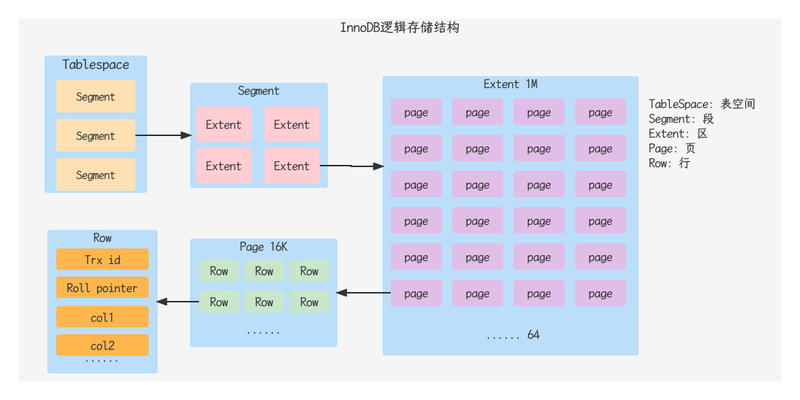

## 插入数据

### insert优化

- 批量插入

```sql
insert into tb_test values(1, 'tom'),(2, 'cat'),(3, 'jerry');
```

- 手动提交事务

```sql
start transaction;
insert into tb_test values(1, 'tom'),(2, 'cat'),(3, 'jerry');
insert into tb_test values(4, 'tom1'),(5, 'cat1'),(6, 'jerry1');
commit;
```

- 主键顺序插入：主键顺序插入性能高于乱序插入

```
主键乱序插入： 6 1 9 21 88 2 4 15 89 5 7 3
主键顺序插入： 1 2 3 4 5 6 7 8 9 15 21 88 89
```

- 大批量插入数据：如果一次性需要插入大批量数据，使用insert语句插入性能较低，次数可以使用MySQL数据库提供的load指令进行插入。操作如下

```shell
# 客户端连接服务器时，加上参数 --local-infile
mysql --local-infile -u root -p
# 设置全局参数local_infile为1，开启本地加载文件导入数据的开关
set global local_infile = 1;
# 执行Load指令将准备好的数据，加载到表结构中
load data local infile '/root/sql.log' into table `tb_user` fields terminated by ',' lines terminated by '\n';
```

## 主键优化

### 数据组织方式

- 在InnoDB存储引擎中，表数据都是根据主键顺序组织存放的，这种存储方式的表称为索引组织表(index organized table IOT)




### 页分裂

- 页可以为空，也可以填充一半，也可以填充100%，每个页包含了2-N行数据（如果一行数据过大，会行溢出），根据主键排列

### 页合并

- 当删除一行记录时，实际上记录并没有被物理删除，只是记录被标记(flaged)为删除并且它的空间变得允许被其他记录声明使用
- 当页中的记录达到MERGE_THRESHOLD(默认为页的50%)，InnoDB会开始寻找最靠近的页（前或后）看看是否可以将两个页合并以优化空间使用
- MERGE_THRESHOLD合并页的阈值，可以自己设置，在创建表或者创建索引时指定

### 主键设计原则

- 满足业务需求的情况下，尽量降低主键的长度
- 插入数据时，尽量选择顺序插入，选择使用AUTO_INCREMENT自增主键
- 尽量不要使用UUID做主键或者是其他自然主键，如身份证号
- 业务操作时，避免对主键的修改

## order by优化


## group by优化

## limit优化

## count优化

## update优化

