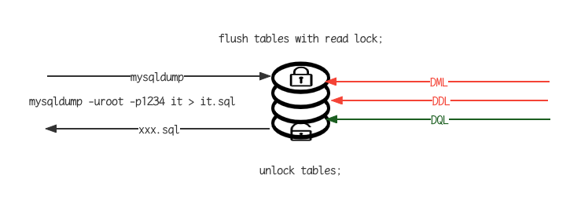

## 概述

### 介绍

- 锁是计算机协调多个进程或线程并发访问某一资源的机制。在数据库中，除传统的计算资源(CPU, RAM, IO)的争用之外，数据也是一种供许多用户共享的资源.如何保证数据并发访问的一致性，有效性是所有数据库必须解决的一个问题，锁冲突也是影响数据库并发访问性能的一个重要因素。从这个角度来说，锁对数据库而言显得尤其重要，也更加复杂

### 分类

MySQL中的锁，按照锁的粒度分，分为以下三类

- 全局锁：锁定数据库中的所有表
- 表级锁：每次操作锁住整张表
- 行级锁：每次操作锁住对应的行数据

## 全局锁

### 介绍

- 全局锁就是对整个数据库实例加锁，加锁后整个实例就处于只读状态，后续的DML的写语句，DDL语句，已经更新操作的事务提交语句都将被阻塞
- 起典型的使用场景是做全库的逻辑备份，对所有的表进行锁定，从而获取一致性视图，保证数据的完整性

### 演示



### 特点

- 数据库中加全局锁，是一个比较重的操作，存在以下几个问题
- 如果在主库上备份，那么在备份期间都不能执行更新，业务基本上就得停摆
- 如果在从库上备份，那么在备份期间从库不能执行主库同步过来的二进制日志(binlog),会导致主从延迟
- 在InnoDB引擎中，我们可以在备份时加上参数 --single-transaction参数来完成不加锁的一致性数据备份

```shell
mysqldump --single-transaction -uroot -p1234 it > it.sql
```

## 表级锁

 ### 介绍

- 表级锁，每次操作锁住整张表。锁定粒度大，发生锁冲突的概率最高，并发度最低。应用在MyISAM, InnoDB, BDB等存储引擎中。
- 对于表级锁，主要分为以下三类
  - 表锁
  - 元数据锁(meta data lock, MDL)
  - 意向锁

### 表锁

- 对于表锁，分为两类
  - 表共享读锁(read lock)
  - 表独占写锁(write lock)
- 语法
  - 加锁： lock tables 表名 read/write
  - 释放锁: unlock tables / 客户端断开连接
- 读锁不会阻塞其他客户端的读，但是会阻塞写。写锁既会阻塞其他客户端的读，又会阻塞其他客户端的写

### 元数据锁(meta data lock, MDL)

- MDL加锁过程是系统自动控制，无需显式使用，在访问一张表的时候会自动加上。MDL锁主要作用是维护表元数据的一致性，在表上有活动事务的时候，不可以对元数据进行写入操作。为了避免DML与DDL冲突，保证读写的正确性。
- 在MySQL5.5中引入了MDL, 当对一张表进行增删改查的时候，加MDL读锁(共享); 当对表结构进行变更操作的时候，加MDL写锁(排他)

| 对应SQL                                       | 锁类型                                | 说明                                             |
| --------------------------------------------- | ------------------------------------- | ------------------------------------------------ |
| lock tables xxx read/write                    | shared_read_only/shared_no_read_write |                                                  |
| select, select .... lock in share mode        | shared_read                           | 与shared_read,shared_write兼容，与exclusive互斥  |
| insert, update, delete, select ... for update | shared_write                          | 与shared_read, shared_write兼容，与exclusive互斥 |
| alter table ...                               | exculsive                             | 与其他mdl都互斥                                  |

- 查看元数据锁

```sql
select object_type, object_schema, object_name, lock_type, lock_duration from performance_schema.metadata_locks;
```

### 意向锁

- 为了避免DML在执行时，加的行锁与表锁的冲突，在InnoDB中引入了意向锁，使得表锁不用检查每行数据是否加锁，使用意向锁来减少表锁的检查。

## 行级锁

