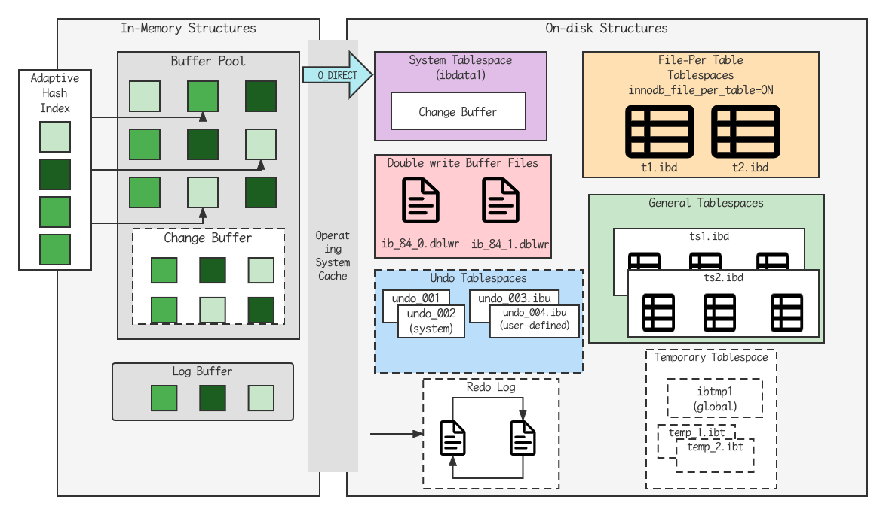

## 逻辑存储结构


- 表空间(ibd文件)：一个mysql实例可以对应多个表空间，用于存储记录，索引等数据
- 段：分为数据段(leaf node segment),索引段(non-leaf segment),回滚段(rollback segment), InnoDB是索引组织表，数据段就是B+树的叶子节点。段用来管理多个Extent(区)。
- 区：表空间的单元结构，每个区的大小为1M。默认情况下，InnoDB存储引擎页大小为16K,即一个区中一共有64个连续的页
- 页：是InnoDB存储引擎磁盘管理的最小单元，每个页的大小默认为16KB。为了保证页的连续性，InnoDB存储引擎每次从磁盘申请4-5个区
- 行：InnoDB存储引擎数据是按行进行存放的
  - Trx_id:每次对某条记录进行改动时，都会把对应的事务id赋值为trx_id隐藏列
  - Roll_pointer: 每次对某条记录进行改动时，都会把旧的版本写入到undo日志中，然后这个隐藏列就相当于一个指针，可以通过它来找到该记录修改的信息

## 架构

MySQL5.5版本开始，默认使用InnoDB存储引擎，它擅长事务处理，具有崩溃恢复特性，在日常开发中使用非常广泛。下面是InnoDB架构图，左侧为内存结构，右侧为磁盘结构



### 内存架构

- Buffer Pool: 缓冲池是主内存中的一个区域，里面可以缓存磁盘上经常操作的真实数据，在执行增删改查操作时，先操作缓冲池中的数据（若缓冲池没有数据，则从磁盘加载并缓存），然后再以一定频率刷新到磁盘，从而减少磁盘IO,加快处理速度
- 缓冲池以Page页为单位，底层采用链表数据结构管理Page,根据状态，将Page分为三种类型
  - free page:空闲page, 未被使用
  - clean page: 被使用page, 数据没有被修改过
  - dirty page: 脏页，被使用page, 数据被修改过，内存中数据与磁盘的数据不一致
- Change Buffer: 更改缓冲区（针对于非唯一二级索引页），在执行DML语句时，如果这些数据Page没有在Buffer Pool中，不会直接操作磁盘，而会将数据变更存在更改缓冲区Change Buffer中，在未来数据被读取时，再将数据合并恢复到Buffer Pool中，再将合并后的数据刷新到磁盘中
- Change Buffer的意义是什么：与聚集索引不同，二级索引通常是非唯一的，并且以相对随机的顺序插入二级索引。同样，删除和更新可能会影响索引树中不相邻的二级索引页，如果每一次都操作磁盘，会造成大量的磁盘IO.有了Change Buffer之后，我们可以在缓冲池中进行合并处理，减少磁盘IO
- Adaptive Hash Index:自适应hash索引，用于优化对Buffer Pool数据的查询。InnoDB存储引擎会监控对表上各索引页的查询，如果观察到hash索引可以提升速度，则建立hash索引。称之为自适应hash索引。自适应hash索引无需人工干预，是系统根据情况自动生成的。参数: adaptive_hash_index
- Log Buffer: 日志缓冲区，用来保存要写入到磁盘中的log日志数据(redo log, undo log),默认大小为16KB, 日志缓冲区的日志会定期刷新到磁盘中。如果需要更新，插入或删除许多行的输入，增加日志缓冲区的大小可以节省磁盘IO.参数: innodb_log_buffer_size: 缓冲区大小。innodb_flush_log_at_trx_commit: 日志刷新到磁盘时机。
  - 1: 日志在每次事务提交时写入并刷新到磁盘
  - 0: 每秒将日志写入并刷新到磁盘
  - 2: 日志在每次事务提交后写入，并每秒刷新到磁盘一次

### 磁盘架构

- System Tablespaces: 系统表空间是更改缓冲区的存储区域。如果表是在系统表空间而不是每个表文件或通用表空间中创建的，它也可能包含表和索引数据(MySQL5.X版本中还包含InnoDB数据字典，Undo log等)。参数: innodb_data_file_path
- File-Per Table Tablespaces: 每个表的文件表空间包含单个innodb表的数据和索引，并存储在文件系统上的单个数据文件中。参数: innodb_file_per_table
- General Tablespaces: 通用表空间，需要通过create tablespace语法创建通用表空间，在创建表时，可以指定该表空间

```sql
create tablespace xxx add default 'file_name' engine=engine_name;
create table xxx ... tablespace ts_name;
```

- Undo Tablespaces: 撤销表空间，MySQL实例在初始化时会自动创建两个默认的undo表空间(初始大小为16M),用于存储undo log日志
- Temporary Tablespaces: InnoDB使用会话临时表空间和全局临时表空间，存储用户的临时表等数据
- Doublewrite Buffer Files: 双写缓冲区，innodb引擎将数据页从Buffer Pool刷新到磁盘前，先将数据页写入双写缓冲区文件中，便于系统异常时恢复数据
- Redo Log:重做日志，是用来实现事务的持久性。该日志文件由两部分组成：重入日志缓冲区(redo log buffer)以及重做日志文件(redo log file)。前者是在内存中，后者是在磁盘中。当事务提交之后会把所有修改信息都会存储到该日志中，用于刷新脏页到磁盘时，发生错误时，进行数据恢复使用。

### 后台线程

- Master Thread: 核心后台线程，负责调度其他线程。还负责将缓冲池中的数据异步刷新到磁盘中，保持数据的一致性。还包括脏页的刷新，合并插入缓存，Undo页的回收
- IO Thread: 在InnoDB存储引擎中大量使用了AIO来处理IO请求，这样可以极大的提高数据库的性能，而IO Thread主要负责这些IO请求的回调

| 线程类型             | 默认个数 | 职责                         |
| -------------------- | -------- | ---------------------------- |
| Read Thread          | 4        | 负责读操作                   |
| Write Thread         | 4        | 负责写操作                   |
| Log Thread           | 1        | 负责将日志缓冲区刷新到磁盘   |
| Insert buffer Thread | 1        | 负责将写缓冲区内容刷新到磁盘 |

- Purge Thread: 主要用于回收事务已经提交了的undo log,在事务提交之后，undo log可能不用了，就用它来回收
- Page Cleaner Thread: 协助Master Thread刷新脏页到磁盘的现场，它可以减轻Master Thread的工作压力，减少阻塞。

## 事务原理

## MVCC

