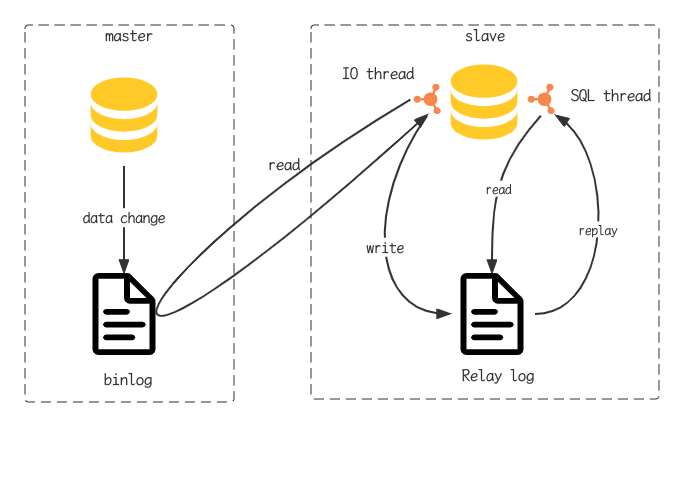

## 概述

- 主从复制是指将主数据库的DDL和DML操作通过二进制日志传到从库服务器中，然后在从库上对这些日志重新执行(也叫重做)，从而使得从库和主库的数据保持同步
- MySQL支持一台主库同时向多台从库进行复制，从库同时也可以作为其他从服务器的主库，实现链状复制
- MySQL复制的优点主要包含以下三个方面
  - 主库出现问题，可以快速切换到从库提供服务
  - 实现读写分离，降低主库的访问压力
  - 可以在从库中执行备份，以避免备份期间影响主库服务

## 原理



- Master主库在事务提交时，会把数据变更记录在二进制日志文件binglog中
- 从库读取主库的二进制文件binglog, 写入到从库的中继日志relay log
- slave重做中继日志中的事件，将改变反映它自己的数据

## 搭建

### 服务器准备

- 192.168.200.200(master)
- 192.168.200.201(slave)

```sh
#开放指定的3306端口
firewall-cmd --zone=public --add-port=2206/tcp --permanent
firewall-cmd -reload
#关闭服务器的防火墙
systemctl stop firewalld
systemctl disable firewalld
```

- 准备好两台服务器之后，在上述的两台服务器中分别安装MySQL, 并完成基础的初始化准备工作

### 主库配置

- 修改配置文件/etc/my.cnf

```sql
# mysql服务ID, 保证整个集群环境中唯一，取值范围1-2^32-1, 默认为1
server-id=1
#是否只读，1代表只读，0代表读写
read-only=0
#忽略的数据，指不需要同步的数据库
#binlog-ignore-db=mysql
#指定同步的数据库
#binlog-do-db=db01
```

- 重启mysql服务器`systemctl restart mysqld`
- 登录mysql，创建远程连接的账号，并授予主从复制权限

```sql
# 创建test用户，并设置密码，该用户可在任意主机连接该MySQL服务
create user 'test'@'%' identified with mysql_native_password by '1234';
# 为test分配主从复制权限
grant replication slave on *.* to 'test'@'%';
```

- 通过指令，查看二进制日志坐标

```sql
show master status;
```

- 字段含义说明：file:从哪个日志文件开始推送日志文件； position: 从哪个位置开始推送日志; binlog_ignore_db: 指定不需要同步的数据库

### 从库配置

- 修改配置文件/etc/my.cnf

```sql
# mysql服务ID, 保证整个集群环境中唯一
server-id=2
#是否只读
read-only=1
```

- 重启mysql服务`systemctl restart mysqld`
- 登录mysql,设置主库配置

```sql
change replication source to source_host='192.168.200.200', source_user='test', source_password='1234', source_log_file='xxx.binlog.0001', source_log_pos=663;
```

- 开启同步操作

```sql
start replica  #8.0.22之后
start slave;  #8.0.22之前
```

- 查看主从同步状态

```sql
show replica status;
show slave status;
```

