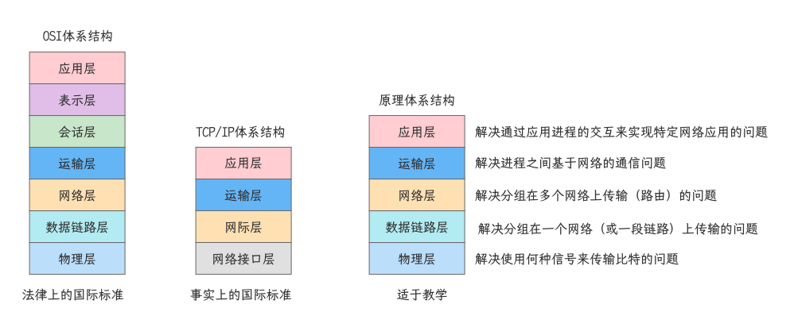
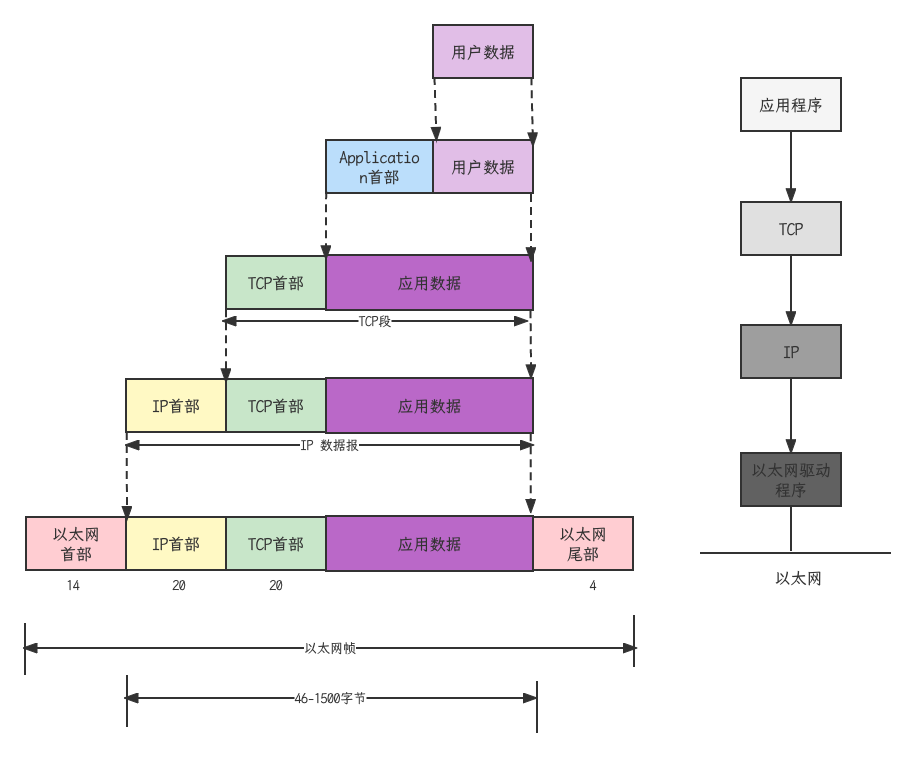

## 分层思想

- 将复杂的流程分解为几个功能相对单一的子过程
- 流程更加清晰，复杂问题简单化
- 更容易发现问题并针对性的解决问题

## 两大模型：协议簇(Protocol Suit)

### OSI: Open System Interconnect

- 开发系统互连参考模型，由ISO(国际标准化组织)定义
- 应用层：为应用程序提供网络服务
- 表示层：数据格式化，加密，解密
- 会话层：建立，维护，管理会话连接
- 传输层：建立，维护，管理端到端连接
- 网络层：IP寻址和路由选择
- 数据链路层：控制网络层与物理层之间通信
- 物理层：比特流传输
- OSI参考模型中定义了每一层的“作用”；定义每一层“作用”的是“协议”；“协议”是约定，其具体内容为“规范”；我们日常所使用的就是遵循各个协议具体“规范”的产品和通信手段

### TCP/IP

- 应用层(HTTP, FTP, TFTP, SMTP, POP, SNMP, DNS)
- 传输层(TCP, UDP)
- 网络层(ICMP, IP, ARP)
- 网络接口层

## 数据封装和解封

- 应用数据需要经过每一层处理之后才能通过网络传输到目的端
- OSI把每一层数据成为PDU(Protocol Data Unit, 协议数据单元)
- TCP/IP根据不同层分别使用了段、包、帧、比特
- 逐层向下传递数据，并添加报头和报尾的过程成为封装(打包)
- 反之，接收方需要逐层向上传递数据，称为解封(拆包)

