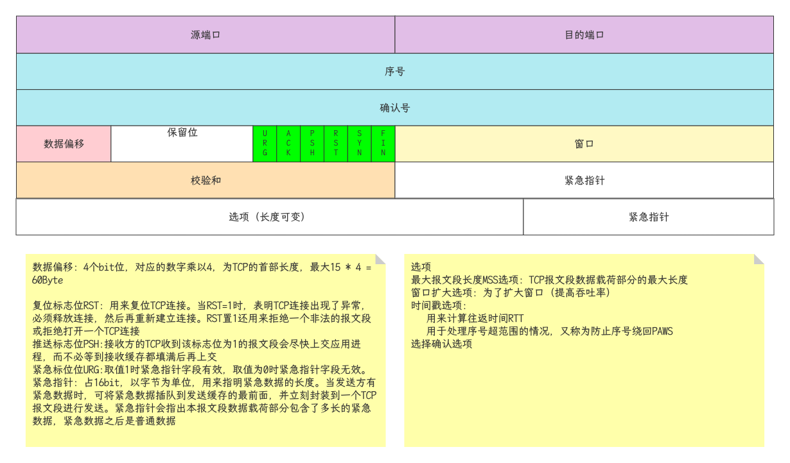

## 概述

- 传输层定义了主机应用程序之间端到端的连通性。传输层中最为常见的两个协议分别是传输控制协议(TCP, Transmission Control Protocol)和用户数据报协议UDP(User Datagram Protocol)
- 传输层提供端到端的连接
- 网络层提供点到点的连接

## 端口

- 0-1023： 公认端口
  - 公认TCP端口：
    - 21: FTP
    - 23: Telnet
    - 25: SMTP
    - 80: HTTP
    - 110: POP3
    - 194: Internet中继聊天(IRC)
    - 443: HTTPS
  - 公认UDP端口
    - 69: TFTP
    - 520: RIP
  - 公认TCP/UDP通用端口
    - 53: DNS
    - 161: SNMP
- 1024-49151: 注册端口
  - 1863: MSN Messenger
  - 8008: HTTP备用
  - 8080: HTTP备用

- 49152 - 65535: 私有或动态端口

- 源端口随机分配，目标端口使用知名端口
- 应用客户端使用的源端口号一般为系统中未使用的且大于1023
- 目的端口号为服务端开启的服务所监听的端口，如HTTP缺省使用80

## 传输层协议

- TCP: Transmission Control Protocol, 传输控制协议
  - 可靠的，面向连接的协议
  - 传输效率低，类似打电话
- UDP: User Datagram Protocol, 用户数据报协议
  - 不可靠的，无连接的服务
  - 传输效率高，类似群聊
  - UDP不提供重传机制，占用资源小，处理效率高
  - 一些时延敏感的流量，如语音，视频等，通常使用UDP作为传输层协议
- TCP header

- TCP拒绝服务 - SYN Flood攻击
  - SYN报文是TCP连接的第一个报文，攻击者通过大量发送SYN报文，造成大量未完成建立的TCP连接，占用被攻击者的资源
- TCP欺骗