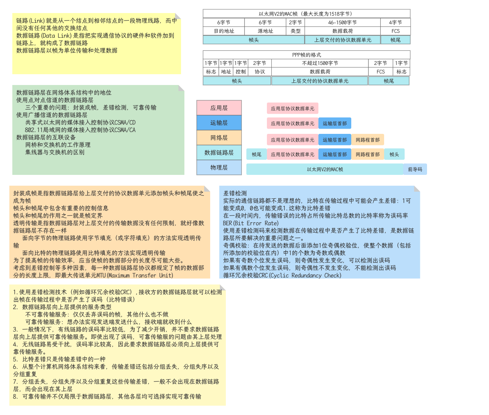

## 以太网

- Ethernet, 当今主导地位的局域网组网技术

### 以太网的分类

- LLC: Logical Link Control, 逻辑链路控制。负责识别网络层的协议类型，接收上层数据包封装成帧后，向下层传递
- MAC: Media Access Control, 介质访问控制。负责控制与连接物理层的物理介质；处理硬件设备的物理地址，定义网络拓扑及数据帧的传递顺序

### 以太网帧结构

- 帧大小范围：64 - 1518
- MTU: 最大传输单元，默认1500自己，每次发送的数据的最大值
- 帧校验：通过一定的计算公式对数据包进行计算
- MAC地址：代表一个网络接口的物理地址，全球唯一
  - MAC地址由两部分组成，分别是供应商代码和序列号。其中前24位代表该供应商代码，由IEEE管理和分配剩下的24位序列号由厂商自己分配