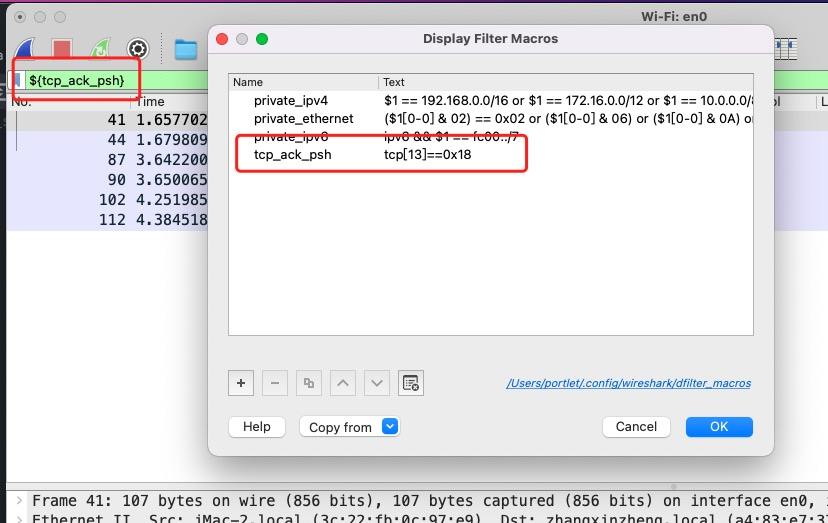

## 实验目的

1. 了解Wireshark界面的基础知识，知道界面中每部分的功能
2. 通过实际的例子来展示Wireshark对于所捕获的数据包分层结构，了解Wireshark对于数据包的强大分析功能
3. 学习基本的数据包筛选方法，为以后的实际分析打下基础

## 过滤方法

- 过滤经过ip地址为10.200.12.114并且端口号为80的数据包：ip.addr==10.200.12.114 and tcp.port==80
- 过滤非tcp协议的数据包: !tcp
- 过滤帧长度小于150字节的数据包：frame.len<=150
- 过滤tcp标志为PSH和ACK的数据包: tcp[13]==0x18
  - 13表示tcp首部的第13个字节，从0计数。偏移14字节的位置
  - 0x18==0b00011000,表示设置了ACK和PSH标志位为1 
- 自定义宏设置过滤。Analyze -> Display Filter Macros,新增key,value键值对Name: tcp_ack_psh, value: tcp[13]==0x18。然后再过滤框直接输入${tcp_ack_psh}就可以过滤出tcp标志为psh和ack的数据包

