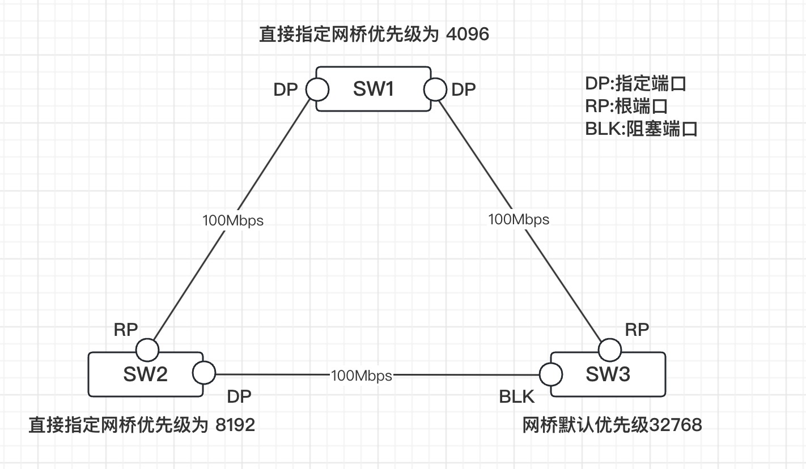
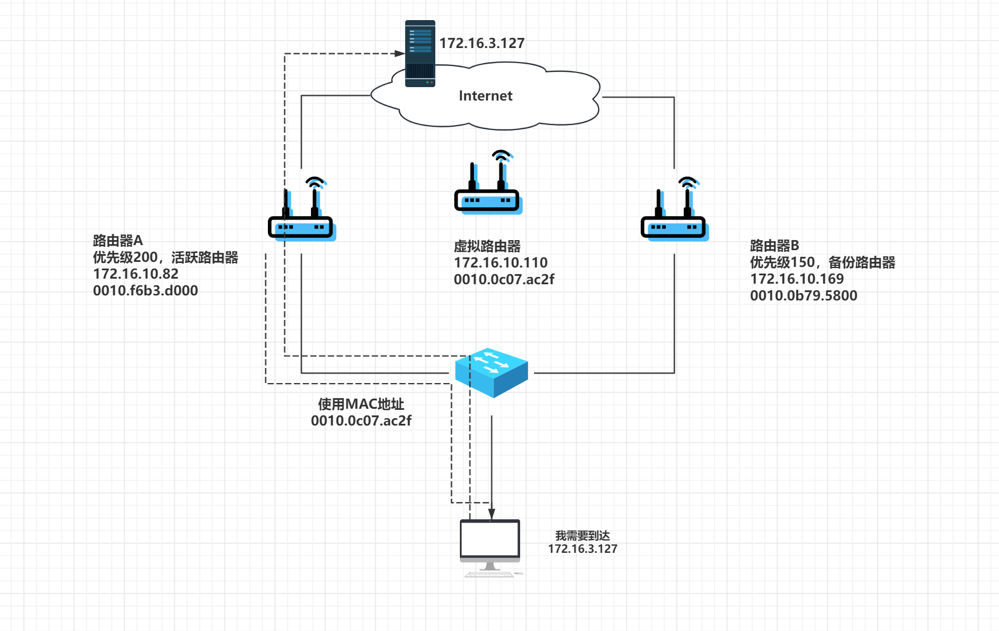
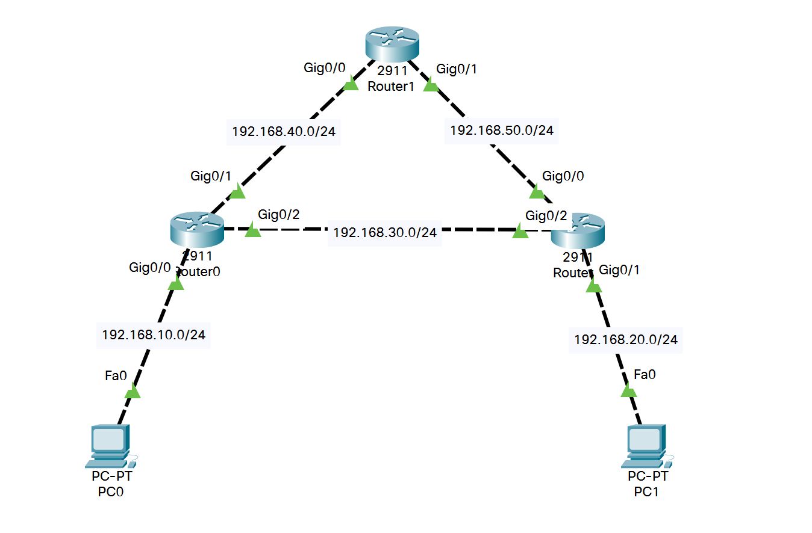
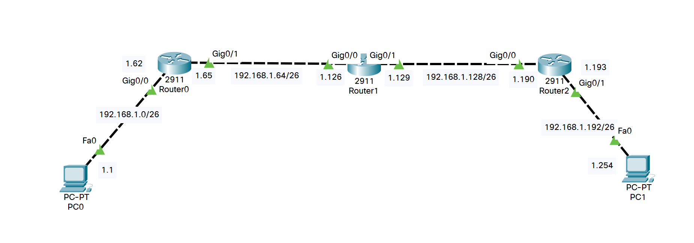
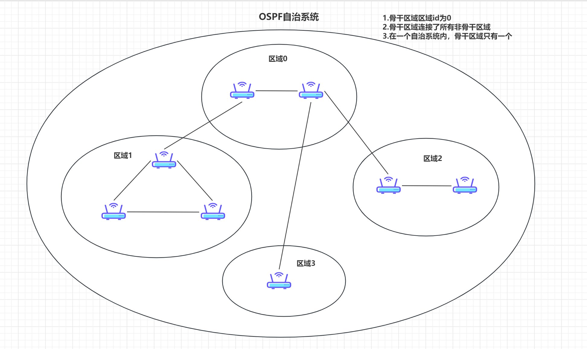
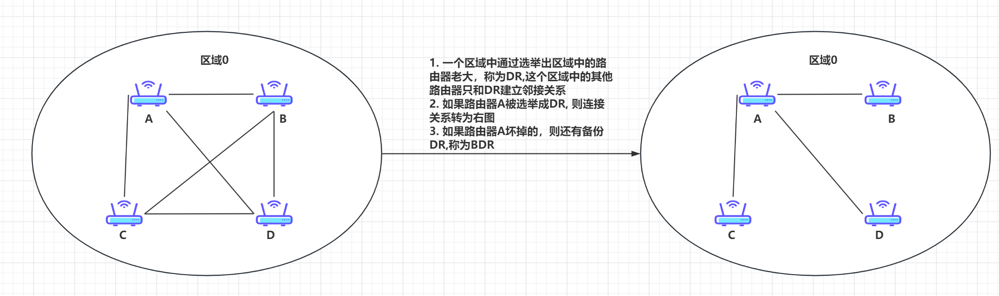
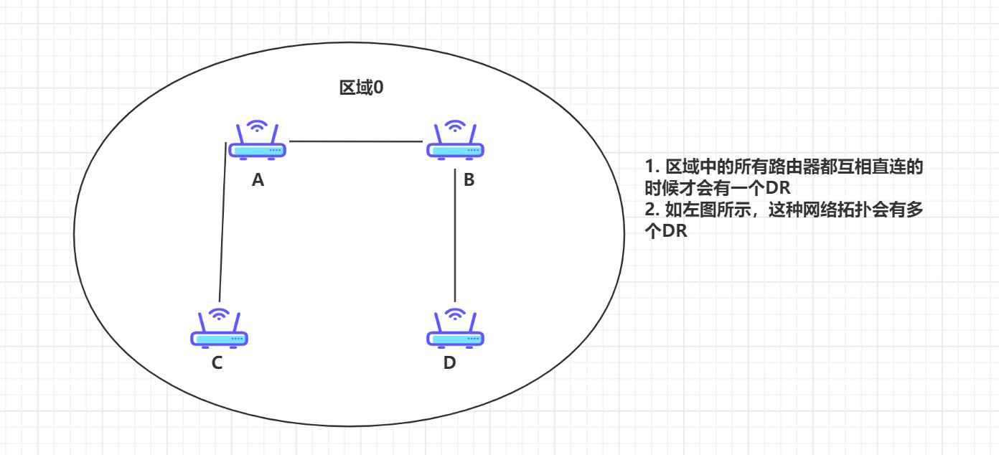
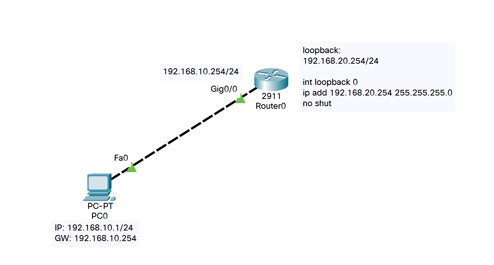
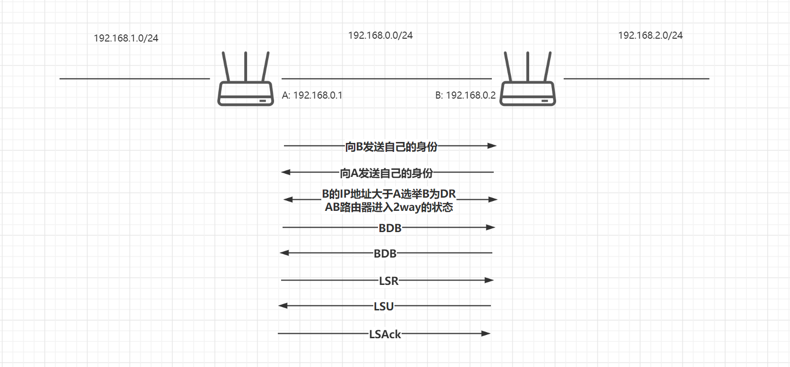
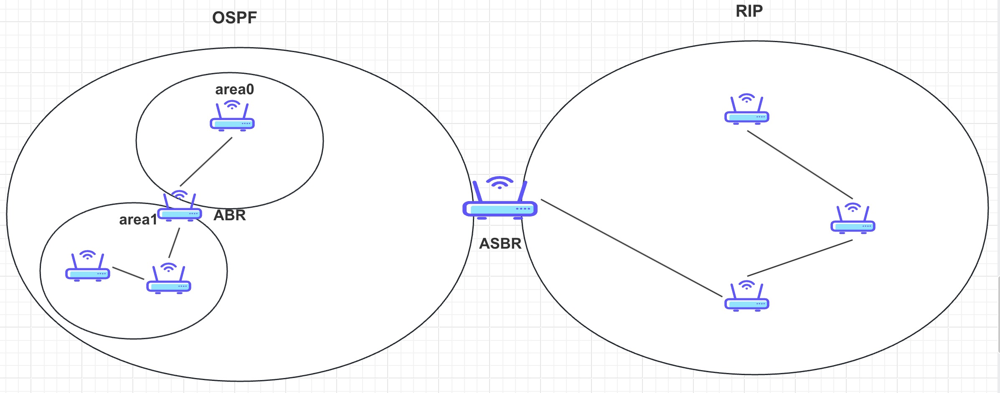

## 交换机的工作原理

- 回顾交换机他是属于数据链路层的设备，数据链路层所传输的是数据帧，所封装的是MAC头部（主要有MAC地址，目的MAC地址），差错校验
- 回顾数据链路层的功能
  - 建立逻辑连接，进行物理地址寻址，差错校验
  - 数据链路的建立，维护和拆除
  - 数据帧的封装，传输，同步，差错校验，在数据链路层也可以做流量控制（一般情况下不在数据链路层做）
- 以太网 = 局域网
- 交换机主要讲的以太网交换机（局域网的交换机）
- 早期的网络共享式以太网，目前所使用的式交换式以太网
- 以太网的MAC:用来标识一个以太网上的某个单独的设备或一组设备  IP地址用于标识网络中的某一台主机
  - 两个设备想要在以太网中进行通信，那就必须要MAC地址进行交互
  - 两个设备需要在网络中进行通信，就必须配置相应的IP地址
- MAC地址有48位二进制组成，通常表示为12位的十六进制
- 一个MAC地址表示方式：前24位表示了厂商的编码，后面24位是序列号，从而就可以实现全球唯一
- 单独设备：当第8位为0的时候表示单独设备，单播地址
- 一组设备：当第8位为1的时候表示一组设备，组播地址
- 所有设备: FF-FF-FF-FF-FF-FF，一个全为1的MAC地址，广播地址
- 00-00-00-00-00-00:默认填充的地址，让不知道对方的MAC地址时，会自动填充一个目的的MAC地址
- 以太网的帧
  - Type用于标识上层(网络层)数据的类型：IP(0800), ARP(0806), ICMP, IGMP, RARP


- 以太网交换机
  - 早期的共享式以太网，它是由集线器(HUB)相连，一个冲突域的网络
  - 现在采用交换式网络，广播：一种信息的传播方式；一对多的方式
  - 工作模式：单工，半双工，双工
  - 接口速率：10，100， 1000

- MAC表中维护的是发送方的MAC地址和接口的对应关系；当交换机收到发来的数据帧后查看帧头部，首先查看源MAC地址有没有记录在字节的MAC表中，如果没有，那么记录；主机A--接口1，继续查看目的MAC地址，如果没有，就直接从除接收接口外的所有连接的接口转发（这种方式称为广播），主机B和主机C都收到，主机C丢弃，主机B回应，发现目标的MAC对应在1号接口上，直接从1号接口进行转发出去（单播一对一转发）
  - 首先学习源MAC地址
  - 接着广播数据帧
  - 接收方单播回应，其他主机丢弃
  - 下一次转发直接以单播方式转发数据


## 交换机的基本配置

#### 命令行模式

- 用户模式：查看统计信息（一般情况下用得非常少，用">"表示）；用户模式切换到特权模式 `enable`或者`en`
- 特权模式： 查看并修改设备配置（一般情况下都是查看居多），用"#"表示；特权模式切换到全局模式 `configure termial` 或者 `conf t`
- 全局模式：针对设备的整体配置参数，用"(config)#"表示，全局模式切换到接口模式 `interface fasteternet0/1`或者`int f0/1`
- 接口模式：针对设备的接口修改配置参数，用"(config-if)#"表示
- 进入对应模式，只能一级一级进入
- 返回对应模式，一级一级返回使用`exit`, 如果说想要快速直接返回到特权模式，可以使用`end`
- 当命令输错后，快速终止 ctrl + shift + 6

#### 常见配置

- 永久不进行域名解析

```powershell
Switch(config)#no ip domain-lookup
```

- 给交换机配置一个主机名

```powershell
Switch>en
Switch#conf t
Enter configuration commands, one per line.  End with CNTL/Z.
Switch(config)#hostname SW1
SW1(config)#
```

- 查看交换机里维护的MAC地址表

```powershell
SW1#show mac-address-table
```

- 交换机的双工模式

```powershell
SW1#conf t
Enter configuration commands, one per line.  End with CNTL/Z.
SW1(config)#int f0/1
SW1(config-if)#duplex half
SW1(config-if)#end
SW1#show int f0/1    #查看接口
```

- 交换机的接口速率

```powershell
SW1#conf t
Enter configuration commands, one per line.  End with CNTL/Z.
SW1(config)#int f0/2
SW1(config-if)#speed 10
SW1(config-if)#end
SW1#show int f0/2
```

- 配置console口密码

```powershell
SW1#conf t
Enter configuration commands, one per line.  End with CNTL/Z.
SW1(config)#line console 0
SW1(config-line)#password 123456
SW1(config-line)#login
```

#### 通过远程管理方式连接交换机(telnet ssh)

- telnet是应用层协议，基于传输层TCP, 默认端口号23， 采用明文密码方式，不是很安全，一般用于内网管理
- ssh是应用层协议，基于传输层TCP,默认端口号22，采用的是密文密码方式，相对来讲比较安全，经常用于跨越互联网管理，也常用于远程管理Linux操作系统
- 既然通过网络的方式进行管理设备，设备就必须配置IP地址，由于交换机上的接口都是交换接口，是不允许配置IP地址，直接为交换机的虚接口配置IP地址，默认情况下交换机的默认虚接口就是vlan 1接口

```powershell
SW1(config)#int vlan 1
SW1(config-if)#ip address 192.168.100.100 255.255.255.0
SW1(config-if)#no shutdown
SW1#show int vlan 1
```

- 配置设备的连接终端并直接设置密码，应用

```powershell
SW1#conf t
Enter configuration commands, one per line.  End with CNTL/Z.
SW1(config)#line vty 0 4
SW1(config-line)#password 654321
SW1(config-line)#login    #表示直接使用密码登录
# “line vty 0 4”是Cisco设备中的命令，它用于进入Line模式，对vty 0~~4线路进行配置。这里，“0”指vty 0线路，“4”指vty 4线路。这个命令主要是在设备上配置远程登陆的权限，使得用户可以通过Telnet或ssh等方式，无需插Console线缆，只要设备连接网络，配置了接口IP地址即可远程登陆到设备上。
```

- 创建用户名密码，配置连接终端并应用

```powershell
SW1#conf t
Enter configuration commands, one per line.  End with CNTL/Z.
SW1(config)#username zhangsan password 123456
SW1(config)#line vty 0 4
SW1(config-line)#login local       #表示使用用户名密码登录
```

- 设置特权模式密码（当同时设置了明文和密文密码，密文密码生效）

```powershell
SW1(config)#enable password 123
SW1(config)#enable secret 456
# 456生效
```

- 配置ssh登录

```powershell
Switch>en
Switch#conf t
Enter configuration commands, one per line.  End with CNTL/Z.
Switch(config)#hostname SW1
SW1(config)#ip domain-name 123.com
SW1(config)#crypto key generate rsa
The name for the keys will be: SW1.123.com
Choose the size of the key modulus in the range of 360 to 2048 for your
  General Purpose Keys. Choosing a key modulus greater than 512 may take
  a few minutes.

How many bits in the modulus [512]: 2048
% Generating 2048 bit RSA keys, keys will be non-exportable...[OK]

SW1(config)#ip ssh time-out 120
*Mar 1 0:0:59.9: %SSH-5-ENABLED: SSH 1.99 has been enabled
SW1(config)#ip ssh authentication-retries 5
SW1(config)#username lisi password 123
SW1(config)#line vty 0 4
SW1(config-line)#login local
```

#### 交换机密码恢复

让交换机在启动过程中不加载配置文件，将配置文件修改，从而不会加载

- 拔掉交换机的插头，插上电源同时按住MODE间
- 出现"switch:"提示松开按键，初始化Flash `swtich:flash_init`
- 将config.text文件修改成config.old, 完成后启动交换机

```powershell
Switch:rename flash:config.text flash:config.old
Switch:boot
```

- 重新启动后把配置文件的名字改回来 `Switch:rename flash:config.old flash:config.text`
- 手工加载配置文件 `Switch: copy flash:config.text system:running-config`
- 进入配置模式修改密码
- running-config: 当前配置文件，他是存放在内存中(RAM)由于具有易失性，设备重启后会清空所以当配置完成后需要将当前配置文件的内存保存起来，使用命令write
- startup-config: 保存配置文件，他是存放在非易失性随机访问存储器中(NVRAM),可以永久保存，想要重置设备密码，就需要绕过此文件，在初始化系统的时候将此文件改名，启动后，将文件名改过来，还需要加载到当前配置文件中，将保存配置文件中的内容加载到当前配置文件 copy flash:config.text system:running-config

## 路由器的工作原理

### 回顾交换机的工作远离

- 交换机里面维护了一张 MAC 地址表，主要记录的是 MAC 地址和接口的对应关系
- 交换机在初始状态下，MAC 地址表是空的，当收到一个来自某接口(f0/1)的数据时，首先查看数据帧中的源 MAC 地址，对照自己的 MAC 地址表，如果不在表中，将发送方的 MAC 地址学习并记录到自己的 MAC 地址表中，并附上对应的接口(f0/1)，再查看目的 MAC 地址，如果目的 MAC 地址也不在 MAC 地址表中，将进行从接收接口(f0/1)外的其他所有连接接口转发出去(广播方式)，此时，目的主机将接收到，其他主机也会接收到，其他主机接收到后直接丢弃，目的主机接收到后进行回应，回应的过程中数据同样会交由交换机进行转发，目的主机这时候就变成发送主机，当交换机接收到来自目的主机的回应报文时(f0/10),同样查看发送方的 MAC 地址，进行学习并记录，并附带对应接口(f0/10),再去查看目的MAC,由于之前已经有记录，所以直接从记录的接口(f0/1)进行转发(单播)
- 总结：交换学习源 MAC,广播数据帧，接收方回应，回应使用单播直接转发

### 回顾路由器相关知识

- 路由器属于三层(网络层)设备
- 网络层所封装的 IP 头部
- 网络层功能
  - 进行逻辑地址(IP 地址)寻址，实现不同网络(网络地址不等或者说内网和外网分割，强调：内网的 IP 地址是无法在外网上进行路由)直接的路径选择
  - 去查找目的是否可以到达，如果可以到达，选择一条最优的路径
- 网络层所传输的 PDU(传输数据单元)是数据包(IP 数据包)

### 网络层 IP 数据包格式


#### IPv4 头部

- 版本：标识当前使用的 IP 版本(IPv4, IPv6)
- 首部长度：由于 IP 数据报文的首部有一个可选项，造成首部长度是可变的，所以需要定义
- 区分服务（服务质量/优先级和服务类型）：为了保障更好的服务，主要是在 IP层做QoS
- 总长度：主要用来标识整个数据包的长度
- 标识，标志，片位移：上层的数据到 IP 层会被分片，这几个字段用来对数据包进行标识，使数据到达目的端重组的时候不会乱序
- 生存时间(TTL): 数据包在路由器转发消耗的时间如果小于1 秒，TTL 就会减一
- 协议：标识上层数据是使用的何种协议
- 首部校验：校验数据报文的首部
- 源地址：发送方的 IP 地址
- 目的地址：接收方的 IP 地址

### 路由器的工作原理

- 路由
  - 从源主机到目的主机的转发过程（跨网络访问）
  - 包含两个内容（确定最佳路径，通过网络传输信息）
- 路由表
  - 直连路由：当路由器的接口配置好对应的 IP 地址并开启接口后自动生成
  - 非直连路由：需要手动配置静态路由或者使用动态路由协议学习到
- 静态路由
  - 由管理员手动配置，不灵活，而且是单向
  - 特殊的静态路由：默认路由，当在路由器中找不到目标网络的路由条目时，再去查看默认路由。使用场景：一般应用于末节（末梢）网络（网络的最末端）（路由器的一端只连接了一个网络）
- 动态路由
  - 通过某种动态路由协议自动的去建立自己的路由表
  - 常见的动态路由协议：RIP, OSPF, IS-IS, BGP, IGRP, EIGRP

### 路由器转发数据包的封装过程


- PC0访问PC2:第一个报文：源IP: 192.168.10.1 目的IP: 192.168.20.1,源MAC: PC0 mac, 目的MAC: R0 g0/0 MAC
- 当R0收到数据报文后，会解封到网络层，查看目的是否可达，如果可以到转发对应到对应接口，如果不可达重新进行二层封装，源mac变成了R0 g0/0接口mac, 目的mac变成了R1 g0/0
- 当R1收到数据报文后，会解封到网络层，查看目的是否可达，目的和字节是同一网络，肯定可达，讲数据报文交给对应接口，重新进行二层封装，源mac变成R1 g0/1目的mac变成了PC1 fa0
- 路由器在转发数据包的封装过程
  - 源IP和目的IP是没有发生变化
  - 源mac和目的mac一直在发生变化
  - 因为路由器会重新进行二层封装
- 同网段传输主要是二层转发（不需要进行重新封装）
- 跨网段传输是三层转发（需要重新进行二层封装）
- 注意：上述实验路由器需要配置静态路由表


## 静态路由

### 概念

- 静态路由由管理员手工配置，单向，缺乏灵活性
- 默认路由：静态路由的一种，比较特殊，他这里是直接指定目标为任何地方

### 配置

- 静态路由

```powershell
ip route 目标网络(目标的网段/目标网络地址) 目标的子网掩码 下一跳地址(下一个路由器的接口的IP地址或者发往下一个路由器的本地接口)

ip route 192.168.10.0 255.255.255.0 192.168.20.2
ip route 192.168.10.0 255.255.255.0 f0/1
```

- 默认路由

```powershell
ip route 0.0.0.0 0.0.0.0 192.168.20.1
ip route 0.0.0.0 0.0.0.0 f0/1
```

- 查看路由条目 `show ip route`

### 在路由器上配置DHCP

- 目的：使客户机可以通过路由器所提供的DHCP服务获取IP地址
- DHCP: 动态主机配置协议
- 主要是为客户机提供TCP/IP参数：IP地址，子网掩码，网关，DNS服务器地址
- 定义DHCP地址池

```powershell
Router>en
Router#conf t
# 池的名字
Router(config)#ip dhcp pool portlet
# 指定分配的网络范围：网络地址和子网掩码
Router(dhcp-config)#network 192.168.10.0 255.255.255.0
# 指定默认网关
Router(dhcp-config)#default-route 192.168.10.254
# 指定DNS服务器地址
Router(dhcp-config)#dns-server 114.114.114.114
```

- 指定保留地址

```powershell
Router(config)#ip dhcp excluded-address 192.168.10.1 192.168.10.50
```


## 虚拟局域网VLAN

### 目的

- 主要应用在交换机上：一台交换机默认情况下连接一个广播域，因为默认情况下所有的接口都是属于同一个vlan, 默认vlan1, 所以是在同一个广播域中

- 划分广播域，不同广播域是不能够进行通信的，如果想要进行通信，这时候需要借助路由
- 增强网络的安全性
- 简化了网络的管理

### vlan种类

- 静态vlan: 基于端口划分，需要管理员去配置，创建vlan并将接口加入vlan
- 动态vlan: 基于MAC地址自动将同一类型的mac地址加入到同一vlan

### 静态vlan

- vlan范围(思科设备)：总计4096， 0-4095
- 0， 4095保留
- 默认vlan1
- 以太网vlan 2-1001
- 扩展以太网： 1025-4094

### 创建静态vlan

- 在vlan数据库中创建

```powershell
Switch>en
Switch#vlan database
% Warning: It is recommended to configure VLAN from config mode,
  as VLAN database mode is being deprecated. Please consult user
  documentation for configuring VTP/VLAN in config mode.

Switch(vlan)#vlan 2
VLAN 2 added:
    Name: VLAN0002
```

- 在全局模式下创建

```powershell
Switch#conf t
Enter configuration commands, one per line.  End with CNTL/Z.
Switch(config)#vlan 2
Switch(config-vlan)#
```

- 将接口加入vlan:需要去指定接口的模式

```powershell
Switch>en
Switch#conf t
Enter configuration commands, one per line.  End with CNTL/Z.
Switch(config)#int range f0/10-20   #或者 int f0/1
Switch(config-if-range)#sw mode acc  #指定端口模式
Switch(config-if-range)#sw acc vlan 2 #加入对应vlan
```

- 查看vlan信息 `show vlan brief`

```powershell
Switch#show vlan brief

VLAN Name                             Status    Ports
---- -------------------------------- --------- -------------------------------
1    default                          active    Fa0/1, Fa0/2, Fa0/3, Fa0/4
                                                Fa0/5, Fa0/6, Fa0/7, Fa0/8
                                                Fa0/9, Fa0/21, Fa0/22, Fa0/23
                                                Fa0/24, Gig0/1, Gig0/2
2    VLAN0002                         active    Fa0/10, Fa0/11, Fa0/12, Fa0/13
                                                Fa0/14, Fa0/15, Fa0/16, Fa0/17
                                                Fa0/18, Fa0/19, Fa0/20
1002 fddi-default                     active    
1003 token-ring-default               active    
1004 fddinet-default                  active    
1005 trnet-default                    active    
```

- 查看指定vlan `show vlan id 2`

```powershell
Switch#show vlan id 2

VLAN Name                             Status    Ports
---- -------------------------------- --------- -------------------------------
2    VLAN0002                         active    Fa0/10, Fa0/11, Fa0/12, Fa0/13
                                                Fa0/14, Fa0/15, Fa0/16, Fa0/17
                                                Fa0/18, Fa0/19, Fa0/20

VLAN Type  SAID       MTU   Parent RingNo BridgeNo Stp  BrdgMode Trans1 Trans2
---- ----- ---------- ----- ------ ------ -------- ---- -------- ------ ------
2    enet  100002     1500  -      -      -        -    -        0      0
```

- 删除vlan

```powershell
conf t
no vlan 2
```

- 通过在交换机上创建vlan, 将不同主机加入到对应vlan后，在同一交换机下，相同vlan可以直接进行通信，不同vlan无法直接进行通信

### vlan trunk

- 目的：实现同一vlan跨交换机进行通信
- 交换机接口模式（默认是动态自动）
  - 连接主机：协商的结果是 access
  - 连接交换机：
    - 动态自动 --- 动态自动    协商结果 access
    - 动态自动 --- 动态企望    协商结果 trunk
    - 动态自动 --- access       协商结果 access
    - 动态自动 --- trunk          协商结果 trunk
- trunk 模式协商结果

| SW1 端口模式       | SW2 端口模式      | SW1 结果 | SW2 结果 |
| ------------------ | ----------------- | -------- | -------- |
| trunk              | dynamic auto      | trunk    | trunk    |
| trunk              | dynamic desirable | trunk    | trunk    |
| dynamic auto       | dynamic auto      | access   | access   |
| dynamic auto       | dynamic desirable | trunk    | trunk    |
| dynamic desirable  | dynamic desirable | trunk    | trunk    |
| trunk, nonegotiate | trunk             | trunk    | trunk    |
| trunk, nonegotiate | dynamic auto      | trunk    | access   |
| trunk, nonegotiate | dynamic desirable | trunk    | access   |

- trunk 封装(802.1Q 帧)


## 单臂路由

- 在同一交换机上划分vlan, 从而相同vlan主机可以通信，不同vlan不能通信。如果想要不同vlan进行通信，怎么办？
- 不同vlan是属于不同广播域，配置的是不同的网段IP, 针对不同网段IP进行通信，这时候需要借助于路由
- 可以实现不同vlan间的通信技术: 单臂路由，三层交换


```powershell
# 交换机配置
Switch>en
Switch#conf t
Enter configuration commands, one per line.  End with CNTL/Z.
Switch(config)#vlan 10
Switch(config-vlan)#vlan 20
Switch(config-vlan)#exit
Switch(config)#int f0/1
Switch(config-if)#switchport access vlan 10
Switch(config)#int f1/1
Switch(config-if)#switchport access vlan 20
Switch(config-if)#int f2/1
Switch(config-if)#switchport mode trunk 
Switch(config-if)#exit

#路由器配置
Router>en
Router#conf t
Router(config-if)#int g0/0.1
Router(config-subif)#encapsulation dot1Q 10
Router(config-subif)#ip add 192.168.10.254 255.255.255.0
Router(config-subif)#exit
Router(config)#int g0/0.2
Router(config-subif)#encapsulation dot1Q 20
Router(config-subif)#ip add 192.168.20.254 255.255.255.0
Router(config-subif)#exit
Router(config)#int g0/0
Router(config-if)#no shut
Router(config-if)#exit
Router(config)#ip dhcp pool vlan10
Router(dhcp-config)#network 192.168.10.0 255.255.255.0
Router(dhcp-config)#default-router 192.168.10.254
Router(dhcp-config)#exit
Router(config)#ip dhcp pool vlan20
Router(dhcp-config)#network 192.168.20.0 255.255.255.0
Router(dhcp-config)#default-router 192.168.20.254
Router(dhcp-config)#exit
```

## 三层交换

- 使用单臂路由可以解决不同 vlan间的通信，为什么还有使用三层交换呢
  - 单臂路由容易造成网络瓶颈，子接口依托于物理接口，当 vlan 过多，物理接口压力过大
  - 单臂路由主要是利用路由器的转发，每一次数据来之后都需要进行路由，路由器的工作量比较大

### 基本概念

- 三层交换技术：二层交换技术 + 三层转发技术
- 传统的三层交换：
  - 三层交换机上，第三层引擎处理数据流的第一个包
  - 交换 ASIC 从三层引擎中获取二层重写信息在硬件中创建一个 MLS条目，负责重写和转发数据流中的后续数据包
  - 一次路由多次交换
- 基于 CEF 的三层交换(MLS)
  - 基于路由表直接去生成邻接关系表，直接进行硬件转发
  - 维护了两张表：路由表（转发信息库 FIB）邻接关系表(MAC 地址信息)
  - 工作原理：主机 A 给 B 发送单播数据包；交换机查找 FIB 表，找到下一条地址；查找下一跳地址对应的邻接关系的二层封装信息；转发

### 原理


### 实验


```powershell
Switch>en
Switch#conf t
Enter configuration commands, one per line.  End with CNTL/Z.
Switch(config)#ip routing
Switch(config)#vlan 10
Switch(config-vlan)#vlan 20
Switch(config-vlan)#exit
Switch(config)#int range f0/1-14
Switch(config-if-range)#switchport access vlan 10
Switch(config-if-range)#exit
Switch(config)#int range f0/15-24
Switch(config-if-range)#switchport access vlan 20
Switch(config-if-range)#exit
Switch(config)#int vlan 10
Switch(config-if)#ip add 192.168.10.254 255.255.255.0
Switch(config-if)#no shut
Switch(config-if)#exit
Switch(config)#int vlan 20
Switch(config-if)#ip add 192.168.20.254 255.255.255.0
Switch(config-if)#no shut
Switch(config-if)#exit
Switch(config)#ip dhcp pool vlan10
Switch(dhcp-config)#network 192.168.10.0 255.255.255.0
Switch(dhcp-config)#default-router 192.168.10.254
Switch(dhcp-config)#exit
Switch(config)#ip dhcp pool vlan20
Switch(dhcp-config)#network 192.168.20.0 255.255.255.0
Switch(dhcp-config)#default-router 192.168.20.254
Switch(dhcp-config)#exit
```

## 链路聚合

### 实现方式

- 思科设备上：私有的 PAgP
- 标准的：基于 802.3ad 的 LACP
- 链路聚合的模式
  - active: LACP 的主动模式
  - passive: LACP 的被动模式
  - auto: PAgP 主动模式
  - desirable: PAgP 被动模式
  - on: 以太网通道

### 基于 IEEE 的 LACP

- 交互信息：
  - 本端和对端系统优先级
  - 本端和对段系统 ID
  - 本端和对段的端口操作 key
  - 本端和对段的端口优先级
  - 本端和对端的端口 ID
  - 本端和对端的端口状态
- 配置
  - 指定汇聚协议：需要先进入端口（如果只有一个端口，就直接进入一个端口，如果多个端口，就进入范围端口）`channel-protocol lacp`
  - 指定聚合模式 `channel-group 1 mode active`
  - 将聚合通道配置为 trunk `int port-channel 1     sw mode trunk`
-  以太网通道（最多捆绑 8条物理通道）

```powershell
int range f0/1-2
channel-group 1 mode on
```

- 用到的一些查看命令

```powershell
show spanning-tree       #查看生成树(主要是去看端口是否全部给捆绑)
show int f0/1 sw         #查看接口模式(当没有讲聚合通道配置为 trunk时，查看出来的物理接口还是 access,当配置为trunk后可以看出通道内的所有的物理接口都是 trunk 模式的)
```

## 生成树协议(STP)

### 概念

- 防止交换机冗余链路产生环路，避免广播风暴

### 工作原理

- 选择根网桥（交换机）
  - 比较网桥 ID，网桥 ID 较小的为根交换机
  - 网桥 ID(网桥的优先级 + 网桥的 MAC 地址)
  - 网桥优先级，默认是 32768，可以由管理员进行更改（更改时注意需要设置为 4096 的倍数）
  - 根网桥上的端口是不可能被阻塞的
- 选择根端口
  - 根路径成本
  - 直连网桥 ID 最小
  - 端口 ID 最小（端口 ID 默认是 128）
- 选择指定端口
  - 根网桥上的所有端口全是指定端口
  - 在每个网段上选择一个指定端口
  - 非根网上选指定端口（根路径成本最小、网桥 ID 最小、端口 ID 最小/端口 ID 默认 128）
- 没有被选中的端口就行阻塞端口



### STP 其他概念

- STP 收敛（整个网络打到一致的情况）
- 交换机的端口五种状态
  - 禁用: down
  - 阻塞：不能发送数据，也不会进行 mac 地址学习，只会侦听网络的BPDU(拓扑变更通告)
  - 侦听：可以收发 BPDU, 但不会进行 mac 地址学习
  - 学习：可以收发 BPDU并可以进行 mac 地址学习，不会转发数据
  - 转发：正常转发业务数据
- 计时器
  - Hello Timer(Hello 时间)：STP 交换机发送 BPDU 的时间间隔，当网络拓扑稳定后，该计时器修改只有在根网桥修改才有效。根网桥会在之后发出的BPDU 中填充适当的字段以向其他非根网桥传递该计时器修改信息。但当拓扑变化之后，TCN BPDU的发送不受这个计时器的管理
  - Forwarding Delay Timer(转发延时)：指一个端口 Listening 和Learning的各自时间，默认 15 秒，即 Listening状态持续15 秒，随后 Learning 状态再持续 15 秒。这两个状态下的端口会处于 Blocking 状态，这是 STP用于避免临时环路的关键
  - Max Age(最大老化时间)：端口会根据接收到的 BPDU 存储所接收到的最好的四个信息(根网桥 BID,累计根路径开销，发送者 BID和发送端口 PID).每次接收到合适的 BPDU,端口都会启动这个 Max Age 计时器。超过这个Max Age时间端口接收不到合适BPDU,就会认为网络直径过大。这个时间默认 20 秒

### 配置

- 因为交换机上有 vlan 的划分，当划分了广播域，是不是就阻挡了广播，所以这里不同的 vlan具有不同的 STP
- 单生成树（交换机上只有一个 vlan）
  - 设置网桥优先级 `spanning-tree vlan 1 priority 4096`
- 多生成树（交换机上有多个 vlan）
- 其他配置
  - 直接指定根网桥 `spanning-tree vlan 1 root primary`
  - 修改端口成本（端口成本由带宽决定） `spanning-tree vlan 1 cost 19`
  - 修改端口优先级 `spanning-tree vlan 1 port-priority 64`

## HSRP(热备份路由选择协议)

- HSRP是思科私有的协议，针对该协议有一个标准的VRRP(虚拟路由器冗余协议)

### HSRP概念

- HSRP 组中的成员：活跃路由器，备份路由器，虚拟路由器，其他路由器
- 虚拟路由器的 mac 地址：
  - 由 48 位二进制组成，前面 24 位是厂商编码，后面 24 位是序列号
  - 后面 24 位：虚拟 MAC 地址固定值(07AC)加上HSRP 组号（由 16进制两位组成）。假设组号是 50，07AC32
- HSRP 消息
  - 采用 UDP 协议，端口号 1985
  - 采用的组播方式：组播地址：224.0.0.2
  - 生命周期 TTL=1

### 工作原理

- 如下图所示，主机需要访问外网172.16.3.127.发现不是同一网络，会将数据交给自己的网关，在这里，主机配置的网络为HSRP组中的虚拟路由器，虚拟路由器收到了数据后，根据HSRP组中的机制（组中路由器的优先级来决定谁是活跃路由器，谁是备份路由器），将数据交给活跃路由器进行转发，活跃路由器在根据自身的路由表进行转发
- 配置需要注意
  - 设置组号（是用来决定虚拟路由器的mac地址）
  - 优先级（确定活跃路由器，优先级高的为活跃）
  - 占先（网络中已经存在活跃路由器后，当优先级比较高的路由器想要作为活跃路由器，就需要配置占先）；占先一般是配置在优先级比较高的路由器上
  - 端口跟踪



### HSPR状态与计时器

- 状态
  - 初始状态
  - 学习状态：该组员未设定虚拟IP地址，并等待从本组活动路由器发出的认证hello报文中学习得到自己的虚拟IP地址
  - 监听状态：该组员已得知或设置了虚拟IP地址，通过监听hello报文监视活动/备份路由器，一旦发现活动/备份路由器长时间未发送Hello报文，则进入发言(speak)状态，开始竞选
  - 发言状态：竞选活动/备份路由器的组员所处的状态，通过发送hello报文使竞争者互相比较，竞争
  - 备份状态：组内备份路由器所处的状态，备份组员监视活动路由器，准备随时在活动路由器坏掉的时候接替活动路由器。备份路由器也周期性发送hello报文告诉其他组员自己没有坏掉
  - 活跃状态：组内活动路由器即负责虚拟路由器实际路由工作的组员所处的状态。活动路由器周期性发送hello报文告诉其他组员自己没有坏掉。

## 动态路由协议

- 静态路由：单向，需要管理员手动配置

### 动态路由

- 是在路由器设备上去启动某动态路由协议，进行自己直连网段的宣告，从而相邻的路由器就可以学习到相邻的路由器所宣告的网段
- 常见的动态路由协议
  - RIP: 路由信息协议（距离矢量路由协议）
  - OSPF: 开放式最短路径优先（内部网关协议）
  - BGP: 边界网关协议
  - EIGRP: 增强内部网关路由协议
  - IS-IS: 中间系统到中间系统，最初是 ISO(the International Organization for Standardization,国际标准化组织)为CLNP(Connection Less Network Protocol, 无连接网络协议)设计的一种动态路由协议
- 特点
  - 减少管理员的工作量
  - 增加了网络带宽
- 什么是内部，什么是边界
  - AS(自知系统)：运行相同的路由协议的路由器属于同一个自治系统（内部网关）
  - 通告自治系统内连接外部的路由器，这个时候就需要外部网关
  - 内部网关路由协议(IGP): 用于在单一自治系统中去决策路由的，RIP, OSPF
  - 外部网关路由协议(EGP): 用于连接不同自治系统，BGP
- 动态路由协议需要考虑的内容
  - 度量值：跳数，带宽，负载，时延，成本。。。
  - 收敛：使所有路由器的路由表都达到一致的状态

### RIP 动态路由协议

#### 基本概念

- 一种内部网关路由协议，在单一自治系统内的路由器去传递路由信息
- 靠跳数(metric)来衡量到达目的的距离：最大 15 跳，16 跳表示不可达
- 每隔 30 秒向相邻的路由器发送路由更新消息，采用的 UDP: 520端口
- RIP 动态路由协议是从相邻的路由器去学习对应的路由条目

#### RIP 的版本

- RIPv1
  - 有类路由协议（采用标准子网掩码）
  - 广播更新
  - 不支持 VLSM(可变长子网掩码，非标准子网掩码)
  - 不支持不连续子网
  
  
  
  ```powershell
  Router0#conf t.
  Router0(config)#router rip                        #进入rip协议配置
  Router0(config-router)#network 192.168.10.0       #宣告网段
  Router0(config-router)#network 192.168.30.0
  Router0(config-router)#network 192.168.40.0
  Router0(config-router)#end
  
  Router1(config)#router rip
  Router1(config-router)#network 192.168.40.0
  Router1(config-router)#network 192.168.50.0
  Router1(config-router)#end
  
  Router(config)#router rip
  Router(config-router)#network 192.168.20.0
  Router(config-router)#network 192.168.30.0
  Router(config-router)#network 192.168.50.0
  Router(config-router)#end
  ```
- RIPv2
  - 无类路由协议（可以使用非标准子网掩码）
  - 组播更新（只会向运行了 RIP 的路由器发送更新消息）
  - 支持 VLSM
  - 自动汇总，可以关闭
  - 支持不连续子网
  
  
  
  ```powershell
  Router0(config)#router rip
  Router0(config-router)#version 2              #进入rip v2版本
  Router0(config-router)#network 192.168.1.0
  Router0(config-router)#network 192.168.1.64
  
  Router1(config)#router rip 
  Router1(config-router)#version 2
  Router1(config-router)#network 192.168.1.64
  Router1(config-router)#network 192.168.1.128
  
  Router2(config)#router rip
  Router2(config-router)#version 2
  Router2(config-router)#network 192.168.1.128
  Router2(config-router)#network 192.168.1.192
  ```

### OSPF 动态路由协议

#### 基本概念

- OSPF 开放式最短路径优先路由协议，是一个内部网关路由协议（在同一个自治系统内进行决策路由）
- 链路状态路由协议：在单一区域内的路由器是向相邻路由器发送链路状态信息，网络收敛后形成网络拓扑
- 工作过程
  - 相邻的路由器首先建立邻接关系
  - 根据链路状态信息，形成对应链路状态数据库
  - 根据 OSPF 自己的算法，进行最短路径树
  - 最终形成路由表

#### OSPF 区域

- 划分区域

  - 为了适应大型网络
  - 每个 OSPF 的路由器只维护自己所在区域的链路状态信息
  - 每个区域都有一个区域 ID: 区域 ID 可以表示成一个十进制的数，也可以表示成一个 IP 地址
  - 骨干区域：主要负责区域之间的路由信息传播；区域 ID:0 或 0.0.0.0
  - 非骨干区域：普通区域
  - 默认情况下，所有的非骨干区域和骨干区域直连

  

- 单区域内容

  

  

  - 在同一个区域当中通过选举 DR 和 BDR 来节省网络中的流量，区域中的其他路由器只会和 DR,BDR 建立邻接关系
  - DR 和 BDR 的选举：通过 router ID 进行选举，router ID最大的路由器作为 DR< 第二大的作为 BDR
  - router ID: 

    - 首先选取路由器 loopback 上数值最高的地址；loopback它是路由器上的虚拟接口，是可以进行收发路由协议报文，也可以配置ip
    - loopback 上没有配置地址，选取物理接口上最大的 IP 地址；

    - 也可以直接使用命令 route-id 直接指定

    

- OSPF 的度量值：cost 值（代价）：基于链路带宽来决定(100Mbps 1)(10Mbps 10)

- 邻接关系建立：

  - 以什么方式去发送数据报文：以组播方式发送
    - 224.0.0.5   代表所有 OSPF 路由器
    - 224.0.0.6   代表 DR, BDR

  - 报文类型
    - hello 报文：用于发现和维持邻接关系，用于选举 DR 和 BDR
    - 数据库描述包(DBD): 向邻居发送自己的链路状态描述信息用来同步链路状态数据库
    - 链路状态请求包(LSR):
    - 链路状态更新包(LSU):
    - 链路状态确认包(LSAck):
    - 根据邻居建立邻接关系；发送DBD同步链路状态，只向DR和BDR发送；发送链路状态请求报文LSR；根据链路状态更新报文更新自己的链路状态信息；确认链路状态信息
    
    

- OSRP 和 RIP 对比

  - RIPv1:不支持可变长子网掩码，使用广播更新
  - RIPv2:使用组播更新
  - 跳数限制都是 15 跳
  - 不能划分区域，网络收敛慢
  - OSPF: 使用组播更新，网络收敛快，支持可变长子网掩码，主要体现在宣告是携带子网掩码

- 配置

```powershell
router ospf 10    # 10 代表 ospf 进程
network 192.168.10.0 0.0.0.255 area 0
# 192.168.10.0   宣告的网段
# 0.0.0.255      反码
# area 0         表示宣告的区域
show ip ospf
```

#### OSPF 多区域

- 目的：实现大型网络环境；划分区域后，实现单区域网络收敛
- 好处
  - 改善网络，更具有扩展性
  - 快速网络收敛
  - 减少了路由表，也减小了 LSU 的流量
- OSPF 的通信流量
  - 在区域内（域内通信量）：DR 和 BRD;内部路由器
  - 不同区域之间（域间通信量）：ABR(区域边界路由器)
  - 与其他自治系统之间（外部通信量）：ASBR(自治系统边界路由器)



- 区域

  - 骨干区域：area 0
  - 非骨干区域：标准区域、末梢区域、完全末梢、非纯末梢

- 链路状态通告(LSA):6 种链路状态通告

  - 类型 1：路由器 LSA,由区域内路由器发出（内部路由器）
  - 类型 2：网络 LSA,由区域内的 DR 发出
  - 类型 3：网络汇总 LSA,由 ABR 发出
  - 类型 4：ASBR 汇总 LSA,由 ABR 发出
  - 类型 5：AS 外部 LSA,由 ASBR 发出
  - 类型 7：非纯末梢区域的外部 LSA

- 末梢区域

  - 定义
    - 只有一个默认路由作为其他区域的出口
    - 区域不能作为虚链路的穿越区域
    - 末梢区域里面没有自治系统边界路由器 ASBR
    - 不是骨干区域 0
  - 特征
    - 末梢区域没有 LSA4,5,7
    - 完全末梢区域除了一条默认路由外的 LSA3 通告，没有 LSA3,4,5,7
    - 减少区域内的链路状态通告

  

#### OSPF 高级配置

##### 一、路由重分发

- 需要充分的路由：OSPF 重分发 RIP, 静态路由、默认路由、直连路由

- 基本概念

  - 一个单一 IP 路由协议是管理网络种 IP 路由的首选方案
  - 在大型的企业种，可能在同一网络内使用到多种路由协议，为了实现多种路由协议的协同工作，路由器可以使用路由重分发(route redistribution)将其学习到的一种路由协议的路由通过另一种路由协议广播出去，这样网络的所有部分都可以连通了。为了实现重分发，路由器必须同时运行多种路由协议。这样，每种路由协议才可以取路由表种的所有或部分其他协议的路由来进行广播

- 针对于重分发到 OSPF 自治系统内路由的路径类型：

  - 类型 1：E1, 内部代价加上外部的代价(cost)
  - 类型 2：E2,只考虑外部代价(cost)

- 配置

  - OSPF 重分发静态路由配置实例

  ```powershell
  router ospf 1
  redistribute static metric 100 subnets metric-type 2
  ```

  - OSPF 重分发默认路由配置实例

  ```powershell
  router ospf 1
  default-information originate
  ```

  - OSPF 重分发 RIP

  ```powershell
  redistribute rip metric 200 subnets
  ```

  - RIP 重分发 OSPF
  - RIP 重分发直连

##### 二、 NSSA 区域

- 基本概念
  - 非纯末梢区域：在此区域内肯定会有一个 ASBR 路由器，需要在 ASBR 上配置重分发
  - OSPF 总计 6 种 LSA：NSSA 区域有哪几种
    - type1
    - type2
    - type3
    - type4
    - type5: E1 E2 没有
    - type7: N1 N2
  - 作为 OSPF 协议的一种扩展属性，NSSA 种定义了一种 LSA -> type7 类型的 LSA,作为区域内的路由器引入外部路由器时使用，该类型的 LSA 除了类型标识与 type5 不相同之外，其他内容基本一样，这样区域内的路由器就可以通告 LSA的类型来判断是否该路由器来自本区域内。但由于 type7 类的 LSA 是新定义的，对于不支持 NSSA 属性的路由器无法识别，所以协议规定：在 NSSA的 ABR上将NSSA内部产生的 type7 类型的 LSA 转化为 type5 类型的 LSA 再发布出去，并同时更改 LSA 的发布者为 ABR 自己。这样NSSA区域外的路由器就可以完全不用支持该类型
  - 对 LSA 的影响
    - 类型 7LSA 在一个 NSSA 区域内携带外部信息
    - 类型 7LSA 在 NSSA 的 ABR 上被转化为 5LSA
    - 不允许外部 LSA
    - 汇总 LSA被引入
  - NSSA 类型
    - N1
    - N2
    - 通过 NSSA 的 ABR 之后转换为 E1, E2

##### 三、虚链路

- 概念：在两台 ABR 之间去建立一条虚链路，穿越一个非骨干区域
- 目的：指一条通过一个非骨干区域连接到骨干区域的链路
