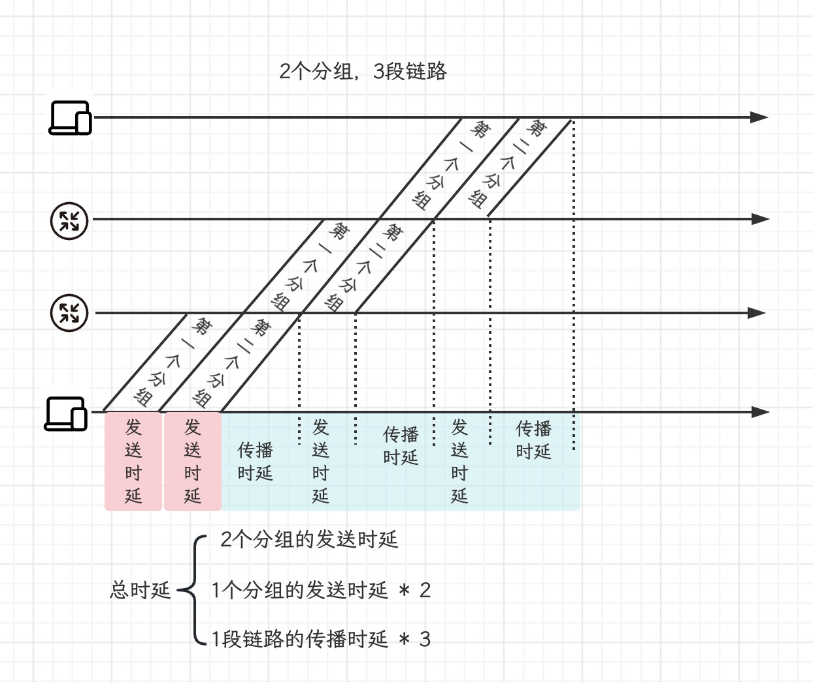
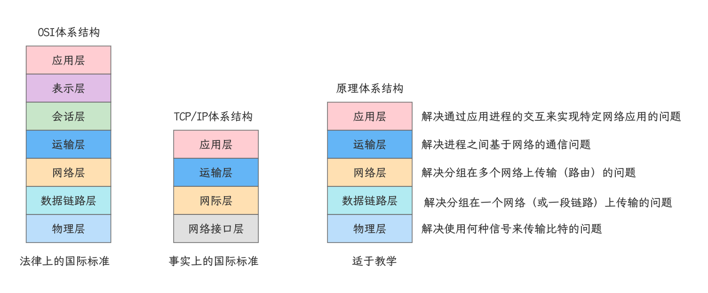
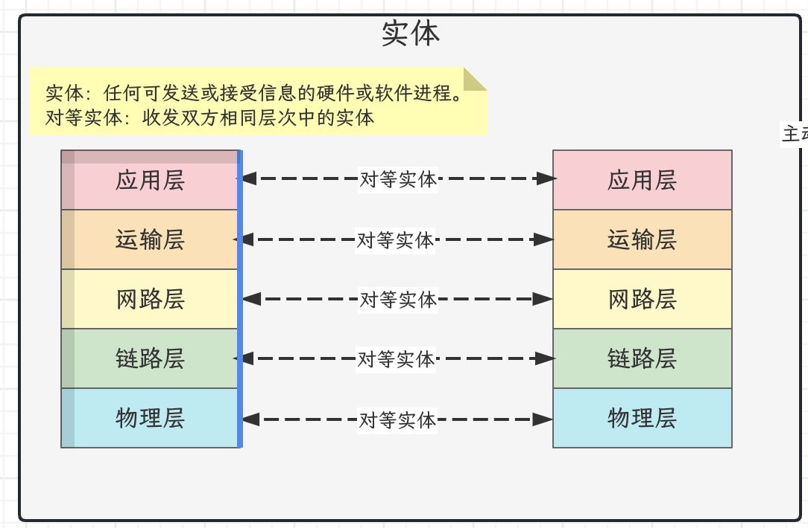
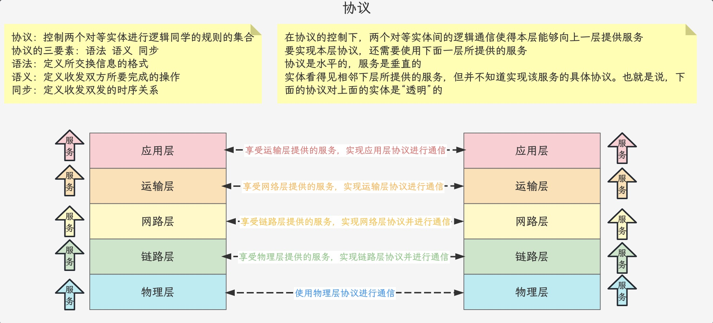
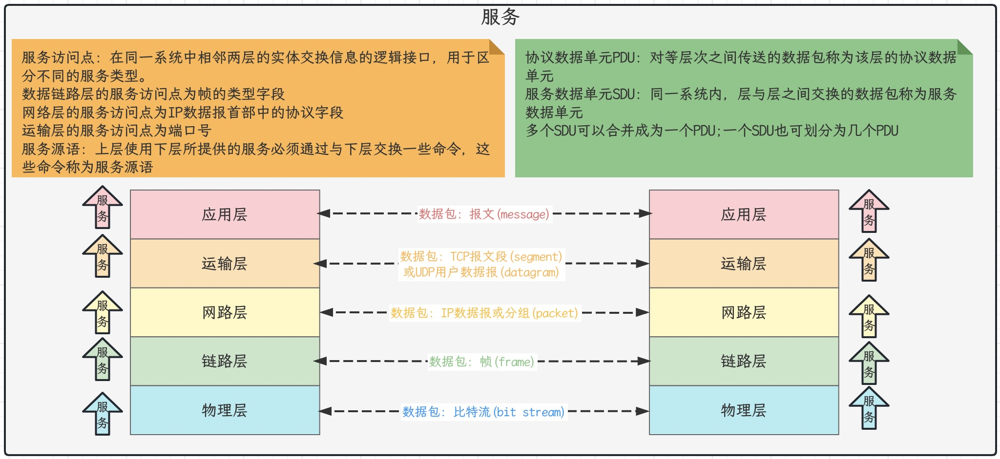

## 网络、互联网与因特网的区别与关系

- 若干节点和链路互连形成网络
- 若干网络通过路由器互连形成互联网
- 因特网是当今世界上最大的互联网
- 我们有时并没有严格区分互联网和因特网这两个名词，许多人口中的互联网实际上是指因特网
- internet：通用名词，互联网，任意通信协议
- Internet：专有名词，因特网，TCP/IP协议族

## 因特网简介

### 因特网发展的三个阶段

- 1969 ARPANET向互联网发展
  - 1969年，第一个分组交换网ARPANET
  - 70年代中期，研究多种网络的互连
  - 1983年，TCP/IP协议成为ARPANET的标准协议（因特网诞生时间）
- 1985 三级结构因特网
  - 1985年，NESNET(主干网、地区网和校园网)
  - 1990年，ARPANET任务完成，正式关闭
  - 1991年，因特网初步商业化，开始收费
- 1993 多层次ISP结构的因特网
  - 1993年，NSFNET被替代，由各种ISP运营
  - 1994年，WWW技术推动因特网迅速发展
  - 1995年，NSFNET停止工作，因特网彻底商业化

### 因特网的标准化工作

- 因特网的标准化工作是面向公众的，其任何一个建议标准在成为因特网标准之前都以RFC技术文档的形式在因特网上发表
- RFC(Request For Comments)的意思是请求评论。任何人都可以从因特网上免费下载RFC文档(https://www.ietf.org/frc.html)并随时对某个RFC文档发表意见和建议。
- 因特网草案(不是RFC文档) -> 建议标准(成为RFC文档) -> 因特网标准

### 因特网管理机构

- 因特网协会(ISOC) : 全面管理
- 因特网体系结构委员会(IAB) : 管理相关协议的开发
- 因特网工程部(IETF) : 研究中短期工程问题主要针对协议的开发和标准化
- 因特网研究部(IRTF) : 理论方面的研究开发一些需要长期考虑的问题

## 电路交换、分组交换、报文交换

### 分组交换

- 优点
  - 没有建立连接和释放连接的过程
  - 分组传输过程中逐段占用通信链路，有较高的通信线路利用率
  - 交换节点可以为每一个分组独立选择转发路由，使得网络有很好的生存性
- 缺点
  - 分组首部带来了额外的传输开销
  - 交换节点存储转发分组会造成一定的时延
  - 无法确保通信时端到端通信资源全部可用，在通信量较大时可能造成网络拥塞
  - 分组可能会出现失序和丢失等问题

### 报文交换

- 报文交换时分组交换的前身
- 在报文交换中，报文被整个地发送，而不是拆分成若干个分组进行发送
- 交换节点将报文整体接收完成后才能查找转发表，将整个报文转发到下一个节点
- 因此，报文交换比分组交换带来地转发时延要长得多，需要交换节点具有得缓冲空间也大很多

### 三种交换方式得对比

- 若要连续发送大量得数据，并且数据传送时间远大于建立连接得时间，则使用电路交换可以有较高得传输效率。然而计算机得数据传送往往是突发式得，采用电路交换时通信线路得利用率会很低
- 报文交换和分组交换都不需要建立连接（即预先分配通信资源），在传送计算机的突发数据时可以提高通信线路的利用率
- 将报文构造成若干个更小的分组进行分组交换，比将整个报文进行报文交换的时延要小，并且可以避免太长的报文长时间占用链路，有利于差错控制，同时具有更好的灵活性

## 计算机网络

### 定义

- 现阶段计算机网络的一个较好的定义：计算机网络主要是由一些通用的、可编程的硬件互连而成的，而这些硬件并非专门用来实现某一特定目的（例如，传送数据或视频信号）。这些可编程的硬件能够用来传送不同类型的数据，并能支持广泛的和日益增长的应用
- 可编程的硬件：不限于计算机，而是包括了智能手机，具有网络功能的传感器以及智能家电等智能硬件，这些硬件一定包含有中央处理单元(CPU)
- 各类应用：计算机网络并非只用来传送数据，而是能够基于数据传送进而实现各种各样的应用，包括今后可能出现的各种应用
- 简单的定义：一些互连的，自治的计算机的集合

### 分类

- 交换方式：电路交换、报文交换、分组交换
- 使用者：公用网、专用网
- 传输介质：有线网络、无线网络
- 覆盖范围：广域网WAN, 城域网MAN, 局域网LAN, 个域网PAN
- 拓扑结构：总线型、星型、环型、网状型

## 计算机网络的性能指标

### 速率

- 速率是指数据的传送速率（即每秒传送多少个比特），也称为数据率或比特率
- 速率的基本单位：bit/s(b/s, bps)常用单位：kb/s, Mb/s, Gb/s, Tb/s
- 数据量单位中的K, M, G, T的数值分别为$2^{10}, 2^{20}, 2^{30}, 2^{40}$; 速率单位中的k, M, G, T的数值分别为$10^3, 10^6, 10^9, 10^{12}$

### 带宽

- 带宽在模拟信号系统中的意义
  - 某个信号所包含的各种不同频率成分所占据的频率范围
  - 单位：Hz(kHz, MHz, GHz)
- 带宽在计算机网络中的意义
  - 用来表示网络的通信线路所能传送数据的能力，即在单位时间内从网络中的某一点到另一点所能通过的最高数据率
  - 单位：b/s(kb/s, Mb/s, Gb/s, Tb/s)

### 吞吐量

- 吞吐量是指在单位时间内通过某个网络或接口的实际数据量。吞吐量常被用于对实际网络的测量，以便获知到底有多少数据量通过了网络
- 吞吐量受网络带宽的限制

### 时延

- 发送时延 = 分组长度(b) / 发送速率(b/s); 发送速率 = min(主机接口速率，线路带宽，交换机或路由器的接口速率)

- 传播时延 = 信道长度(m) / 信号传播速率(m/s)
  - 自由空间：3.0 * 10^8 m/s
  - 铜线: 2.3 * 10^8 m/s
  - 光纤: 2.0 * 10^8 m/s
  
- 排队时延：不方便计算

- 处理时延：不方便计算

- 在下图所示的采用“存储-转发”方式的分组交换网络中，所有链路的数据传输速率为100Mbps,分组大小为100B,其中分组头大小为20B.若主机H1向主机H2发送一个大小为980 000B的文件，则在不考虑分组拆装时间和传播延迟的情况下，从H1发送开始到H2接收完为止，需要的时间至少是(C)

  - A 80ms 
  - B 80.08 ms
  - C 80.16 ms
  - D 80.24ms

  
  $$
  需要的最小时长 = 所有分组的发送时延 + 1个分组的发送时延* 2 \\ = \frac{1000B}{100Mb/s}(1个分组发送时延) * \frac{980000B}{1000B-20B}(构成发送文件的分组数量) + \frac{1000B}{100Mb/s}(1个分组发送时延) * 2 = 80.16ms
  $$

### 时延带宽积

- 时延带宽积是传播时延和带宽的乘积
- 若发送端连续发送数据，则在所发送的第一个比特即将到达终点时，发送端就已经发送了时延带宽积个比特

- 举例：主机A和主机B之间采用光纤链路，链路长1km, 链路带宽为1Gb/s, 请计算该链路的时延带宽积

$$
时延带宽积 = \frac{1km}{2*10^8m/s}(传播时延) * 1Gb/s(带宽) = 5000b
$$

- 因此，链路的时延带宽积也称为以比特为单位的链路长度，这对我们以后理解以太网的最短帧长是非常有帮助的。

### 往返时间

- 往返时间RTT是指通信双方双向交互一次所耗费的时间
- 卫星链路的往返时间较长$\frac{36000km}{3*10^8m/s} * 2 = 240ms$

### 利用率

- 链路利用率
  - 链路利用率是指某条链路有百分之几的时间是被利用的（即有数据通过）
  - 完全空闲的链路利用率为零
- 网络利用率：是指网络中所有链路的链路利用率的加权平均
- 根据排队论可知，当某链路的利用率增大时，该链路引起的时延就会迅速增加
- 当网络的通信量较少时，产生的时延并不大，但在网络通信量不断增大时，分组在交换节点（路由器或交换机）中的排队时延会随之增大，因此网络引起的时延就会增大
- 令$D_0$表示网络空闲时的时延，D表示网络当前时延，那么在理想的假定条件下，可用下式来表示D, $D_0$和网络利用率U之间的关系。$D = \frac{D_0}{1 - U}$

- 一些大型ISP往往会控制信道利用率不超过50%。如果超过了就要进行扩容，增大线路的带宽。

### 丢包率

- 丢包率是指在一定的时间范围内，传输过程中丢失的分组数量与总分组数量的比率
- 分组丢失主要有以下两种情况
  - 分组在传输过程中出现误码，被传输路径中的节点交换机（路由器）或目的主机检测出误码而丢弃
  - 节点交换机根据丢弃策略主动丢弃分组
- 丢包率可以反映网络拥塞情况
  - 无拥塞时路径丢包率为0
  - 轻度拥塞时路径丢包率为1% - 4%
  - 严重拥塞时路径丢包率为5% - 15%

## 常见的三种计算机网络体系结构

- 在OSI参考模型中，下列功能需要由应用层的相邻层实现的是(B)
  - A 对话管理
  - B 数据格式与转换
  - C 路由选择
  - D 可靠传输
- OSI参考模型的第5层(自下而上)完成的主要功能是(C)
  - A 差错控制
  - B 路由选择
  - C 会话管理
  - D 数据表示转换
- 在TCP/IP参考模型中，由传输层相邻的下一层实现的主要功能是(B)
  - A 对话管理
  - B 路由选择
  - C 端到端报文传输
  - D 节点到节点流量控制

## 计算机网络体系结构中的专用术语

### 实体

- 实体是指任何可发送或接收信息的硬件或软件进程
- 对等实体是指通信双方相同层次中的实体

### 协议

- 协议是控制两个对等实体在“水平方向”进行“逻辑通信”的规则的集合。
- 协议的三要素
  - 语法：定义所交换信息的格式
  - 语义：定义通信双方所要完成的操作
  - 同步：定义通信双方的时序关系

### 服务

- 在协议的控制下，两个对等实体在水平方向的逻辑通信使得本层能够向上一层提供服务
- 要实现本层协议，还需要使用下面一层所提供的服务
- 协议是“水平的”，而服务是“垂直”的
- 实体看得见下层提供的服务，但并不知道实现该服务的具体协议。下层的协议对上层的实体是“透明”的。
- 在同一系统中相邻两层的实体交换信息的逻辑接口称为服务访问点SAP, 它被用于区分不同的服务类型
- 帧的类型字段，IP数据报的协议字段，TCP报文段或UDP用户数据报的端口号字段都是SAP
- 上层要使用下层所提供的服务，必须通过与下层交换一些命令，这些命令称为服务原语
- 对等层次之间传送的数据包称为该层的协议数据单元(Protocol Data Unit, PDU)
- 同一系统内层与层之间交换的数据包称为服务数据单元(Service Data Unit, SDU)

### 试题

- 下列选项中，不属于网络体系结构所描述的内容是(C)
  - A 网络的层次
  - B 每一层使用的协议
  - C 协议的内部实现细节
  - D 每一层必须完成的功能