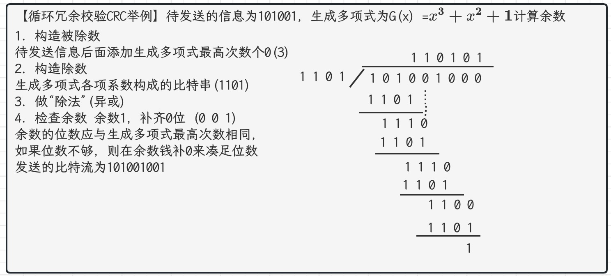
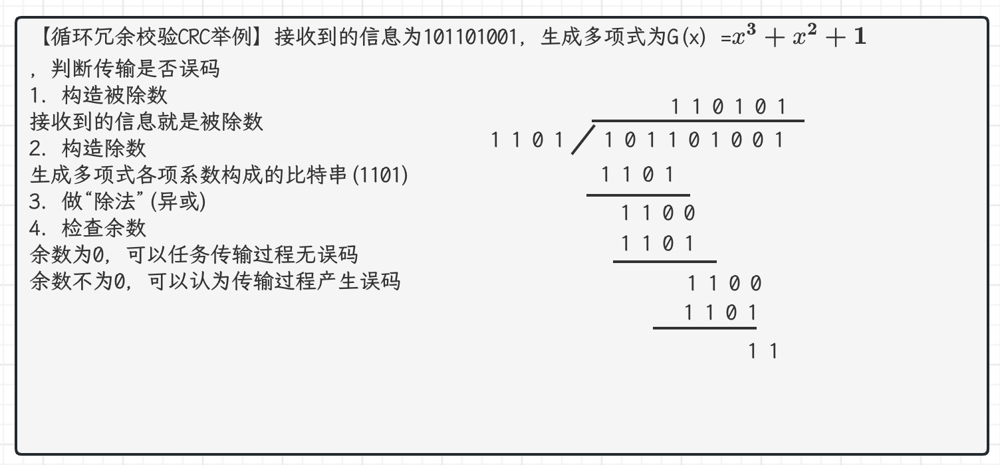
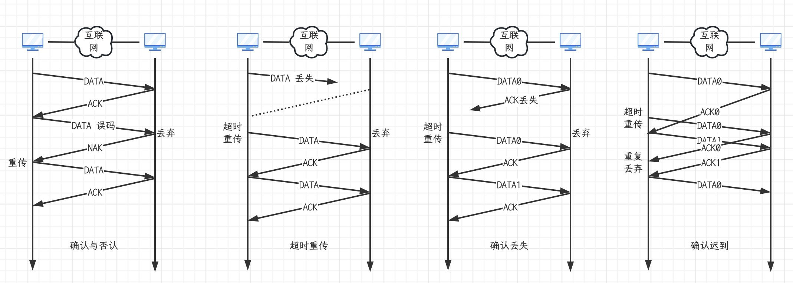
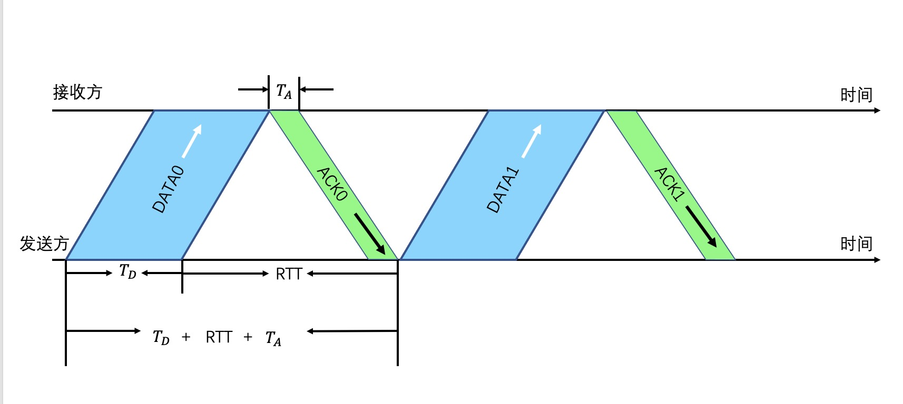
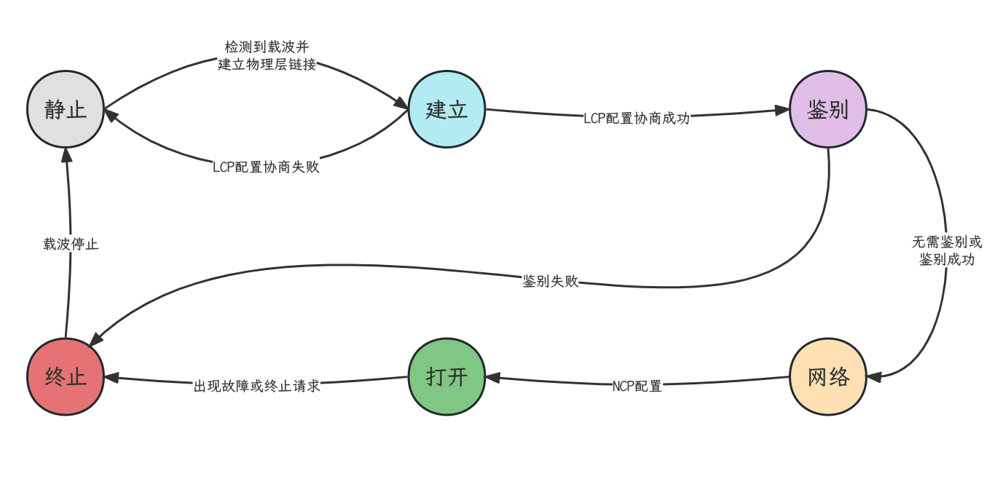

## 概述

- 链路(Link)是指从一个节点到相邻节点的一段物理线路（有线或无线），而中间没有任何其他的交换节点。
- 数据链路(Data Link)是基于链路的。当在一条链路上传送数据时，除需要链路本身，还需要一些必要的通信协议来控制这些数据的传输，把实现这些协议的硬件和软件加到链路上，就构成了数据链路
- 计算机中的网络适配器（俗称网卡）和其相应的软件驱动程序就实现了这些协议。一般的网络适配器都包含了物理层和数据链路层这两层的功能。
- 帧（Frame）是数据链路层对等实体之间在水平方向进行逻辑通信的协议数据单元PDU

## 数据链路层的三个重要问题

- 封装成帧和透明传输
  - 数据链路层给上层交付下来的协议数据单元PDU添加帧首部和帧尾部，这称为封装成帧
  - 如果能够采取措施，使得数据链路层对上层交付的PDU的内容没有任何限制，就好像数据链路层不存在一样，就称为透明传输
- 差错检测
  - 帧在传输的过程中可能出现误码
  - 接收方根据发送方添加在帧尾部中的检错码，可以检测出帧是否出现了误码
- 可靠传输
  - 不可靠传输服务：收到有误码的帧，直接丢弃，其他什么都不要做；未收到发送方发送的帧，也不进行任何处理
  - 可靠传输服务：实现发送方发送什么，接收方最终都能正确收到。

## 封装成帧

- 封装成帧是指数据链路层给上层交付下来的协议数据单元PDU添加一个首部和一个尾部，使之成为帧。

  - 帧的首部和尾部包含有一些重要的控制信息
  - 帧首部和尾部的作用之一就是帧定界（并不是每一种数据链路层协议的帧都包含有帧定界标志）

  <table>
    <tr>
      <td colspan="7" align="center">点对点协议的PPP帧</td>
    </tr>
    <tr>
      <td>1B</td>
      <td>2B</td>
      <td>最大1500B</td>
      <td>2B</td>
      <td>1B</td>
      <td>1B</td>
      <td>1B</td>
    </tr>
    <tr>
    	<td>标志</td>
      <td>FCS</td>
      <td>数据载荷</td>
      <td>协议</td>
      <td>控制</td>
      <td>地址</td>
      <td>标志</td>
    </tr>
  </table>

  <table>
    <tr>
    	<td colspan="7" align="center">以太网V2的MAC帧（最大长度1518B;帧首部和尾部没有帧定界标志）</td>
    </tr>
    <tr>
    	<td>4B</td>
      <td>46-1500B</td>
      <td>2B</td>
      <td>6B</td>
      <td>6B</td>
    </tr>
    <tr>
    	<td>FCS</td>
      <td>数据载荷</td>
      <td>类型</td>
      <td>源地址</td>
      <td>目的地址</td>
    </tr>
  </table>

  - 以太网V2的MAC帧会在物理层添加前导码，帧间间隔（发送96比特所耗费的时间）

  

- 为了提高数据链路层传输帧的效率，应当使帧的数据载荷的长度尽可能地大于首部和尾部的长度
- 考虑到对缓存空间的需要以及差错控制等诸多因素，每一种数据链路层协议都规定了帧的数据载荷的长度上限，即最大传送单元(Maximum Transfer Unit, MTU),例如，以太网的MTU为1500个字节

## 透明传输

- 透明传输是指数据链路层对上层交付下来的协议数据单元PDU没有任何限制，就好像数据链路层不存在一样。

  - 面向字节的物理链路使用字节填充的方法实现透明传输
  - 面向比特的物理链路使用比特填充的方法实现透明传输

- HDLC协议对0111 1100 0111 1110组成帧后对应的比特串为：0111 1100 0011 1110 10

  - 高级数据链路控制协议HDLC采用帧首部和帧尾部中的标志字段作为帧定界符，其值为01111110.HDLC为了实现透明传输，采用零比特填充法，即每5个连续比特1后面插入一个比特0

- 在某个数据链路层协议中使用下列字符编码

  - A:01000111  B:11100011  ESC:11100000  FLAG:01111110
  - 其中帧的数据载荷为4个字符A， B, ESC以及FLAG，请分别使用字符填充法和零比特填充法将其封装成帧

  <table>
    <tr>
    	<td colspan="8" align="center">字符填充法封装成帧</td>
    </tr>
    <tr>
    	<td>帧定界符</td>
      <td colspan="6" align="center">帧的数据载荷</td>
      <td>帧定界符</td>
    </tr>
    <tr>
    	<td>FLAG</td>
      <td>A</td>
      <td>B</td>
      <td>转义ESC</td>
      <td>ESC</td>
      <td>转义ESC</td>
      <td>FLAG</td>
      <td>FLAG</td>
    </tr>
    <tr>
    	<td>01111110</td>
      <td>01000111</td>
      <td>11100011</td>
      <td>11100000</td>
      <td>11100000</td>
      <td>11100000</td>
      <td>01111110</td>
      <td>01111110</td>
    </tr>
  </table>

  <table>
    <tr>
    	<td colspan="6" align="center">零比特填充法封装成帧</td>
    </tr>
    <tr>
    	<td>帧定界符</td>
      <td colspan="4" align="center">帧的数据载荷</td>
      <td>帧定界符</td>
    </tr>
    <tr>
    	<td>FLAG</td>
      <td>A</td>
      <td>B</td>
      <td>ESC</td>
      <td>FLAG</td>
      <td>FLAG</td>
    </tr>
    <tr>
    	<td>01111110</td>
      <td>01000111</td>
      <td>11(0)100011</td>
      <td>111(0)00000</td>
      <td>011111(0)10</td>
      <td>01111110</td>
    </tr>
  </table>

## 差错检测

### 误码的相关概念

- 实际的通信链路都不是理想的，比特在传输过程中可能会产生差错（称为比特差错）
  - 比特1可能变成比特0
  - 比特0可能变成比特1
- 在一段时间内，传输错误的比特数量占所传输比特总数的比率称为误码率(Bit Error Rate, BER)
- 提高链路的信噪比，可以降低误码率。但在实际的通信链路上，不可能使误码率下降为零
- 使用差错检测技术来检测数据再传输过程中是否产生了比特差错，是数据链路层所要解决的重要问题之一
- 以太网V2的MAC帧根据帧尾中的检错码检测帧中是否有误码

### 奇偶校验

- 奇校验是在待发送的数据后面添加1个校验位，使得添加该校验位后的整个数据中比特1的个数为奇数
- 偶校验是在待发送的数据后面添加1个校验位，使得添加该校验位后的整个数据中比特1的个数为偶数

### 循环冗余校验

- 奇偶校验，循环冗余校验等差错检测技术，只能检测出传输过程中出现了差错，但并不能定位错误，因此无法纠正错误
- 要想纠正传输中的差错，可以使用冗余信息更多的纠错码（例如海明码）进行前向纠错。但纠错码的开销比较大，在计算机网络中较少使用
- 在计算机网络中，通常采用我们后续课程中将要介绍的检错重传方式来纠正传输中的差错，或者仅仅丢弃检测到差错的帧，这取决于数据链路层向上层提供的是可靠传输服务还是不可靠传输服务
- 循环冗余校验CRC具有很好的检错能力（漏检率极低），虽然计算比较复杂，但非常易于硬件实现，因此被广泛应用于数据链路层。

## 可靠传输

### 可靠传输的相关概念

- 使用差错检测技术（例如循环冗余校验CRC）,接收方的数据链路层就可检测出帧在传输过程中是否产生了误码（比特差错）
- 数据链路层向其上提供的服务类型
  - 不可靠传输服务：仅仅丢弃有误码的帧，其他什么也不做
  - 可靠传输服务：通过某种机制实现发送方发送什么，接收方最终就能收到什么
- 一般情况下，有限链路的误码率比较低。为了减少开销，并不要求数据链路层向其上层提供可靠传输服务。及时出现了误码，可靠传输的问题由其上层处理
- 无线链路易受干扰，误码率比较高，因此要求数据链路层必须向上层提供可靠传输服务
- 传输差错类型
  - 分组重复，分组失序，分组丢失：出现在数据链路层的上层
  - 误码（比特差错）：出现在数据链路层及其下层
- 可靠传输服务并不局限于数据链路层，其他各层均可选择实现可靠传输
- 可靠传输的实现比较复杂，开销比较大，是否使用可靠传输取决于应用需求
- 实现可靠传输服务的方式：停止-等待协议(Stop and wait, SW); 回退N帧协议(Go back N, GBN); 选择重传协议(Selective Repeat, SR).这三种可靠传输实现机制的基本原理并不仅局限于数据链路层，可以应用到其上各层。

### 停止等待协议

- 停止等待协议实现原理

- 图一：确认，否认和重传
- 图二：一般可将超时重传时间RTO设置为略大于收发双方的平均往返时间RTT
- 图三：确认丢失数据分组需要编号。丢弃重复的数据分组，再发送一个确认分组。
- 图四：确认迟到，确认分组需要编号
- 注意事项：
  - 使用超时重传机制后，就可以不使用否认机制了，这样可使协议实现起来更加简单。但是，如果点对点链路的误码率较高，使用否认机制可以使发送方在超时计时器超时前就尽快重传
  - 为了让接收方能够判断所收到的数据分组是否是重复的，需要给数据分组编号。由于停止等待协议的特性，只需1比特编序号即可，即序号0和序号1
  - 为了让发送方能够判断所收到的确认分组是否是重复的，需要给确认分组编号，所用比特数量与数据分组所用比特数量一样，即一个比特，即序号0和序号1.数据链路层一般不会出现确认分组迟到的情况，因此在数据链路层实现停止等待协议可以不用给确认分组编号
  - 给超时计时器设置的超时重传时间RTO应当仔细选择，一般将RTO设置为略大于收发双方的平均往返时间RTT。
    - 在数据链路层，点对点的往返时间RTT比较固定，RTO就比较好设定
    - 在运输层，由于端到端往返时间非常不确定，设置合适的超时重传时间RTO有时并不容易
  - 停止等待协议属于自动请求重传(Automatic Repeat reQuest, ARQ)协议。即重传的请求是发送方自动进行的，而不是接收方请求发送重传某个误码的数据分组。
- 停止等待协议的信道利用率

$$
信道利用率 \space U \approx \frac{T_D}{T_D+RTT+T_A} \space \underrightarrow{T_A << T_D \text{因为确认分组长度远小于数据分组长度}} \space U \approx \frac{T_D}{TD+RTT} \\ \underrightarrow{RTT >> T_D \text{例如，卫星链路的RTT很大}}  \space \space \space \space \text{U很低} \\ \underrightarrow{RTT << T_D \text{例如，无线局域网的RTT远小于}T_D} \space \space \space \space \text{U比较高}
$$

- 若出现超时重传，对于传送有用的数据信息来说，信道利用率还要降低

- 在往返时间RTT相对较大的情况下，为了提高信道利用率，收发双方不适合采用停止等待协议，而可以选择回退N帧协议(GBN)或选择重传协议(SR)

- 主机甲采用停止等待协议向主机乙发送数据，数据传输速率为3kbps,单向传播时延是200ms, 忽略确认帧的传输时延。当信道利用率等于40%时，数据帧的长度为(D)

  - A 240比特  B400比特  C480比特  D800比特

  - $\frac{T_D}{T_D + 200ms * 2} = 0.4 => T_D = 267ms = 0.267s = L b/3000bps => L=800b$

### 回退N帧协议

- 发送方
  - 发送窗口$W_T$的取值范围是$1 < W_T \leq (2^n - 1)$.其中n构成分组序号的比特数量
    - 如果$W_T = 1$变成了停止等待协议
    - 如果$W_T > (2^n - 1)$ 接收方无法分辨新旧数据分组
  - 可在未收到接收方确认分组的情况下，将序号落入发送窗口内的多个数据分组全部发送出去
  - 只有收到对已发送数据分组的确认分组时，发送窗口才能向前滑动到相应位置
  - 收到多个重复确认时，可在重传计时器前尽早开始重传，由具体实现决定
  - 发送窗口内某个已发送的数据分组产生超时重传时，发送窗口内该数据分组的后续已发送的数据分组也必须全部重传，这就是回退N帧协议名称的由来
- 接收方
  - 接收窗口$W_R = 1$的，因此只能按序接收数据分组
  - 只接收序号落入接收窗口内且无误码的数据分组，并且将接收窗口向前滑动一个位置，与此同时给发送方发送相应的确认分组
  - 为了减少开销，接收方不必每收到一个按序到达且无误码的数据分组就给发送方发送一个相应的确认分组
    - 可以在连续收到多个按序到达且无误码的数据分组后（数量由具体实现决定），才针对最后一个数据分组发送确认分组，这称为累计确认
    - 或者可以在自己有数据分组要发送时才对之前按序接收且无误码的数据分组进行捎带确认
  - 接收方收到未按序到达的数据分组后，除丢弃外，还可对之前最后一个按序到达的数据分组进行重复确认，以便发送方尽快重传
- 回退N帧协议在流水线传输的基础上，利用发送窗口来限制发送方连续发送数据分组的数量，是一种连续ARQ协议。
- 在回退N帧协议的工作过程中，发送窗口和接收窗口不断向前滑动，因此这类协议又称为滑动窗口协议
- 在信道质量较差（容易出现误码）的情况下，回退N帧协议的信道利用率并不比停止等待协议的信道利用率高
- 数据链路层使用后退N帧协议，发送方已经发送了编号0-7的帧。当计时器超时时，若发送方只收到了0，2，3号帧的确认，则发送方需要重发的帧数是(C)
  - A.2  B.3  C.4  D.5
  - 需要重发4-7号帧
- 主机甲与主机乙之间使用回退N帧协议传输数据，甲的发送窗口尺寸为1000，数据帧长为1000字节，信道带宽为100Mbps,乙每收到一个数据帧就立即利用一个短帧（忽略其传输延迟）进行确认，若甲乙之间的单向传播延迟是50ms, 则甲可以达到的最大平均数据传输速率约为(C)
  - A.10Mpbs  B.20Mbps  C.80Mbps  D.100Mbps
  - $\text{甲可以达到的最大平均数据传输速率} \approx \text{可发送的数据量} \div (\text{数据帧的发送时延 + 信号的单向传播时延} \times 2) \\ \approx (1000 \times 8) \times 1000 \div (1000 \times 8) \div (100 \times 10^6) + 0.05 * 2 \approx 80Mbps$

### 选择重传协议

- 用n(n>1)个比特给分组编号，发送窗口$W_T$与接收窗口$W_R$的关系如下

$$
1 < W_R \leq 2^{n-1} \begin{cases} 1 < W_R \leq W_T (W_R超过W_T没有意义) \\
W_T + W_R \leq 2^n (确保接收窗口向前滑动后，落入接收窗口内的新序号与之前的旧序号没有重叠，避免无法分辨新旧数据分组)
\end{cases} \\
当W_R取最大值2^{n-1}时，W_T能取到的最大值也为2^{n-1}
$$

- 发送方
  - 可在未收到接收方确认分组的情况下，将序号落入发送窗口的多个数据分组全部发送出去
  - 只有按序收到对已发送数据分组的确认分组时，发送窗口才能向前滑动到相应位置
  - 如果收到未按序到达的确认分组，应对其进行记录，以防止其相应数据分组的超时重发，但发送窗口不能向前滑动
- 接收方
  - 可接收未按序到达但没有误码并且序号落入接收窗口内的数据分组
  - 为了使发送方仅重传出现差错的分组，接收方不再采用累积确认，而需要对每一个正确接收到的数据分组进行逐一确认
  - 只有在按序接收数据分组后，接收窗口才能向前滑动到相应位置
- 数据链路层采用选择重传协议SR传输数据，发送方已发送了0-3号数据帧，现已收到1号帧的确认，而0，2号帧依次超时，则此时需要重传的帧数是(B)
  - A.1 B.2 C.3 D.4
  - 与回退N帧协议不同，选择重传协议不采用累计确认，接收方需要对每一个正确接收的数据分组进行逐一确认
  - 发送方仅重传未收到确认而超时的数据帧，因此重传0号和2号这两个数据帧

## 点对点协议

### 点对点协议PPP概述

- 点对点协议(Point to Point Protocol, PPP)是目前使用最广泛的点对点数据链路层协议
- 点对点协议PPP主要有两种应用
  - 因特网用户连接ISP. PPPoE
  - 路由器之间通过PPP协议连接(广域网链路)

- 从网络体系结构的角度看点对点协议PPP的组成

| 网络层        | TCP/IP中的IP  Novell NetWare网络操作系统中的IPX  Apple公司的AppleTalk |
| ------------- | ------------------------------------------------------------ |
| 数据链路层PPP | 一套网络控制协议NCPs 一个网络层PDU封装到串行链路的方法 一个链路控制协议LCP |
| 物理层        | 面向字节的异步链路 面向比特的同步链路                   |

### PPP的帧格式

<table>
  <tr>
    <td colspan="7" align="center">点对点协议的PPP帧</td>
  </tr>
  <tr>
    <td>1B</td>
    <td>2B</td>
    <td>最大1500B</td>
    <td>2B</td>
    <td>1B</td>
    <td>1B</td>
    <td>1B</td>
  </tr>
  <tr>
  	<td>标志</td>
    <td>FCS</td>
    <td>数据载荷</td>
    <td>协议</td>
    <td>控制</td>
    <td>地址</td>
    <td>标志</td>
  </tr>
  <tr>
  	<td colspan="2" align="center">帧尾部</td>
    <td>最大传输单元MTU=1500B</td>
    <td colspan="4" align="center">帧首部</td>
  </tr>
</table>

- 标志(Flag)字段：PPP帧的定界符，取值为0x7E
- 地址(Address)字段：取值为0xFF,预留
- 控制(Control)字段：取值为0x03,预留
- 协议(Protocol)字段：其值用来指明帧的数据载荷应向上层交付给哪个协议处理
  - 0021：IP数据报
  - C021：LCP分组
  - 8021：NCP分组
- 帧检测序列(Frame Check Sequence, FCS)字段：其值是使用循环冗余校验CRC计算出的检错码

### PPP帧的透明传输

- 面向字节的异步链路使用字节填充来实现透明传输(RFC1662)
  - 发送方的处理：
    - 将数据载荷中出现的每一个0x7E减去0x20(相当于异或0x20得到0x5E),然后在其前面插入转义字符0x7D
    - 若数据载荷中原来就有0x7D,则把每一个0x7D减去0x20得到0x5D, 然后在其前面插入转义字符0x7D
    - 将数据载荷中出现的每一个ASCII码控制字符(即数值小于0x20的字符)，加上ox20(相当于异或0x20,将其转换成非控制字符)，然后在其前面插入转义字符0x7D
  - 接收方的处理：进行与发送方相反的转换，就可以正确地恢复出未经过字节填充的原始数据载荷
- 面向比特的同步链路使用零比特填充来实现透明传输
  - 发送方的处理：对帧的数据载荷进行扫描(一般由硬件完成，每出现5个连续的比特1，则在其后填充一个比特0)
  - 接收方的处理：对帧的数据载荷进行扫描，每出现5个连续的比特1时，就把其后的一个比特0删除

### PPP帧的差错检测

- 帧检验序列FCS字段：其值是使用循环冗余校验CRC计算出的检错码。CRC采用的生成多项式为$CRC-CCITT=X^{16}+X^{12}+X^5+1$

### PPP的工作状态

- 以用户主机拨号接入因特网服务提供者ISP的拨号服务器的过程为例

## 共享式以太网

- 以太网(Ethernet)以曾经被假想的电磁波传播介质-以太(Ether)来命名
- 以太网最初采用无源电缆(不包含电源线)作为共享总线来传输帧，属于基带总线局域网，传输速率为2.94Mbps
  - 使用共享总线的共享式以太网
  - 使用集线器的共享式以太网
- 共享式以太网发展流程
  - 1975年以太网诞生美国Xero公司
  - 1976年以太网里程碑论文《以太网：局域计算机网络的分布式包交换技术》
  - 1979年3Com公司成立
  - 1980年以太网标准1
  - 1982年以太网标准2
  - 1983年IEEE以太网标准
- 以太网目前已经从传统的共享式以太网发展到交换式以太网，传输速率已经从10Mbps提高到100Mbps,1Gbps甚至10Gbps.

## 网络适配器

- 要将计算机连接到以太网，需要使用相应的网络适配器(Adapter),网络适配器一般简称为“网卡”
- 在计算机内部，网卡与CPU之间的通信，一般是通过计算机主板上的IO总线以并行传输方式进行
- 网卡与外部以太网（局域网）之间的通信，一般是通过传输媒体（同轴电缆，双绞线电缆，光纤）以串行方式进行的
- 网卡除要实现物理层和数据链路层功能，其另外一个重要功能就是要进行并行传输和串行传输的转换。由于网络的传输速率和计算机内部总线上的传输速率并不相同，因此在网卡的核心芯片中都会包含用于缓存数据的存储器
- 在确保网卡硬件正确的情况下，为了使网络正常工作，还必须要在计算机的操作系统中为网卡安装相应的设备驱动程序。驱动程序负责驱动网卡发送和接收帧

## MAC地址

- 点对点信道数据链路层不需要使用地址
- MAC地址一般被固话在网卡的电可擦编程只读存储器EEPROM中，因此MAC地址也被称为硬件地址
- MAC地址又是也被称为物理地址
- 一般情况下，普通用户计算机中往往包含两块网卡
  - 一块用于接入有线局域网的以太网卡
  - 另一块用于接入无线局域网的Wi-Fi网卡
- 每块网卡都有一个全球唯一的MAC地址
- 交换机和路由器往往具有更多的网络接口，所以会拥有更多的MAC地址
- 综上所述，严格来说，MAC地址是对网络上各接口的唯一标识，而不是对网络上各设备的唯一标识
- IEEE802局域网的MAC地址格式
  - b1(G/L: Global/Local): G/L=0:全球管理  G/L=1:本地管理
  - b0(I/G: Individual/Group): I/G=0:单播地址  I/G=1:多播地址
  - 字节发送顺序：第1字节  -> 第6字节
  - 字节内的比特发送顺序: b0 -> b7

<table>
  <tr>
  	<td colspan="9">组织唯一标识符OUI(由IEEE的注册管理机构分配)第1-3字节</td>
    <td colspan="9">网络接口标识符(由获得OUI的厂商自行随意分配)第4-6字节</td>
  </tr>
  <tr>
    <td colspan="8">第1字节</td>
    <td>第2-3字节</td>
    <td>第4-5字节</td>
    <td colspan="8">第6字节</td>
  </tr>
  <tr>
  	<td>b7</td>
    <td>b6</td>
    <td>b5</td>
    <td>b4</td>
    <td>b3</td>
    <td>b2</td>
    <td>b1</td>
    <td>b0</td>
    <td>......</td>
    <td>......</td>
    <td>b7</td>
    <td>b6</td>
    <td>b5</td>
    <td>b4</td>
    <td>b3</td>
    <td>b2</td>
    <td>b1</td>
    <td>b0</td>
  </tr>
</table>

<table>
  <tr>
  	<td>第1字节的b1位</td>
    <td>第1字节的b0位</td>
    <td>MAC地址类型</td>
    <td>地址占比</td>
    <td>地址数量</td>
  </tr>
  <tr>
    <td rowspan="2">0</td>
    <td>0</td>
    <td>全球 单播(由厂商网络设备时固化在设备中)</td>
    <td>1/4</td>
    <td rowspan="4">2^48 = 280万亿</td>
  </tr>
  <tr>
  	<td>1</td>
    <td>全球多播(由交换机，路由器等标准网络设备所支持的多播地址)</td>
    <td>1/4</td>
  </tr>
  <tr>
  	<td rowspan="2">1</td>
    <td>0</td>
    <td>本地单播(由网络管理员分配，优先级高于网络接口的全球单播地址)</td>
    <td>1/4</td>
  </tr>
  <tr>
  	<td>1</td>
    <td>本地多播(可由用户对网卡编程实现，以表明其属于哪些多播组)</td>
    <td>1/4</td>
  </tr>
</table>

- MAC地址表示方式
  - 标准表示法：XX-XX-XX-XX-XX-XX
  - 其他表示法：XX:XX:XX:XX:XX:XX   XXXX.XXXX.XXXX
- 网卡从网络上每收到一个无误码的帧，就检查帧首部的目的MAC地址，按以下情况处理：
  - 如果目的MAC地址是广播地址(FF-FF-FF-FF-FF-FF)，则接受该帧
  - 如果目的MAC地址与网卡上固化的全球单播MAC地址相同，则接受该帧
  - 如果目的MAC地址是网卡支持的多播地址，则接受该帧
  - 除上述1，2，3情况外，丢弃该帧
- 网卡还可被设置为一种特殊的工作方式：混杂方式(Promiscuous Mode)。工作在混杂方式的网卡，只要收到共享媒体上传来的帧就会收下，而不管帧的目的MAC地址是什么
  - 对于网络维护和管理人员，这种方式可以监视和分析局域网上的流量，以便找出提高网络性能的具体措施
  - 嗅探器(Sniffer)就是一种工作在混杂方式的网卡，再配合相应的工具软件(WireShark)就可以作为一种非常有用的网络工具来学习和分析网络
  - 混杂方式就像一把双刃剑，黑客常利用这种方式非法获取网络用户的口令

## CSMA/CD协议的基本原理

- 在以太网的发展初期，人们普遍认为“无源的电缆线比有源器件可靠”，因此将多个站点连接在一条总线上来构建共享总线以太网

